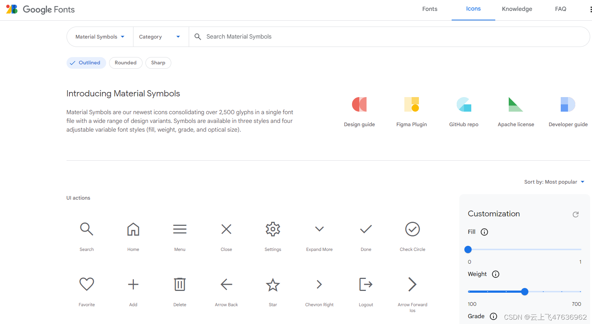

## 浏览
谷歌Material图表库网址：https://fonts.google.com/icons?hl=zh-cn

可直接在线浏览各个图标的样子以及字符串表示



## 使用npm安装
网址：https://github.com/marella/material-icons#readme
安装命令：

```bash
npm install material-icons@latest
```

## CSS引用
在项目的主文件中引入css文件 (example: src/index.js in Create React App, src/main.js in Vue CLI):
```bash
import 'material-icons/iconfont/material-icons.css';
```
## 使用
在html中使用图标时，设置好class和对应的图标名称即可，见下面代码示例：
```html
<span class="material-icons">pie_chart</span>          <!-- Filled -->
<span class="material-icons-outlined">pie_chart</span> <!-- Outlined -->
<span class="material-icons-round">pie_chart</span>    <!-- Round -->
<span class="material-icons-sharp">pie_chart</span>    <!-- Sharp -->
<span class="material-icons-two-tone">pie_chart</span> <!-- Two Tone -->
```
