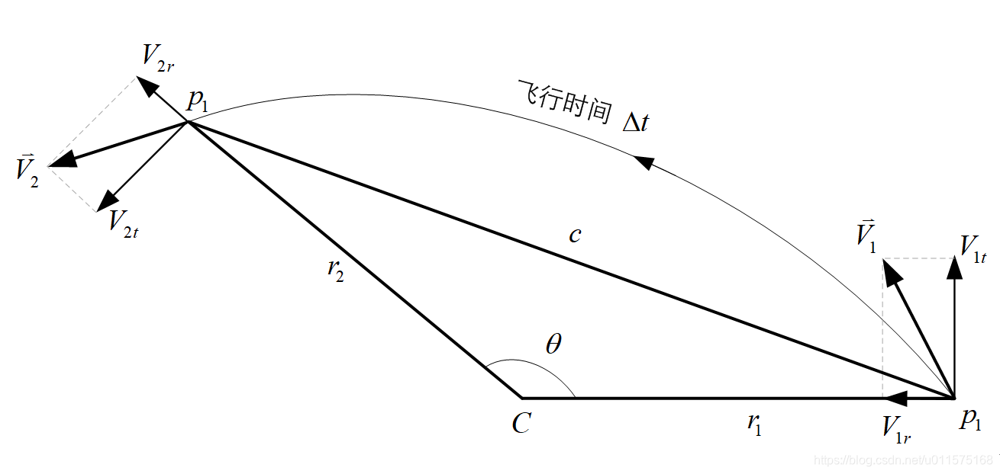
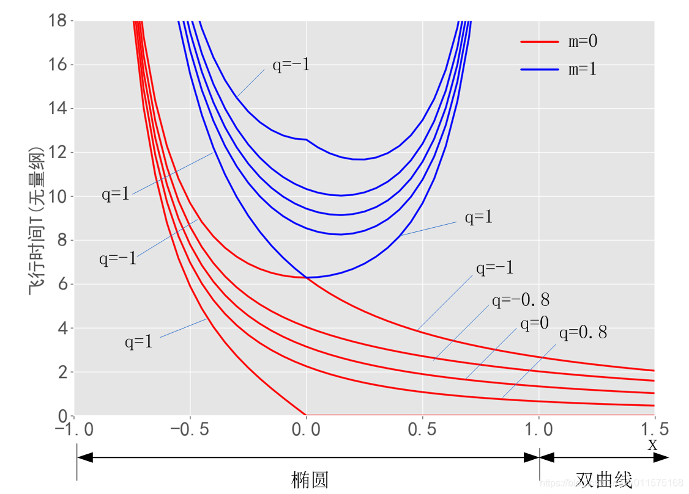

# 兰伯特(Lambert)方程的求解算法1

本文针对兰伯特方程给出具体的算法，并不打算给出详细的过程。各位读者可参照此算法及相应的代码进行编程计算。

## 介绍
见下图，仅考虑中心天体C的万有引力，飞行器从$P_1$点飞行到$P_2$点，飞行时间为$\Delta t$。起点$P_1$的地心距为$r_1$,终点$P_2$的地心距为$r_2$,飞行路径所对应的地心角为$\theta$。

兰伯特首先发现此两点轨道转移所需要的时间仅与始末的几何构型以及轨道半长径有关，而与其它轨道参数无关，其数学表述为：
$$
\sqrt\mu\Delta t =F(a,r_1+r_2,c)
$$

拉格朗日和高斯曾经都研究过这个问题，并给出相应的表达式，有兴趣的读者可直接参考相关教科书，此处不再详述。

下面介绍比较高效的求解算法，主要由R.H.Gooding在1990年的数篇文献中给出。想要详细了解，可参考他的两篇文献：
1. [A procedure for the solution of Lambert's orbital boundary-value problem](https://download.csdn.net/download/u011575168/12114449)
2. [On the Solution of Lambert's Orbital Boundary-Value Problem](https://download.csdn.net/download/u011575168/12114452)

本文基于上述两篇文献，直接给出算法。
## 初始化
由上图兰伯特转移轨道的几何构型，初始输入参数如下：
1. $r_1$，转移轨道起点$P_1$到引力中心C的距离 (m)；
2.  $r_2$，转移轨道起点$P_2$到引力中心C的距离(m) ；
3. $\theta$， 转移轨道的地心夹角，不超过360°；
4. $\Delta t$，转移轨道的飞行时间(s)；
5. $m$，椭圆轨道时，转移轨道的飞行圈数，$m=0$时，表示转移轨道的地心角 $\theta$不超过360°；$m>0$时，仅表示椭圆转移轨道，指转移轨道的地心角超过了360°。
6. $\mu$，中心天体的引力常数；
由初始输入参数，可得部分参数：
7. $c=\sqrt{(r_1-r_2)^2+4r_1r_2sin^2(\theta/2)}$；
8. $s=(r_1+r_2+c)/2$ ；
9.  $q=\sqrt{r_1r_2}cos(\theta/2)/s$；
10. $1-q^2=c/s$，为了避免计算中有效位数的损失，此参数单独计算；
11. $T=\sqrt{8\mu/s^3}\Delta t$: 无量纲飞行时间；

## 转移时间T及其导数的求解（TLAMB）
输入：
1. $m$
2. $q$
3. $1-q^2$
4. $x$
5. $n$，n=0表示仅计算时间T，n=1表示计算一阶导数，n=2表示计算到二阶导数，n=3表示计算到三阶导数。

输出：$T,T',T'',T'''$
 $T$的导数($T',T'',T'''$)指$T$对$x$的1-3阶导数。

无量纲转移时间$T$可表达成如下形式：
 $$
 T(m,q,x)\tag1
 $$
 其中，$q$与转移轨道几何构型相关，自变量$x$与轨道半长轴$a$相关，有：$$x^2=1-s/(2a)$$

根据参数$m,q,x$的初值，$T$的计算有两种方式：直接计算与级数计算。下面分别阐述。

 #### 直接计算方式
当下式成立时，，采用直接计算方式。
$$m>0  或 x<0 或|u|>0.4\tag2$$
 其中
 $$u=1-x^2$$
 因此，针对$x$的具体范围为：$x<\sqrt{0.6}$或$x>\sqrt{1.4}$，即$x$的范围不在1附近（抛物线轨道）
定义 
$$z= \sqrt{1-q^2+q^2x^2}$$
当$qx\le0$时，
$$
\left\{ 
\begin{array}{l}
\alpha=z-qx \\
\beta=qz-x \\
\end{array}
\right. 
$$
当$qx>0$时，
$$
\left\{ 
\begin{array}{l}
\alpha=\frac{1-q^2}{z+qx} \\
\beta=\frac{(1-q^2)(q^2u-x^2)}{qz+x} \\
\end{array}
\right. 
$$
令
 $$
\left\{ 
\begin{array}{l}
y=\sqrt{|u|} \\ 
f=\alpha y
\end{array}
\right. 
$$
且令
$$
 g =
\begin{cases}
xz+qu,  & \text{if $qxu\ge0$} \\
\frac{x^2-q^2u}{xz-qu} , & \text{if $qxu<0$}
\end{cases}
$$
**则参数$d$为**
$$
d =
\begin{cases}
m\pi+arctan2(f,g) & \text{if $x\le1$} \\
tanh^{-1}(f/g)=ln(f+g) & \text{if $x>1$}
\end{cases}
$$
上式中，$arctan2(f,g)$为反正切函数$tan^{-1}(f/g)$的扩充，由$f$,$g$ 的符号决定了返回值的正确象限。
当$x>1且f<0.4$时，文献中使用级数方式计算$ln(f+g)$，经测试，误差不超过$10^{-15}$，因此此处仅使用$ln(f+g)$。

最后，直接给出 $T$及其导数的计算公式：
$$
\begin{cases}
T=2(d/y+\beta)/u \\
T'=(3xT+4q^3x/z-4)/u \\
T''=(3T+5xT'+4(q/z)^3(1-q^2))/u \\
T'''=(8T'+7xT''-12x(q/z)^5(1-q^2))/u
\end{cases}\tag3
$$
注意，上式中， 参数$u$不可能为0；但参数$z$有可能为0，因此当$z=0$时，不计算T的导数($T',T'',T'''$)，直接赋值为0。
 #### 级数计算方式
当直接计算方式的条件（式2）不成立时，则采用级数计算方式。此时x在1附近，接近抛物线。
此时无量纲时间 $T$的级数表达式为：
$$T=\sum_{n=0}^\infty A_nb_nu^n\tag4$$
其中
$$\begin{cases}
A_n =\frac{(2n)!}{2^{2n-2}(n!)^2(2n+3)} \\
b_n =1-q^{2n+3} 
\end{cases}$$
在实际求解时，式(4)变为下式：
$$Tx^2=\sum_{n=0}^\infty C_nu^n\tag5$$
其中
$$
C_n=-\frac{6n+1}{4n^2-1}A_nb_n+A_{n-1}(b_n-b_{n-1})
$$
上式中，$A_n$的递推公式为：
$$
A_n =\frac{a_n}{2n+3}\\
a_n =\frac{2n-1}{2n}a_{n-1}
$$
$b_n$的递推公式为：
$$b_n =b_{n-1}+q^{2n+1}(1-q^2)$$
初值为：
$$C_0 =A_0b_0$$
其中，$A_0 =4/3$，$b_0$则由下式给出
$$
b_0 =
\begin{cases}
1-q^3 & \text{if $q<0.5$} \\
(q+1/(1+q))(1-q^2) & \text{if $q \ge0.5$}
\end{cases}
$$
最后，直接给出 $T$的导数计算公式：
$$
\begin{cases}
T'=-2xT'_u \\
T''=-2T'_u+4x^2T''_u \\
T'''=12xT''_u-8x^3T'''_u
\end{cases}\tag6
$$
也就是说，$T$对$x$的导数($T',T'',T'''$)依赖$T$对$u$的导数($T'_u,T''_u,T'''_u$)

$T$对$u$的导数($T'_u,T''_u,T'''_u$)可由（4）式推导，得到：

$$
T'_u= \sum_{n=0}^\infty A_nb_nnu^{n-1} \\
T''_u= \sum_{n=0}^\infty A_nb_nn(n-1)u^{n-2} \\
T'''_u= \sum_{n=0}^\infty A_nb_nn(n-1)(n-2)u^{n-3} \tag 7
$$
上式1-3阶导数的求和过程可与式（5）的求和过程同步。

下图给出了转移时间T（无量纲）的图像。横坐标为$x$,其范围为：$x\in(-1,\infty)$，图中只画到1.5。
$x\in(-1,1)$时，为椭圆轨道；
$x=1$时，为抛物线轨道；
$x\in(1,\infty)$时，为双曲轨道；
此外，图中仅画出了$m=0,1$的图像。

### 源码(C#)
```csharp
//     	    Lambert 方程的无量纲时间 (R.H.Gooding 方法)
//--------------------------------------------------------------------
//   1   t=sqrt(8u/s^3)*Δt= 2*pi*m/(1-x*x)^1.5+
//           4/3*(F[3,1;2.5;0.5*(1-x)]-q^3*F[3,1;2.5;0.5*(1-y)])
//       其中:   y=sqrt(1-q*q+q^2*x^2)=sqrt(qsqfm1+q^2*x^2)
//   2   此算法根据不同情况，用直接计算法和级数法来计算
//       *与文献中的算法不同之处：f<0.4时(q接近1,x>1.2)，未采用级数循环计算，而直接采用
//          log(f+g)计算，经测试，误差小于1e-15。
//   3   算法引用的文献为：
//       1   Gooding,R.H.:: 1988a,'On the Solution of Lambert's Orbital
//           Boundary-Value Problem',RAE Technical Report 88027
//       2   Gooding,R.H.:: 1989, 'A Procedure for the Solution of Lambert's 
//           Orbital Boundary
//   4   主要由子程序XLamb调用进行迭代寻根使用
//   5   注意输入参数n,当为-1时，只计算参数qz-x/qz+x/qx+z

/// <summary>
/// Lambert 方程的无量纲时间 (R.H.Gooding 方法)
/// <para>主要由子程序XLamb调用进行迭代寻根使用</para>
/// </summary>
/// <param name="m">飞行的圈数(0 for 0-2pi)</param>
/// <param name="q">q=sqrt(r1*r2)/s*cos(0.5*theta)</param>
/// <param name="qsqfm1">(1-q*q): c/s</param>
/// <param name="x">自变量(x*x=1-am/a)</param>
/// <param name="n">0仅计算t; 2计算到d2t; 3计算到d3t  -1仅计算qz-x/qz+x/qx+z</param>
/// <param name="t">out:无量纲时间(T=sqrt(8u/s^3)*Δt)</param>
/// <param name="dt">out:T对x的1阶导数; n=-1时为qz-x</param>
/// <param name="d2t">out:T对x的2阶导数;n=-1时为qz+x</param>
/// <param name="d3t">out:T对x的3阶导数;n=-1时为qx+z</param>
public static void TLAMB(int m, double q, double qsqfm1, double x, int n, out double t, out double dt, out double d2t, out double d3t)
{
    dt = d2t = d3t = 0.0;           //  缺省值

    double sw = 0.4;                //  初值
    bool lm1 = (n == -1);           //是否计算qz-x/qz+x/qx+z
    //  导数计算的判断标志
    bool l1 = (n >= 1);
    bool l2 = (n >= 2);
    bool l3 = (n == 3);

    double qsq = q * q;             //q^2
    double xsq = x * x;             //x^2
    double u = (1 - x) * (1 + x);   //u=1-x^2

    #region 直接计算(非级数计算)，含n=-1时的情形
    if (lm1 || m > 0 || x < 0 || Math.Abs(u) > sw)
    {
        double y = Math.Sqrt(Math.Abs(u));
        double z = Math.Sqrt(qsqfm1 + qsq * xsq);
        double qx = q * x;
        //  alpha,beta
        double a = 0;       //z-qx
        double b = 0;       //qz-x  n=-1时使用dt返回
        double aa = 0;      //z+qx  n=-1时使用d2t返回
        double bb = 0;      //qz+x  n=-1时使用d3t返回

        if (qx <= 0)
        {
            a = z - qx;
            b = q * z - x;
        }
        if (qx < 0 && lm1)
        {
            aa = qsqfm1 / a;
            bb = qsqfm1 * (qsq * u - xsq) / b;
        }
        if (qx == 0.0 && lm1 || qx > 0)
        {
            aa = z + qx;
            bb = q * z + x;
        }
        if (qx > 0.0)
        {
            a = qsqfm1 / aa;
            b = qsqfm1 * (qsq * u - xsq) / bb;
        }
        //  如果n=-1，则返回，并通过dt/d2t/d3t返回:qz-x/qz+x/qx+z
        if (lm1)
        {
            t = 0;
            dt = b;
            d2t = bb;
            d3t = aa;
            return;
        }

        double g;
        if (qx * u >= 0)
            g = x * z + q * u;
        else
            g = (xsq - qsq * u) / (x * z - q * u);

        double f = a * y;

        //  椭圆情形
        if (x <= 1.0)
            t = m * Math.PI + Math.Atan2(f, g);
        //  双曲线情形
        else
        {
            if (f > sw)  //正常计算Log(f+g)
                t = Math.Log(f + g);
            #region 使用级数计算Log(f+g)
            else
            {
                double told;
                double fg1 = f / (g + 1.0);
                double term = 2.0 * fg1;
                double fg1sq = fg1 * fg1;
                t = term;
                double twoi1 = 1.0;
                do
                {
                    twoi1 = twoi1 + 2.0;
                    term = term * fg1sq;
                    told = t;
                    t = t + term / twoi1;
                } while (t != told);
            }
            #endregion
        }

        t = 2.0 * (t / y + b) / u;  //无量纲时间

        if (l1 && z != 0)           //1-3阶导数
        {
            double qz = q / z;
            double qz2 = qz * qz;
            double qz3 = qz2 * qz;
            dt = (3.0 * x * t - 4.0 * (a + qx * qsqfm1) / z) / u;
            if (l2)
                d2t = (3.0 * t + 5.0 * x * dt + 4.0 * qz3 * qsqfm1) / u;
            if (l3)
                d3t = (8.0 * dt + 7.0 * x * d2t - 12.0 * qz3 * qz2 * x * qsqfm1) / u;
        }
    }
    #endregion

    #region 级数计算( T*x^2=Sum(Cn*u^n) n=0,1,2...)
    else
    {
        //  求解T时级数中u的n次方
        double u0i = 1.0;
        //  求解T的1-3阶导数时级数中u的n次方
        double u1i = 0;
        double u2i = 0;
        double u3i = 0;
        if (l1) u1i = 1.0;
        if (l2) u2i = 1.0;
        if (l3) u3i = 1.0;

        double term = 4.0;          //a0
        double tq = q * qsqfm1;     //q*(1-q^2)

        double tqsum = 0.0;         //b0
        if (q < 0.5) tqsum = 1.0 - q * qsq;
        if (q >= 0.5) tqsum = (1.0 / (1.0 + q) + q) * qsqfm1;

        double ttmold = term / 3.0; //A0
        t = ttmold * tqsum;         //A0*b0: T*x^2的级数的0次方

        double told = t - 1.0;      //T*x^2的级数前一值，force t ~= told to get one pass through

        int i = 0;
        double tterm, tqterm;       //An,An*bn
        while (i < n || t != told)
        {
            i = i + 1;
            u0i = u0i * u;  //u^n

            if (l1 && i > 1) u1i = u1i * u;
            if (l2 && i > 2) u2i = u2i * u;
            if (l3 && i > 3) u3i = u3i * u;

            term = term * (i - 0.5) / i;    //an
            tq = tq * qsq;                  //bn-b(n-1)
            tqsum = tqsum + tq;             //bn=b(n-1)+q^(2n)*q*(1-q^2)
            told = t;                       //保留T*x^2级数的当前值
            tterm = term / (2.0 * i + 3.0); //An=an/(2n+3)
            tqterm = tterm * tqsum;         //An*bn
            // T*x^2的级数: +当前的Cn*u^n
            t = t - u0i * ((1.5 * i + 0.25) * tqterm / (i * i - 0.25) - ttmold * tq);
            ttmold = tterm;                 //保留当前的An
            tqterm = tqterm * i;            //An*bn*n
            //  T对u的1-3阶级数:+当前的An*bn*n*..
            if (l1) dt = dt + tqterm * u1i;
            if (l2) d2t = d2t + tqterm * u2i * (i - 1.0);
            if (l3) d3t = d3t + tqterm * u3i * (i - 1.0) * (i - 2.0);
        }

        //  T对x的1-3阶导数
        if (l3) d3t = 8.0 * x * (1.5 * d2t - xsq * d3t);
        if (l2) d2t = 2.0 * (2.0 * xsq * d2t - dt);
        if (l1) dt = -2.0 * x * dt;
        //  T:最后求得的级数需要除以x^2
        t /= xsq;
    }
    #endregion
}
```


