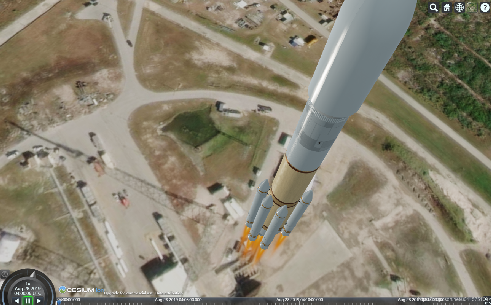
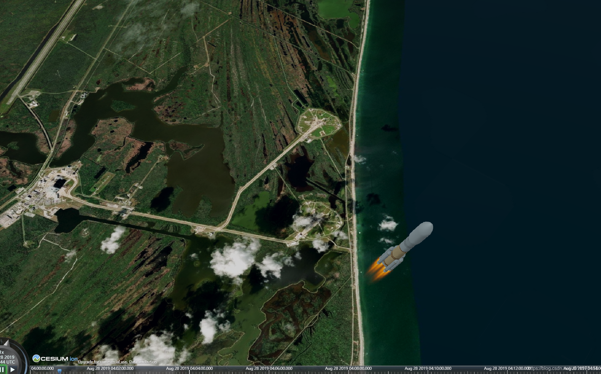
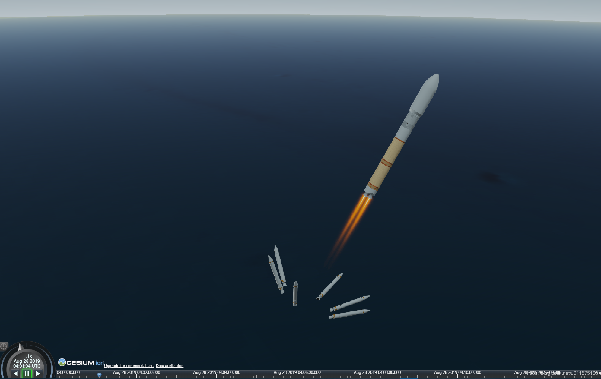
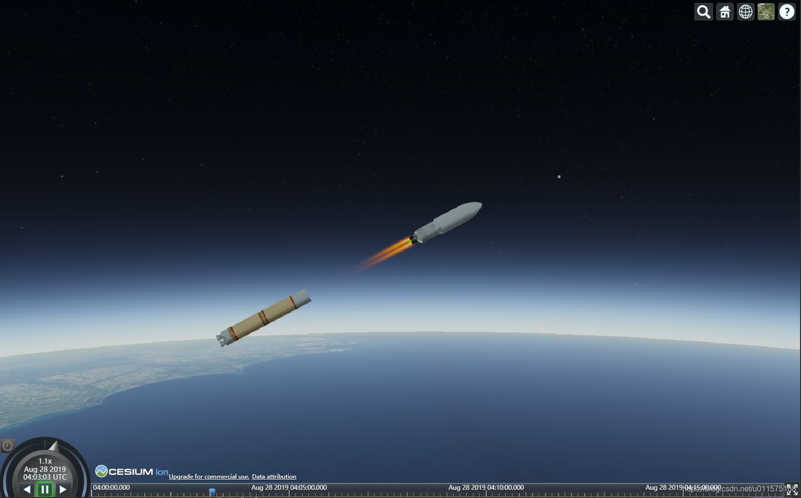
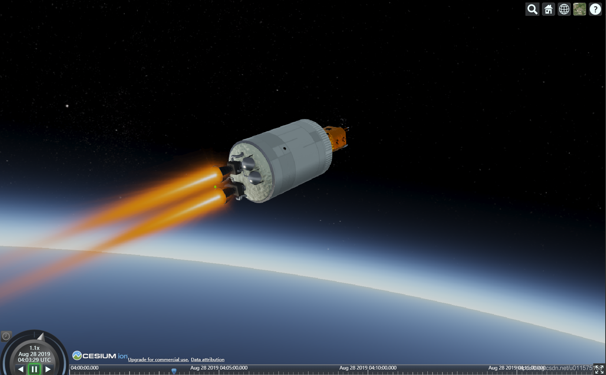
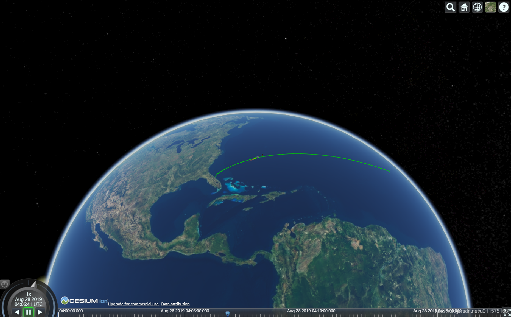

# 基于Cesium的火箭发射演示

@[TOC](基于Cesium的火箭发射演示)
好久没有更新博客了，惭愧！

借助于Cesium，可以开发出网页版本的火箭飞行演示系统。下面是我个人网站上做的以美国ULA未来“火神“”火箭为模型的全过程飞行演示。
[基于Cesium的火箭飞行过程演示](http://astrox.cn:8070/lyf/VulcanRocket/VulcanLaunch.html)

所涉及到的相关信息有：
 1. 火箭的发射弹道是我自己计算的，也可以利用STK软件生成，数据为地固系下的位置、速度；记住，一定要在地固系下，因为Cesium中所有的数据都是在地球固连系下（WGS84系）表示的；
 2. 火箭模型直接引用Cesium的网站模型库（http://assets.agi.com/models/launchvehicle.glb），大家如果把最后的"launchvehicle"替换成其它模型的名字即可，当然你要知道名字，呵呵；
 3. 诸如火焰、助推器分离、一二级分离是通过关节定义的，这个在launchvehicle.glb里已经存在了，所以我们在自己做gltf格式的模型时需要考虑是否具备关节动画演示功能；我在本地机器测试时关节动画都是显示的，好像放到网站上就不行了？？
 4. 地球的影像层是加载Cesium默认的；
 
 目前仅仅展示了最基本的飞行轨迹、各级分离动作。若想要展示效果更好，可在页面上增加飞行高度、速度等参数的即时显示！
 

