# 基于GeoServer的WMS（Web Map Service）的发布

假如我们通过地图下载软件（例如BigMap）下载了google街道图，缩放级别2级（其他级别也可以），地图格式为.tiff格式，那么如何通过GeoServer自建Web GIS服务，将此地图以WMS格式发布，从而供浏览器调用？
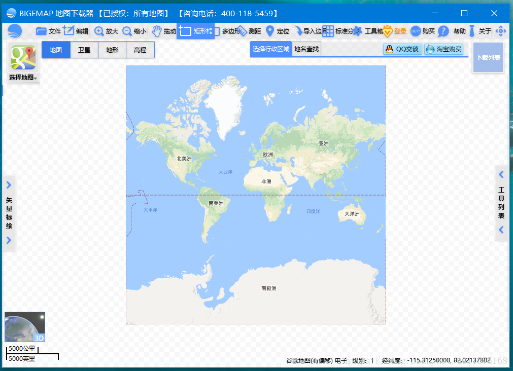
下面阐述具体的过程。

## 添加新的工作区
工作区就相当于文件夹，主要用来管理我们以后添加的各种图层，特别是当你的图层越来越多时，工作区很有必要。
点击“工作区”，然后点击“添加新的工作区”。
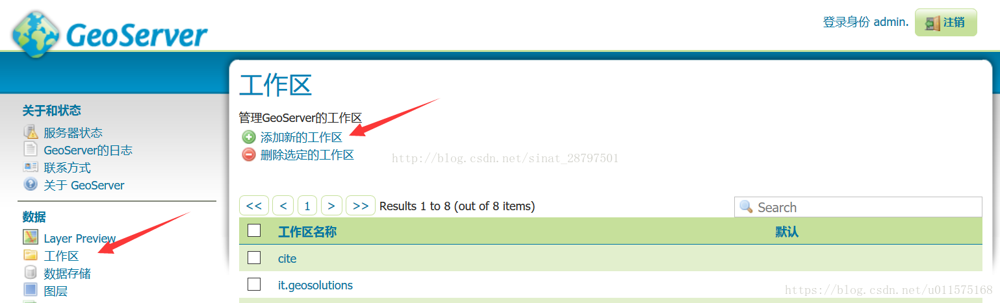
填写“Name”、”命名空间URI“(这个名称随便填写，我也不知道有啥用处)，以及选择是否是“默认工作区”。 如果原意使用系统默认的工作空间，就不用建立了。
名称最好都为英文，避免出现不必要的错误。
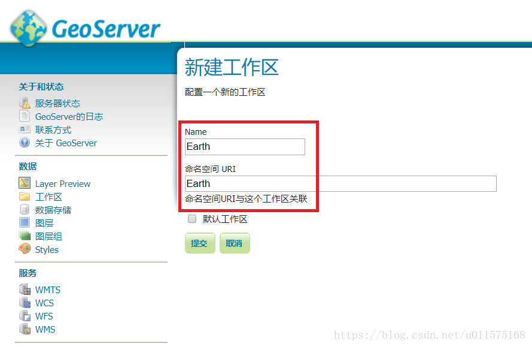

## 添加数据存储
添加数据存储也就是添加我们需要发布的地图资源。
依次点击“数据存储”-“添加新的数据存储”
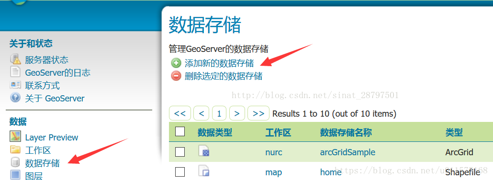
可以看到数据源包括很多，主要有两类
 1. 矢量数据源（Vector Data Sources），也称要素数据，常用的为ShapeFile格式
 2. 栅格数据源（Raster Data Sources），常用的为Geotiff格式。
矢量数据和栅格数据是GIS里数据源最重要两种方式，具体可参考GIS相关资料。
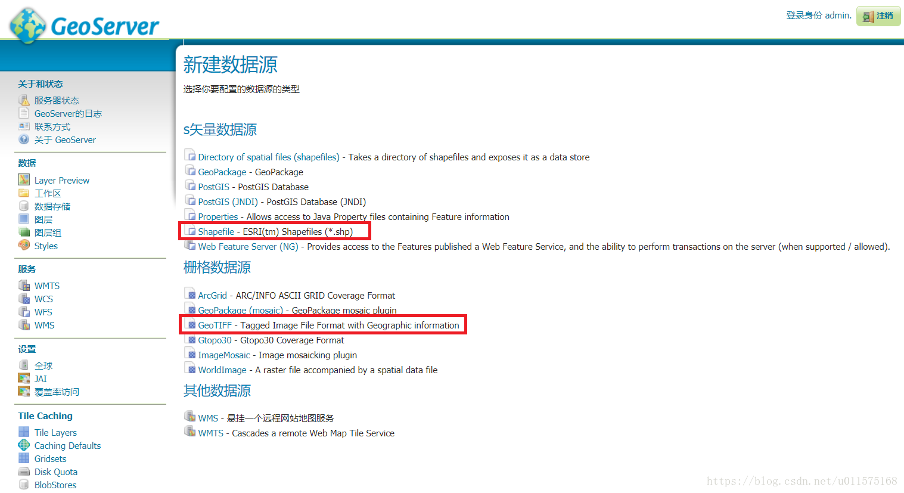
这里我们选择GeoTIFF，把我们需要发布的带有地理坐标的TIFF格式的图片加载进来即可。
添加栅格数据源时，
 1. 选择我们的数据放在哪个工作区（如刚才我们新建的工作区Earth）
 2. 给数据源起个名字
 3. 添加说明
 4. 添加数据，点击“浏览”，在弹出的窗口中，默认显示的是GeoServer默认目录下的数据，可通过“数据目录”下拉框，将ggStr_L2.tif文件添加进来。
 5. 保存
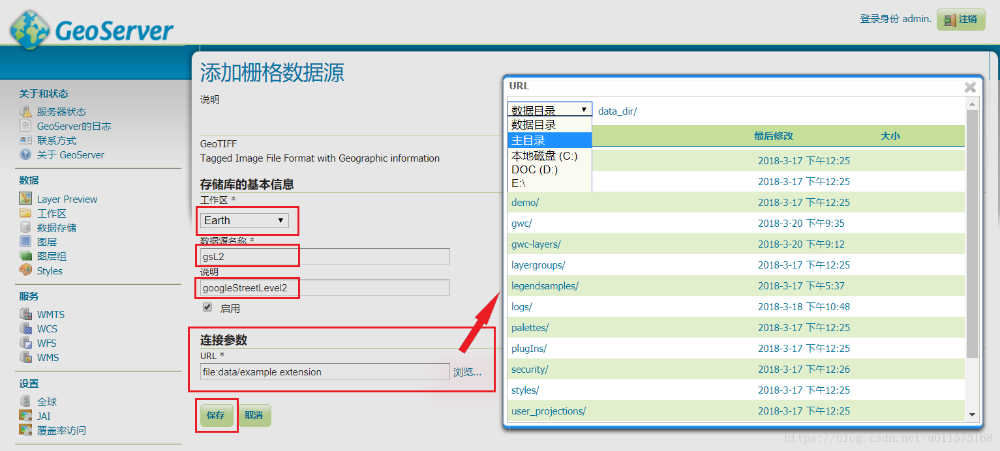

## 图层的发布
在上步添加数据源并保存后，则会默认新建一个图层，即图层的发布，点击“发布”即可。
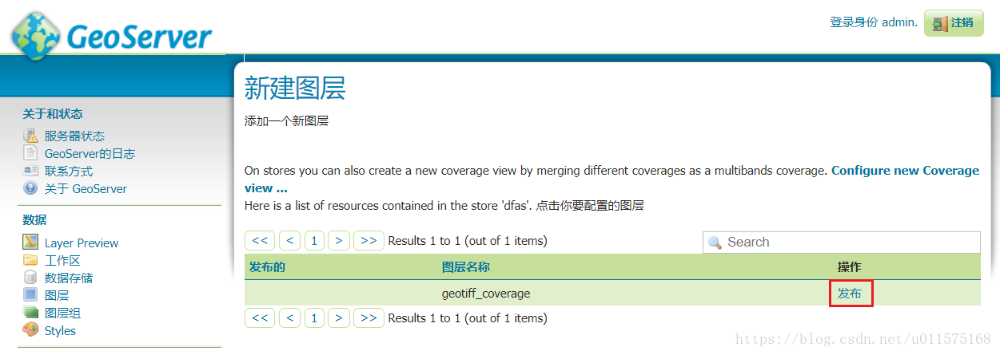
图层发布后转到编辑图层界面。主要有四个标签页：数据、发布、维度、Tile Caching。
这里仅编辑“数据”页面，其它暂时不改变。修改图层发布的默认参数：命名、标题，然后拖到后拖到页面最下面，点击“保存”。
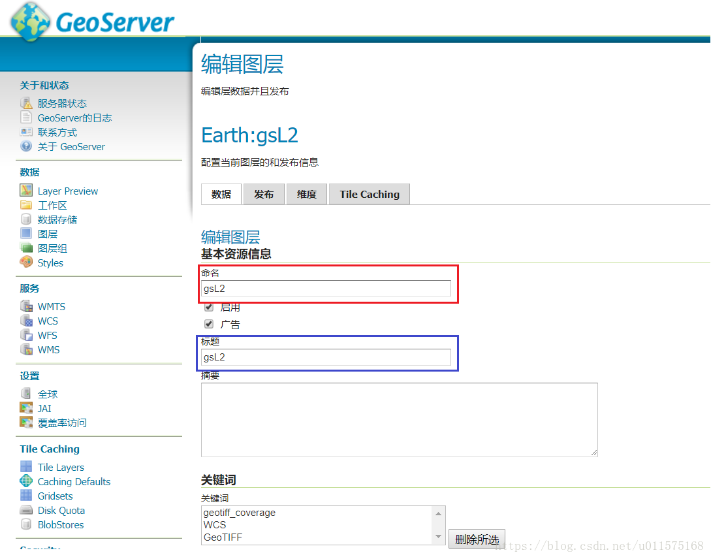

## 图层列表
所有已发布的图层可以在图层列表中可以看到。点击“图层”即可打开目前所有发布的图层，见下图。刚才我们发布的图层gsL2也在其中。注意“Title”、“图层名称”、“存储”列的显示名称与之前我们设置的名称之间的关系。
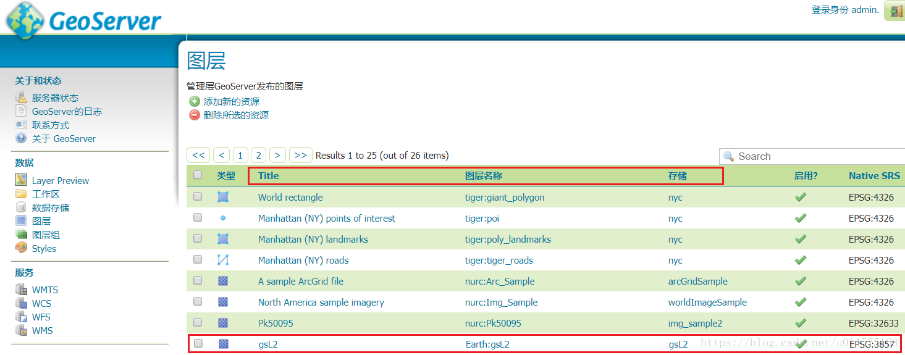

## 图层预览
至此，图层已发布，基于GeoServer的WMS服务已可以使用。
GeoServer软件本身提供图层预览服务，点击“Layer Preview”即可看到所有图层。
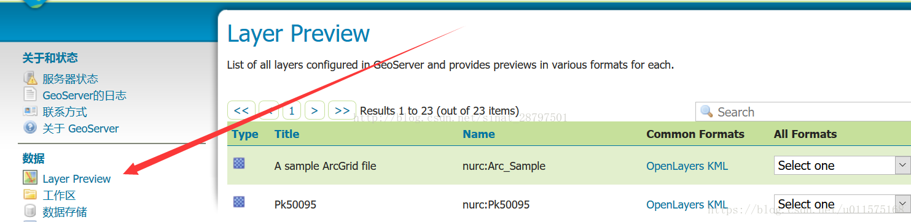
点击所要预览图层的“openlayers”，即可在浏览器中看到实际的图层发布效果。
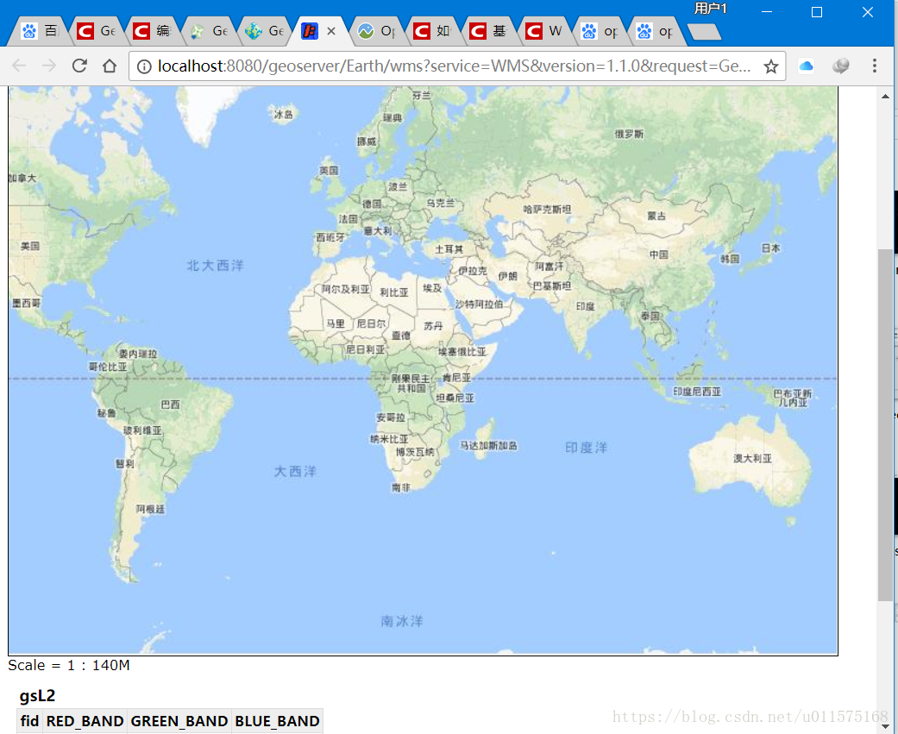
我们可以看到在浏览器地址栏中的具体地址：
http://localhost:8080/geoserver/Earth/wms?service=WMS&version=1.1.0&request=GetMap&layers=Earth:gsL2&styles=&bbox=-2.0037508342789E7,-2.003750834278895E7,2.003750834278944E7,2.0037508342789494E7&width=768&height=768&srs=EPSG:3857&format=application/openlayers
上述链接就可以作为各种客户端向GeoServer请求WMS服务的地址参考，这个问题后面再说。

参考：

 1. [如何使用GeoServer发布WMS服务](https://blog.csdn.net/sinat_28797501/article/details/69668701)
 2. [GeoServer入门](https://www.cnblogs.com/w-wanglei/p/6557581.html)
