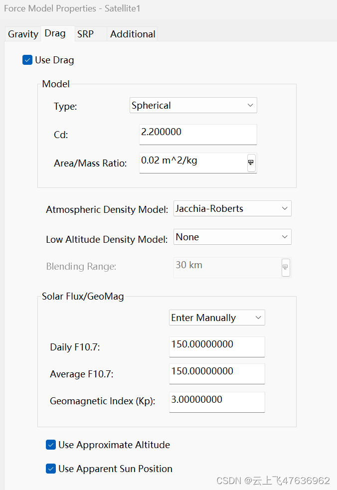
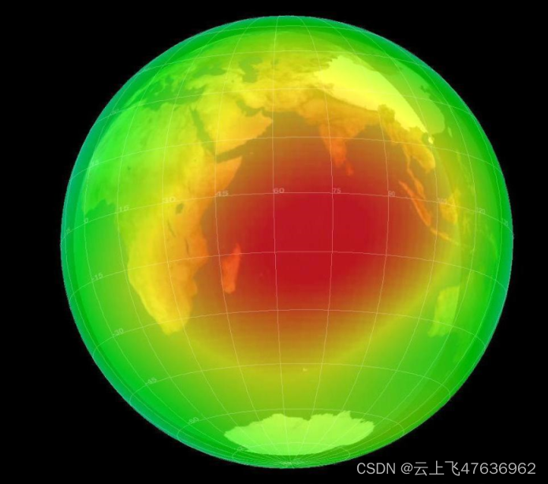
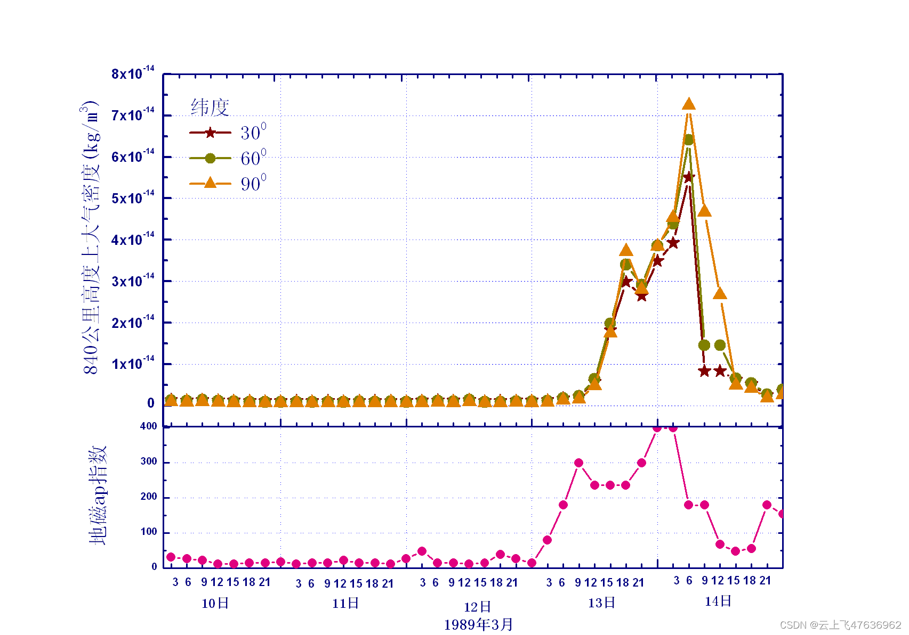
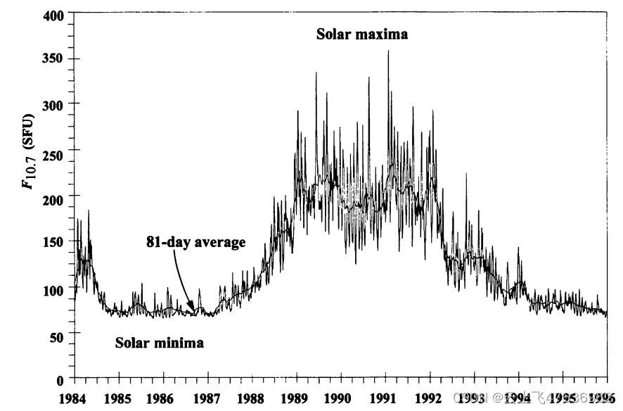
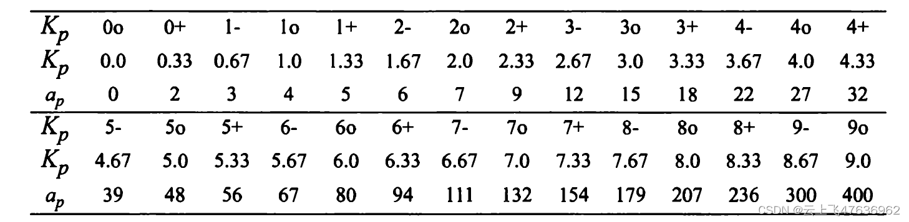
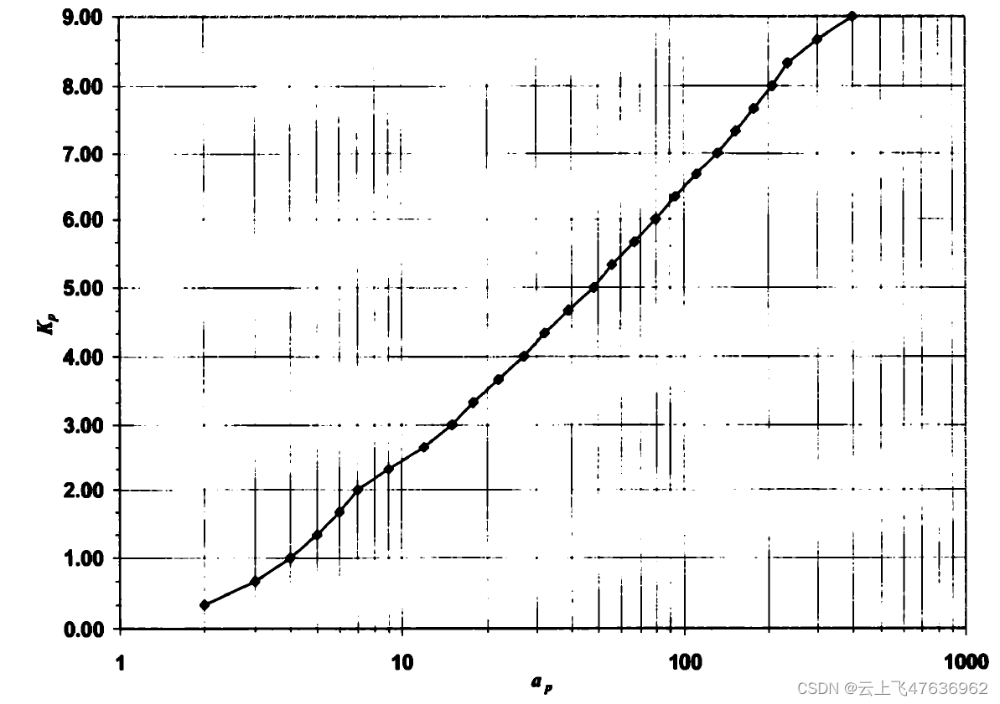
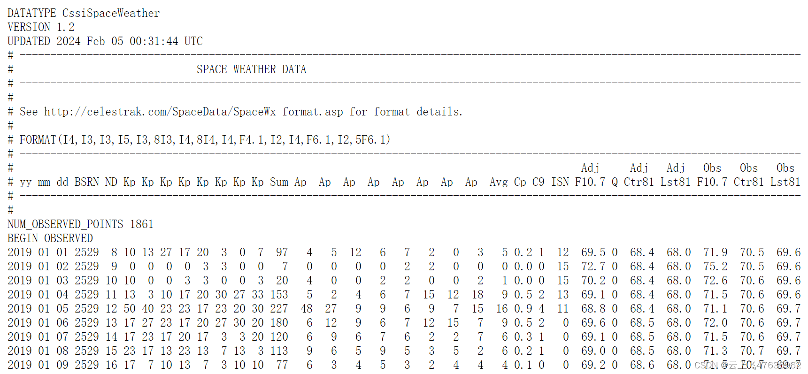
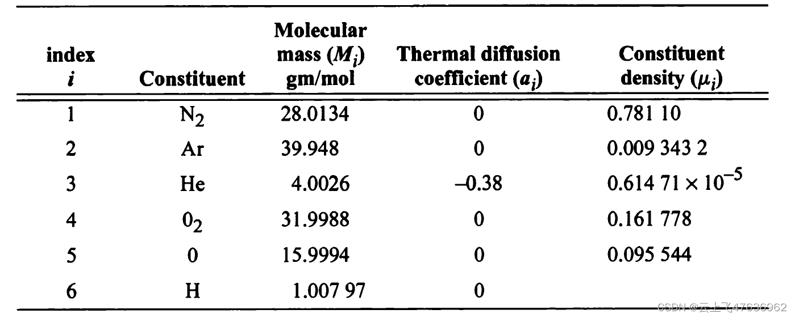
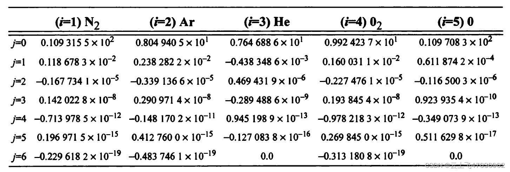

# 大气密度模型:Jacchia-Robert

@[TOC](大气密度模型：Jacchia-Robert)

在使用STK进行卫星轨道计算时，采用高精度轨道积分器（HPOP）会涉及到大气阻力的设置，见下图，其中大气密度模型缺省选择的为Jacchia-Robert。其中涉及到的参数有：
- Cd：大气阻力系数$C_D$
- Aere/Mass Ratio：卫星的面值比$A/m$
- Atmoshpheic Density Model：大气密度模型(缺省为:Jacchia-Robert)
- Daily F10.7：太阳辐射通量$F10.7$
- Average F10.7：81天平均太阳辐射通量$\bar{F}10.7$
- Geomagnetic Index(Kp)：行星3小时地磁指数Kp

本文介绍在轨道力学中常用的大气密度模型:Jacchia-Robert，主要用于地球卫星的大气阻力计算。

注意！！本文不讨论125km以下的大气密度，这个是飞机、高超滑行飞行器需要考虑的范畴。
## 大气阻力公式
在近地轨道（300km-2000km），地球大气的阻力不容忽视，尤其对于500km高度以下的卫星，阻力作用明显。大气阻力对卫星产生一个阻力的作用，阻力公式为：
$$
\vec{F}_{drag}=-\frac{1}{2}\rho(\frac{C_DA}{m})V_r\vec{V}_r
$$
其中：
$\rho$：卫星所在位置处的大气密度
$A/m$：即卫星的面质比系数，即卫星的迎风面积和质量的比值
$C_D$：大气阻力系数。（一般取2.2）
$\vec{V}_r$：卫星在地心惯性系中相对大气的速度

对于大气密度而言，虽然上面仅仅是一个参数，但是却与许多参数有关。

## 大气密度概述
最简单，也最容易计算的大气密度模型为静止大气模型，即考虑地球为一圆球体，大气密度随着高度呈指数衰减。大气密度仅仅与高度相关，与地固系下具体位置无关，也与太阳辐射和地磁通量无关。

显然，静止大气模型容易计算，但是却与实际情形不符合。对于近地轨道，地球大气密度与太阳辐射和地磁通量密切相关，从而导致地球上空每个地方的密度都不相同，且随着时间的变化而变化，见下图。

简单来说，大气密度与大气温度密切相关，而大气温度主要受到太阳辐射和地磁活动影响（称之为空间环境扰动），从而造成地球上空每个地方的温度都不一样！！

空间环境扰动可以引起大气密度的剧烈变化，若大气密度在短时间内快速上升，卫星受到的大气阻力也会突然增加，从而加快卫星轨道的衰减。比如，美国“哥伦比亚”号航天飞机在1981年4月12日飞行时，遇到一次剧烈的空间环境扰动事件，陡增的大气密度导致该航天飞机下降到较低轨道的时间比预期快了60%。

再比如1989年3月份的“卡林顿事件”中，空间环境的剧烈扰动引起大气密度急剧增加，使840km高度的大气密度增加了9倍。大气密度的剧增引起了美国的太阳峰年卫星（SMM）在整个事件期间的运行高度下降了5km，从而提前陨落。

假定T时刻，卫星在地固系下的位置为$\vec{r}_{sat}$，那么卫星所在位置的大气密度主要受到以下几点影响：

- 太阳辐射对大气的温度影响（$F10.7$参数和$\bar{F}10.7$参数，）
- 地磁辐射对大气的温度影响（Kp指数）
- T时刻太阳的位置（$\vec{r}_{sun}$）

因此，计算给定位置$\vec{r}_{sat}$处的大气密度时，需要的参数为：$F10.7$、$\bar{F}10.7$、Kp，以及具体计算大气密度的模型。

下面首先介绍太阳和地磁辐射参数，然后详细介绍Jacchia-Robert的大气密度模型
## 太阳辐射通量(F10.7）
太阳活动是影响大气的主要因素，常见的太阳活动指数包括太阳黑子数SSN及10.7厘米射电辐射通量F10.7。

太阳黑子，是人们最早观测到的太阳活动现象。1843年，德国天文爱好者施瓦布通过日常观测发现了太阳黑子数量的多少存在11年左右的周期。之后，随着观测数据的增加，这一规律不断被证实，并且人们发现黑子数的多少与这个时期的太阳活跃程度相对应。于是，太阳黑子数的这种规律变化成为人们划分太阳活动周期的标志，黑子数量的高峰年称为太阳活动峰年，黑子数最少年称为太阳活动低年，两次低年之间定为一个太阳活动周。

 除了太阳黑子数之外，人们还发现了另一种能代表太阳活动周变化的参量—10.7cm射电流量（F10.7）。
 
太阳向宇宙空间发射（太阳高层大气的辐射）的电磁波中，波长从毫米到十米不等，其中，10.7cm波长(2800MHz)属于极紫外辐射。地球高层大气吸收太阳极紫外辐射，吸收能量的20%~30%用来加热高层大气。

**定义10.7cm波长的射电辐射通量的大小为太阳辐射通量指数，也称F107指数（常用F10.7表示**）。F10.7的单位为"太阳通量单位"(SFU)，具体数值为:
$$1SFU=10^{-22}W/m^2/Hz$$
从长期的监测中人们发现，F10.7和太阳黑子数有很强的相关性，F10.7值的大小也能很好地代表太阳活动的强弱，并且由于F10.7在地面就可以监测获取，长久以来在许多重要的电离层和中高层大气模型中，**通常都是以F10.7作为输入来表征太阳活动的水平**。因此，无论是过去、现在，还是未来，F10.7监测在太阳活动预报和研究中都将具有举足轻重的地位。
 
 F10.7指数的范围在60到300之间，中国气象标准规定了太阳活动水平的分级， 按F107指数对太阳活动水平进行划分如下：
等级     | F10.7数值
-------- | -----
很低|$-80$
低  | $80-100$
中  | $100-150$
高  | $150-200$
很高 | $200-$

F107指数分为两种，一种是每天的观测值$F10.7$，另一种是81天（3个太阳自转周期）的平均值$\bar{F}10.7$，见下图。

## 地磁指数（kp或Ap）
地磁扰动会引起大气离子化，从而引起大气密度的变化。

全球范围内有12个站实时监测地磁的变化，并以相对安静时的磁场作为参考，对地磁观测的三个分量中在水平两分量扰动的平均值，每三小时给出地磁扰动强度的指数，称为三小时磁情指数$a_p$(**3-hourly index**)。$a_p$的单位为2纳特（nT)。
$$1nT = 10^{-9}Tesla$$
把一天分为8个时间段,每段三小时，每段都有一个指数$a_p$，一天8个数值，取其平均值则得到$A_p$，称为日行星振幅(daily planetary amplitude)。

$a_p$或$A_p$数值范围为0-400，数值越大，地磁扰动越强，一般大于100就很少见，常见的数值在10-20左右。

与$a_p$数值相对应的是行星指数$K_p$(planetary index)，它与$a_p$为准对数关系，且一一对应，因此$K_p$也是3小时一个数值，数值范围0-9，越大表示地磁活动越强。

以$K_p$的数值对地磁暴的等级进行分类如下：
磁暴等级     | $K_p$数值
-------- | -----
平静|$0-2$
扰动  | $2-3$
活跃  | $3-4$
小磁暴  | $4-5$
大磁暴 | $5-6.5$
严重磁暴 |6.5-9

$a_p$和$K_p$的关系如下表。

两者对应的关系如下图，以对数方式画出。

地磁指数$a_p$和$K_p$的相互转换可以使用3次多项式进行插值，此处不再详述。

## 太阳和地磁指数的数据获取与计算

太阳通量指数$F10.7$和$\bar{F}10.7$，以及地磁指数$a_p$（$A_p)$和$K_p$在网上可以查询到每天的数据，本文给出几个来源:

- [空间环境预报中心-SEPC](http://www.sepc.ac.cn/)
- [NOAA，美国国家大气和海洋管理局](https://www.ngdc.noaa.gov/stp/spaceweather.html)
- [Celestrak网站](https://celestrak.org/SpaceData/)

其中，Celestrak网站上给出的数据包含了上述几个指数，包括3小时指数和日平均指数，数据格式见下图。

计算时，需要根据当前时刻T根据给定的数据得到$F10.7、\bar{F}10.7、K_p$，等参数。

也可以简化，取常数：
$$F10.7=\bar{F}10.7=150.0\\
K_p=3.0$$

STK默认的大气密度设置中，上述三个参数就是这几个常数。
## Jacchia-Robert大气密度模型

Jacchia-Roberts大气密度模型是一种用于描述大气层密度分布的数学模型。该模型由意大利科学家J. M. Jacchia和美国科学家L. G. Roberts在20世纪60年代开发。

Jacchia-Roberts模型旨在提供大气层密度的近似值，以便用于空间科学和工程应用中，例如卫星轨道预测、再入飞行器设计等。该模型基于大量的大气观测数据，并利用统计方法来拟合这些观测数据，以获得对大气密度的预测。

Jacchia-Roberts模型考虑了多种影响大气密度的因素，包括太阳活动、地球磁场、大气成分等。它将大气层分为多个不同的层次，并使用复杂的数学公式来描述每个层次的密度分布。模型的输入参数包括高度、纬度、经度、时间等。

需要注意的是，Jacchia-Roberts模型是一种经验模型，它的准确性可能会受到多种因素的影响，例如地理位置、季节变化、太阳活动等。因此，在具体的应用中，可能需要根据实际情况进行调整或采用其他更精确的模型。

总而言之，Jacchia-Roberts大气密度模型是一种常用的近似模型，用于估计大气层密度分布，特别适用于空间科学和工程领域的应用。

大气密度模型计算的思路为：外层大气温度受太阳辐射和地磁活动的影响并且存在周日变化，首先求出外层大气温度，再利用静态模式求出各大气成分的数密度，对求出的数密度加以地磁、季节纬度项和半年项改正，并最终求出大气密度值，具体过程如下：
### 基本参数
令T时刻，地固系下，卫星的位置$\vec{r}_{sat}=(r_I,r_J,r_K)^T$,太阳的单位位置矢量$\vec{r}_{sun}=(r_x,r_y,r_z)^T$。

那么卫星的大地纬度（近似公式，没有迭代求解）为：
$$\phi_{gd}=tan^{-1}\left(\frac1{(1-f)^2}\left[\frac{r_K}{\sqrt{r^2_{I}+r^2_J}}\right]\right)$$
太阳的纬度为：
$$\delta_s=tan^{-1}\left(\frac{r_z}{\sqrt{r^2_{x}+r^2_y}}\right)$$
太阳的相对时角$LHA_s$（此处单位为度）为：
$$
LHA_s=\frac{180°}{\pi}\left(\frac{r_xr_J-r_yr_I}{|r_xr_J-r_yr_I|}cos^{-1}\left(\frac{r_xr_I+r_yr_J}{\sqrt{r^2_x+r^2_y}\sqrt{r^2_I+r^2_J}}\right)\right)
$$
卫星的大地高度$h$的计算，需要考虑地球椭球体，具体计算公式可以为精确的，也可以近似计算，此处不再给出，注意，在后面的计算中，大地高度$h$的单位为km。

后面需要用到的其它常数为：
$$
T_0=183° \\
R_{pole}=6356.766km\\
g_0 =9.80665 \\
R = 8.31432\\
A =6.022045×10^{23}\\
\epsilon=23.439291°=0.4090928
$$
### 大气温度
夜间全球外层温度，$T_c$
$$T_c(K) = 379+3.24\bar{F}_{10.7}+1.3[F_{10.7}-\bar{F}_{10.7}]$$
由此得到未修正的外层大气温度$T_{unc}$
$$T_{unc}=T_c\left(1+0.3\left[sin^{2.2}(\theta)+(cos^{2.2}(\eta)-sin^{2.2}(\theta))cos^3\left(\frac{\tau}{2}\right)\right]\right)$$
上式中:
$$
\eta=\frac{|\phi_{gd}-\delta_s|}{2}\\
\theta=\frac{|\phi_{gd}+\delta_s|}{2}\\
\tau=LHA_s-37°+6.0°sin(LHA_s+43.0°)
$$
注意，在计算$\tau$时，三角函数为度，需要转换为弧度，另外得到$\tau$后也需要转换为弧度，才能带入$T_{unc}$中计算。

考虑地磁指数$k_p$对温度的修正
$$
\Delta T_{corr}=\begin{cases}
28.0°k_p+0.03e^{k_p}, & h\geq200km \\
14.0°k_p+0.02e^{k_p}, & h<200km
\end{cases}
$$
从而得到修正的外层温度$T_{corr}$：
$$
T_{corr}=T_{unc}+\Delta T_{corr} \tag{1}
$$
临界点温度$T_x$为:
$$
T_x=371.6678°+0.0518806T_{corr}-294.3505°e^{-0.00216222T_{corr}} \tag{2}
$$
令$T_0=183°$。则125km高度以下的温度为
$$
T(h)_{0-125}=T_x+\frac{T_x-T_0}{35^4}\sum_{n=0}^4C_nh^n \tag{3}
$$
上式中的系数为:
$$
C_0=-89284375.0; C_1=3542400.0; C_2=-52687.5\\
C_3=340.5;C_4=-0.8
$$
125km高度以上的温度为（Robert修正）:
$$
T(h)_{125-}=T_{corr}-(T_{corr}-T_x)e^{-\left(\frac{T_x-T_0}{T_{corr}-T_x}\right)\left(\frac{h-125}{35}\right)\left(\frac l{R_{pole}+h}\right)} \tag{4}
$$
上式中，系数$l$为多项式的和
$$
l=\sum_{j=0}^4l_jT^j_{corr} \tag{5}
$$
系数为:
$$
l_0=0.1031445×10^5\\
l_1=0.2341230×10^1\\
l_2=0.1579202×10^{-2}\\
l_3=-0.1252487×10^{-5}\\
l_4=0.2462708×10^{-9}\\
$$
### 大气密度
首先考虑几项对大气密度的修正。
#### 地磁修正
高度200km以下($h<200km)$时，考虑地磁的修正为：
$$
(\Delta log_{10}\rho)_G=0.012k_p+1.2×10^{-5}e^{k_p}
$$
#### 季节纬度变化
首先计算自1958年1月1日零时到当前时刻的累计天数（假设都使用TAI时间计算），并可得到累计的世纪数：
$$T_{1958}=\frac{JD_T-JD_{1958}}{365.2422}
$$
$JD_{1958}$对应的儒略日为2436204.5。

则季节纬度变化的修正为：

$$
(\Delta log_{10}\rho)_{LT}=0.014(h-90)sin(2\pi T_{1958}+1.72)sin(\phi_{gd})|sin(\phi_{gd})|e^{-0.0013(h-90)^2}
$$
#### 半年变化
令
$$
\tau_{SA}=T_{1958}+0.09544\left([0.5+0.5sin(2\pi T_{1958}+6.035)]^{1.65}-0.5\right)
$$
则半年变化的修正为：
$$
(\Delta log_{10}\rho)_{SA}=(5.876×10^{-7}h^{2.331}+0.06328)e^{-0.002868h}\\
×\left(0.02835+[0.3817+0.17829sin(2\pi \tau_{SA}+4.137) ]sin(4\pi \tau_{SA}+4.259)\right)
$$

#### 密度公式
上述三项的修正总和为：
$$
(\Delta log_{10}\rho)_{corr}=(\Delta log_{10}\rho)_G+(\Delta log_{10}\rho)_{LT}+(\Delta log_{10}\rho)_{SA}
$$
Robert(1971)注意到大气密度在90km-125km变化比较剧烈，因此他将大气密度分为三个段,不同高度对应的大气密度(单位:$kg/m^3$)为：
$$
\rho (h)=
\begin{cases}
\rho (h)_{90-100}×1000×10^{(\Delta log_{10}\rho)_{corr}}, & 90km<h\leq100km\\
\rho (h)_{100-125}×1000×10^{(\Delta log_{10}\rho)_{corr}}, & 100km< h\leq125km\\
\rho (h)_{125-}×1000×10^{(\Delta log_{10}\rho)_{corr}}, & 125km<h
\end{cases}
$$
上式中，乘以1000是因为原来的公式中大气密度的单位为$g/cm^3$。

由于卫星轨道一般不可能低于125km，所以本文只给出125km以上的大气密度，即上式中的$\rho (h)_{125-}$。
#### 125km以上密度:$\rho (h)_{125-}$
大气密度是由6种气体分子的密度单独计算的，六种气体分子的相关参数见下表。

后面公式中，需要使用到上表中的参数$M_i$和$a_i$。

首先给出各分子在125km高度处的密度$\rho_i(125)$（注意，这里$i$取值为1-5，氢气H分子暂未包含，后面单独计算）。
$$
\rho_i(125)=\frac{M_i}A10^{\sum^6_{j=0} \delta_{ij}T^j_{corr}}\tag{6}
$$
系数$\delta_{ij}$由下表给出。

并令各分子的$\gamma_i$系数为：
$$
\gamma_i=\frac{M_ig_0R^2_{pole}}{RlT_{corr}}\left(\frac{T_{corr}-T_x}{T_x-T_0}\right)\left(\frac{35}{6481.766}\right)
$$
其中，$l$的取值参见公式(5)，其余常数参见"基本参数"章节。

则最终的大气密度由6种气体分子的密度相加而成，其中前5种的和为：
$$
\rho_{1-5} (h)_{125-}=\sum_{i=1}^5\rho_i(125)\left(\frac{T_x}{T(h)}\right)^{1+a_i +\gamma_i}\left(\frac{T_{corr}-T(h)}{T_{corr}-T_x}\right)^{\gamma_i} \tag{7}
$$
上式中，对于第3种气体He的密度$\rho_3(125)$有修正，修正公式如下：
$$
(\Delta log_{10}\rho)_{He}=0.65\left|\frac{\delta_s}{\epsilon}\right|\left[sin^3\left(\frac{\pi}{4}-\frac{\phi_{gd}\delta_s}{2|\delta_s|}\right)-0.35355\right]
$$
则修正后的$\rho_3(125)$为：
$$
\rho_3(125)=\rho_3(125)×10^{(\Delta log_{10}\rho)_{He}}
$$
第6种气体分子H密度$\rho_6(h)$为(仅在500km以上高度才考虑）：
$$
\rho_6 (h)_{500-}=\rho_H(500)\left(\frac{T_{500}}{T(h)}\right)^{1+\gamma_H}\left(\frac{T_{corr}-T(h)}{T_{corr}-T_{500}}\right)^{\gamma_H} \tag{7}
$$
上式中，$T_{500}$表示在500km高度的温度，有(4)式给出，另外$\rho_H(500)$为500km高度的H分子的密度，由下式给出:
$$
\rho_H(500)=\frac{M_H}A10^{[73.13-(39.4-5.5log_{10}T_{500})(log_{10}T_{500})]}
$$
因此，最终6种气体分子的密度总和为：
$$
\rho (h)_{125-}=\rho_{1-5} (h)_{125-}+\rho_6 (h)_{500-} \tag{8}
$$

因此，最终Jacchia-Robert的大气密度模型由上式给出（本文仅给出125km高度以上的公式），注意，当高度大于2500km以上时，可直接令大气密度为0，即2500km以上高度认为无大气。
## 算例
- 时间：2017-01-01 00:00:00 UTC
- 大地纬度：45 deg
- 大地经度：0 deg
- $F10.7$:  100
- $\bar{F}$: 100
- $Kp$:  4

则不同大地高度的大气密度如下：

大地高度(km)     | 大气密度(kg/m^3)
-------- | -----
125.1 | 1.5899e-8
300 | 1.3061e-11
700 | 1.3480e-14
1500 | 4.0058e-16
## 参考

- [卫星在轨寿命浅谈](http://blog.sepc.ac.cn/?p=6647)
- [空间环境预报的基石——太阳活动监测](http://blog.sepc.ac.cn/?p=8096)
- [地磁活动指数与太阳活动指数](https://zhuanlan.zhihu.com/p/90120012)
- Julia源码: [SatelliteToolboxAtmosphericModels.jl](https://github.com/JuliaSpace/SatelliteToolboxAtmosphericModels.jl)
- "Fundamentals of Astrodynamics and Applications", 3rd Edition, David A. Vallado; Appendix B
- [Geosat卫星定轨中的大气阻力摄动](http://center.shao.ac.cn/twtnk/n16/n16-12.pdf)
- [NOAA Kp和ap指数下载](https://www.ngdc.noaa.gov/stp/GEOMAG/kp_ap.html)
