# 月球地形数据介绍（LOLA）

@[TOC](月球地形数据介绍)
本文介绍LRO探测器所获取到的月球地形数据（通过LOLA载荷），包括地形数据的基础知识、LOLA数据产品以及针对全球和两级区域所采用的两种投影系的详细说明。

## 地形栅格数据
在详细介绍前，首先简要阐述下地形数据的基础知识。

月球地形DEM（Digital Elevation Model）栅格数据是用于表示月球（或其他星体）表面高程信息的数字化模型。它通过离散化月球表面，并将其划分为一系列网格单元（像素），每个像素包含一个高程值，用于表示相应地点的海拔高度。

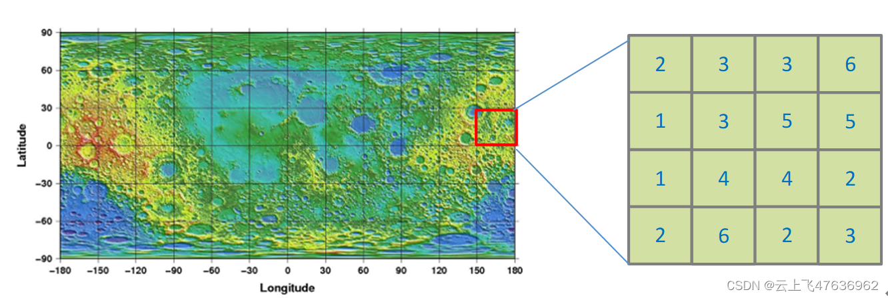
DEM栅格数据通常以栅格形式存储（即类似二维图像，只不过一般图像为RGB三个通道，而DEM仅高程一个通道），其中每个栅格单元代表一个地理区域的特定大小（例如30米×30米）。每个栅格单元的高程值可以通过测量、遥感技术或其他地形数据源获取。

DEM数据广泛应用于地理信息系统（GIS）、地形分析、水文模拟、环境建模、地质研究等领域。通过分析DEM数据，可以提取地表的坡度、坡向、流域分割、地形剖面等地形特征，为地理空间分析和决策提供有关地形的详细信息。
栅格数据可以使用多种格式进行存储和交换。以下是几种常见的栅格数据格式的介绍：

- GeoTIFF（Geographic Tagged Image File Format）：GeoTIFF是一种常用的地理信息系统（GIS）栅格数据格式。它是基于标准的TIFF（Tagged Image File Format）格式扩展而来，通过添加地理元数据和地理坐标系统信息，使得栅格数据可以与地理空间位置相关联。GeoTIFF支持单波段和多波段数据，可以存储高程数据、遥感影像等。
- ASCII Grid格式：ASCII Grid是一种简单的文本格式，用于存储栅格数据。它以纯文本形式表示栅格数据的每个像素值，可以方便地在不同软件和平台之间进行交换和共享。ASCII Grid格式适用于小型栅格数据集，但对于大型数据集来说，文件大小可能会很大。
- USGS DEM格式：USGS DEM是美国地质调查局（USGS）开发的一种常见的高程数据格式。它以二进制格式存储，包含高程数据、投影信息、地理坐标系统等。USGS DEM格式广泛用于美国境内的地形数据。
- SRTM HGT格式：SRTM（Shuttle Radar Topography Mission）是由NASA进行的一个全球范围的高程数据获取项目。SRTM HGT格式是用于存储SRTM数据的一种格式，以二进制形式存储高程数据。每个文件覆盖一个特定区域的高程数据，以文件名中的经度和纬度表示。

以上介绍的只是栅格数据格式的一小部分，还有其他格式如ENVI、GeoPackage、BIL等也被广泛使用。选择适当的格式取决于数据的特点、使用的软件和应用需求。

## LOLA介绍
目前最新的月球地形高程数据来源于美国2009年发射的LRO探测器。

“月球勘测轨道器”(Lunar Reconnaissance Orbiter，LRO)是NASA“机器人月球探测计划”的首个探测器，于2009年6月18日用宇宙神-5运载火箭发射。任务目标是绘制月球特征和月球资源网，用于未来月球前哨站的设计和建造。此外探测器还进行安全着陆地点的选择、月球资源的鉴别、月球辐射对人类的影响研究以及新技术验证等，探测器由NASA戈达德航天飞行中心(GSFC)研制，整个项目耗资约4.91亿美元，其中发射成本为1.36亿美元。

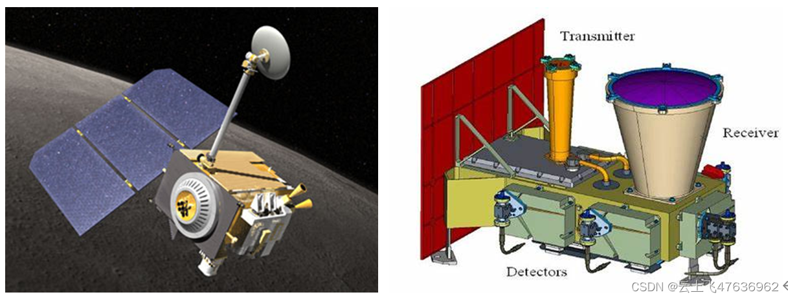
LRO任务中搭载的"月球轨道激光高度计"LOLA（Lunar Orbiter Laser Altimeter）的主要目标是测量月球表面的高度和地形。它通过发射激光脉冲并测量脉冲返回的时间来确定激光束到达月球表面和返回的时间差，从而计算出地面的高度。

下面是LOLA的一些特点和功能：

 1. 测量精度：LOLA的测量精度非常高，可以测量月球表面的高度差异至少为10厘米。这使得LOLA成为研究月球地形和地貌的重要工具。
 2. 数据分辨率：LOLA的数据分辨率为约5米，这意味着它可以提供非常详细的月球地形数据。
 3. 应用领域：LOLA的测量数据经过严格的校准和验证，以确保其准确性和可靠性。这些数据被广泛应用于研究月球的地质演化、撞击坑形成、地壳构造等问题。它还为未来的月球探测任务提供了重要的地形和地貌信息。
 
地形数据通常以栅格形式存储（即通常的栅格数据），其中每个栅格单元（对应一个经纬度）都包含一个高程值。这些高程值可以用来创建三维地形模型，使科学家和研究人员能够对月球表面进行可视化和分析。

## LOLA数据的处理与发布
LOLA地形数据的处理与发布主要为以下几个流程：

- 数据预处理：LOLA获取的原始数据可能需要进行预处理，包括数据格式转换、噪声去除、校准和地理定位等操作。这些步骤旨在提高数据质量和可用性。

- 数据处理和分析：经过预处理的LOLA数据可以进行进一步的处理和分析，以获得特定的科学或地理信息。例如，可以进行地形高程模型的生成、重力场分析、地质特征提取等。

- 数据产品生成：处理完的LOLA数据可以生成各种数据产品，如高程图、重力场模型、地质特征图等。这些产品通常以标准格式（如GeoTIFF、ASCII）或特定的数据格式（如PDS）发布。

- 数据发布和共享：LOLA数据和相关的数据产品可以通过研究机构的网站、数据中心或专门的数据共享平台进行发布和共享。这些平台通常提供数据下载、搜索和浏览功能，以方便用户访问和使用数据。

- 数据文档和元数据：LOLA数据的处理和发布通常伴随着相应的数据文档和元数据的生成。这些文档包括数据集的描述、数据处理方法、坐标系统、单位等信息，以帮助用户理解和正确使用数据。

## 数据类型和格式
在NASA的PDS系统中可以查询与下载相关的LOLA数据，数据类型主要包含以下几种：

1）EDR：实验数据记录（Experiment Data Record），即原始数据。
2）RDR：减少数据记录（Reduced Data Record），即经过校准和地理定位的数据。
3）GDR：网格数据记录（Gridded Data Record），即以网格点形式呈现的栅格数据。

对于大部分常规用户来说使用的为GDR数据。在网站上，通常提供IMG和JP2两种格式的数据供用户下载。

- IMG：GDR产品中使用的文件格式，代表标准的PDS图像存档格式，是一种包含16位有符号整数（数值范围:-32,768到32,767）的简单二进制数组，没有头部、压缩或其他特殊格式。每个IMG文件都有一个相同名称但扩展名为.LBL的PDS标签文件来描述该文件（.LBL文件是文本文件）。
- JP2：GDR产品中使用的文件格式，代表JPEG2000文件，为了方便与常用的地图制作软件工具配合使用。可以在JP2INFO.TXT中了解更多关于这种格式的信息。JP2文件也有PDS标签。
AUX.XML：每个JPEG2000产品都附带一个名为[product]PPD_AUX.XML（用于圆柱投影）或[product]MPP_AUX.XML（用于极地投影）的文件。这个非常简短的XML文件包含某些地图程序（如ArcGIS、GDAL和Global Mapper）用于显示图像的信息。必须将其下载到工作目录并重命名为[product]PPD.JP2.AUX.XML或[product]MPP.JP2.AUX.XML，以使软件能够识别该文件。

通过提供IMG格式，用户可以直接访问原始的16位有符号整数数据，并使用PDS标签了解数据的详细信息。而JP2格式则更适合在流行的地图软件工具中使用，因为JPEG2000格式在图像压缩和展示方面具有较好的性能和广泛的支持。因此，用户根据需要选择IMG或JP2格式的数据。
## 投影坐标系
在LOLA数据中，主要采用" simple cylindrical projection"（简单柱面投影）和" polar stereographic projection"（极方位立体投影）两种投影坐标系，在PDS数据中常简称为“cylindrical”和“polar”。其中，月球全球区域的地形数据一般采用“simple clylindrical projection”，月球南北极的地形数据采用“polar stereographic projection”，在下载数据的时候需要注意这两者的含义和区别。

### SIMPLE CYLINDRICAL
它是一种简化的柱面投影，也是常用的等距柱面投影（equidistant cylindrical projection）。在Simple Cylindrical投影中，地球或其他行星的经度和纬度坐标被映射到图像的x和y坐标上。在投影系中，经度线和纬度线是相互垂直，且间距相等的。对于全球范围而言，经度是纬度的2倍，因此对应的栅格数据的宽度（经度）是高度（纬度）的两倍，见下图。
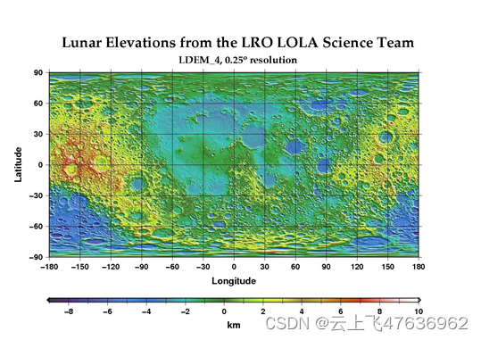
简单柱面投影的定义包括以下参数：
- 原点经度（Center Longitude）：确定投影的中央经度，通常选择行星表面的一个特定经度作为原点。
- 比例因子（Scale Factor）：用于控制地理坐标与图像坐标之间的比例关系，以确保地理位置在图像中的投影保持尺度一致。
- false_easting和false_northing：这些参数用于在x和y方向上对坐标进行平移，以确保投影后的图像在给定的图像坐标系中的位置

采用等经纬度投影系的GDR地形数据文件可以看成一个长宽比为2:1的二进制图像。每个栅格单元（或像素点）代表一个地理区域的特定尺寸，如0.25°×0.25°，对应的高程数值表示此区域的平均高度。每个栅格单元都具有一个相应的像素坐标，用于确定在图像中的具体位置。

像素坐标系用于描述二维图像中像素点的位置，其坐标原点在图像的左上角，U轴为横轴向右，V轴为纵轴垂直于U轴向下。在GDR地形数据中，U轴使用SAMPLE表示，V轴使用LINE表示。原点在左上角，横轴和纵轴坐标为整数，且从1开始，即左上角第一个像素的坐标为（1,1）。

投影坐标系原点位于图像的中心，对应的经纬度坐标为（180°,0°），X轴向右为正，表示经度，范围为（0°,360°）；Y轴向上为正，表示纬度，范围为（-90°,90°）。

注意，像素坐标系的坐标数值为整数，投影坐标系的坐标数值为实数。每一个栅格数据（像素）在投影坐标系下的位置为其栅格中心点的坐标。

像素坐标系和等经纬度投影坐标系的关系见下图。
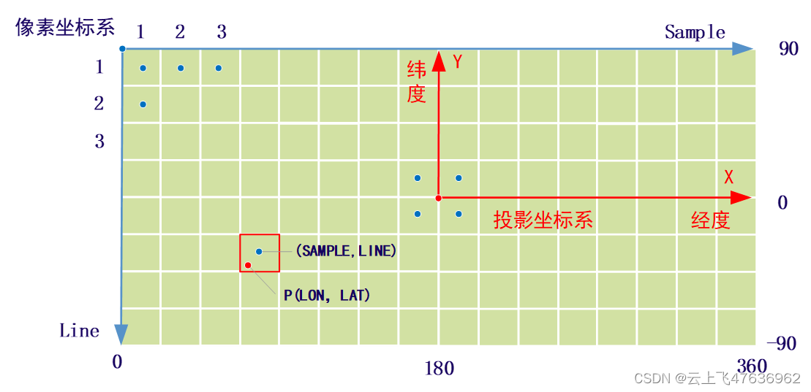
根据以上关系，我们可以给出像素坐标系和等经纬度投影坐标系之间的相互转换关系，也就是以下两个问题：
1)	已知像素坐标（SAMPLE，LINE），其对应的经纬度（LON，LAT）是多少？
2)	已知经纬度（LON，LAT），如何求解对应的像素坐标（SAMPLE，LINE）?

第1个问题中的像素坐标（SAMPLE，LINE）是指栅格区域中心点对应的经纬度。

第2个问题中，已知经纬度（例如图中的P点），那么获得的像素坐标是指包含P点的栅格区域对应的像素坐标（SAMPLE，LINE）；也就是说，只要P点在栅格区域内（图中红色框内部），那么无论P点数值如何变化，其对应的像素坐标始终是同一个。

下面给出像素坐标到经纬度的转化关系：

```bash
LON = CENTER_LONGITUDE + (SAMPLE-SAMPLE_PROJECTION_OFFSET - 1) / RES
LAT = CENTER_LATITUDE - (LINE - LINE_PROJECTION_OFFSET - 1) / RES
```
经纬度到像素坐标的转换公式如下：
```bash
SAMPLE = NINT(SAMPLE_PROJECTION_OFFSET+ RES * (LON - CENTER_LONGITUDE)) + 1
LINE = NINT(LINE_PROJECTION_OFFSET - RES * (LAT - CENTER_LATITUDE)) + 1
```
上式中，NINT表示四舍五入取整。RES的单位为：像素数/deg。

CENTER_LONGITUDE和CENTER_LATITUDE表示投影系原点对应的经度和纬度，GDR数据中，一般取值为180°和0°。

SAMPLE_PROJECTION_OFFSET和LINE_PROJECTION_OFFSET是指投影系原点相对左上角第1个栅格点（像素坐标为（1,1））的偏移，可为浮点数。

给定像素坐标（SAMPLE，LINE）后，即可从IMG（或JP2）文件中获取到对应的高程值（以DN表示）。注意获取到的高程值为16位整数值，还需要乘以缩放因子（SCALING_FACTOR），因此最终的实际高程（HEIGHT）为：

```bash
HEIGHT = DN * SCALING_FACTOR
```
对于GDR数据，SCALING_FACTOR为0.5，因此地形高度并不是连续的，最小间隔为0.5米。

以LDEM_4.IMG文件为例（其它文件参见下节），对应的附属标签文件LDEM_4.LBL文件中的部分内容如下。

```c
OBJECT                  = IMAGE
    NAME                  = HEIGHT
    DESCRIPTION           = "Each sample represents height relative to a
      reference radius (OFFSET) and is generated using geolocated LOLA data
      produced by the LOLA team."
    LINES                 = 720
    LINE_SAMPLES          = 1440
    MAXIMUM               = 21008
    MINIMUM               = -17758
    SAMPLE_TYPE           = LSB_INTEGER
    SAMPLE_BITS           = 16
    UNIT                  = METER
    SCALING_FACTOR        = 0.5
    OFFSET                = 1737400.
  END_OBJECT              = IMAGE
……
OBJECT                    = IMAGE_MAP_PROJECTION
 ^DATA_SET_MAP_PROJECTION     = "DSMAP.CAT"
 MAP_PROJECTION_TYPE          = "SIMPLE CYLINDRICAL"
 MAP_RESOLUTION               = 4 <pix/deg>
 A_AXIS_RADIUS                = 1737.4 <km>
 B_AXIS_RADIUS                = 1737.4 <km>
 C_AXIS_RADIUS                = 1737.4 <km>
 POSITIVE_LONGITUDE_DIRECTION = "EAST"
 CENTER_LATITUDE              = 0 <deg>
 CENTER_LONGITUDE             = 180 <deg>
 REFERENCE_LATITUDE           = 'N/A'
 REFERENCE_LONGITUDE          = 'N/A'
 LINE_FIRST_PIXEL             = 1
 LINE_LAST_PIXEL              = 720
 SAMPLE_FIRST_PIXEL           = 1
 SAMPLE_LAST_PIXEL            = 1440
 MAP_PROJECTION_ROTATION      = 0.0
 MAP_SCALE                    = 7580.84 <m/pix>
 MAXIMUM_LATITUDE             = 90 <deg>
 MINIMUM_LATITUDE             = -90 <deg>
 WESTERNMOST_LONGITUDE        = 0 <deg>
 EASTERNMOST_LONGITUDE        = 360 <deg>
 LINE_PROJECTION_OFFSET       = 359.5 <pix>
 SAMPLE_PROJECTION_OFFSET     = 719.5 <pix>
 COORDINATE_SYSTEM_TYPE       = "BODY-FIXED ROTATING"
 COORDINATE_SYSTEM_NAME       = "MEAN EARTH/POLAR AXIS OF DE421"
END_OBJECT                    = IMAGE_MAP_PROJECTION

```
从LBL文件中，我们可知LDEM_4.IMG数据尺寸大小为1440×720，即宽度为1440个像素，高为720个像素；由于经纬度是等间距的，所以，每个像素表示的范围为一个正方形，边长为0.25°×0.25°。

SAMPLE_PROJECTION_OFFSET为719.5，LINE_PROJECTION_OFFSET为359.5，表示投影系原点相对左上角第1个栅格点（1,1）的偏移值。

MAP_RESOLUTION即为公式中的RES，数值为4 pix/deg。

CENTER_LONGITUDE为180，CENTER_LATITUDE为0。

对于左上角的第1个栅格点，其像素坐标为（1,1），则其对应的经纬度数值为：

```bash
LON = 180 + (1 – 719.5 – 1)/4 = 0.125
LAT = 0 – (1- 359.5 -1)/4 = 89.875
```
反之，第1个栅格点对应的经度范围为（0,0.25）,纬度范围为（89.75,90），只要经纬度位于此范围，则求得的像素坐标均为（1,1,）。以LON=0.125,LAT=89.875为例，有：

```bash
SAMPLE = NINT(719.5+ 4 * (0.125 - 180)) + 1=1
LINE = NINT(359.5 - 4 * (89.875 - 0)) + 1=1
```
对于其它数据，如LDEM_256、LDEM_512等，从LBL文件查询的得到对应的SAMPLE_PROJECTION_OFFSET、LINE_PROJECTION_OFFSET等数值，带入转换公式即可。
### POLAR STEREOGRAPHIC
极方位立体投影（Polar Stereographic Projection）主要用于将地球或其他行星的极区域（北极或南极）投影到一个平面上。

极射影投影通过将地球表面的经纬线投影到以极点为中心的平面上，来实现对极区域的表示。在极射影投影中，极点是投影的中心，极线（经线）是从极点出发的线，而纬线则变成从极点出发的弧线。
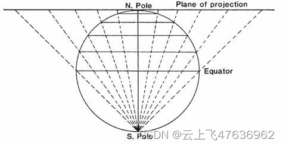
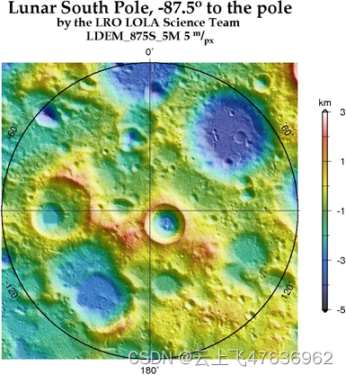
极射影投影的定义包括以下参数：
- 中央经度（Central Meridian）：确定投影的中央经度，通常选择极区域的一个特定经度作为中央经度。
- 纬度原点（Latitude of Origin）：确定投影的纬度原点，即极点所对应的纬度。
- 比例因子（Scale Factor）：用于控制地理坐标与投影坐标之间的比例关系，以确保地理位置在投影中的尺度一致。
- false_easting和false_northing：这些参数用于在x和y方向上对坐标进行平移，以确保投影后的图像在给定的图像坐标系中的位置。

极射影投影在极区域附近具有较小的形变，并且能够保持极点附近的角度和形状。然而，随着距离极点的增加，形变逐渐增大。

采用极方位立体投影系的GDR地形数据文件可以看成一个长宽比为1:1的二进制图像。每个栅格单元（或像素点）代表一个地理区域的特定尺寸，如5m×5m，对应的高程数值表示此栅格单元区域的平均高度。每个栅格单元都具有一个相应的像素坐标，用于确定在图像中的具体位置。

投影坐标系原点位于图像的中心，对应的纬度坐标为90°（北极点）或-90°（南极点），X轴向右为正，指向90°经度方向；Y轴指向0°经度方向（地球方向）为正；对于北极点投影，Y轴指向下方为正；而对于南极点投影，Y轴指向上方为正，因此在下面的公式转换中需要注意。
同样，像素坐标系的坐标数值为整数，投影坐标系的坐标数值为实数。每一个栅格数据（像素）在投影坐标系下的位置为其栅格中心点的坐标。

像素坐标系和投影坐标系的关系见下图。
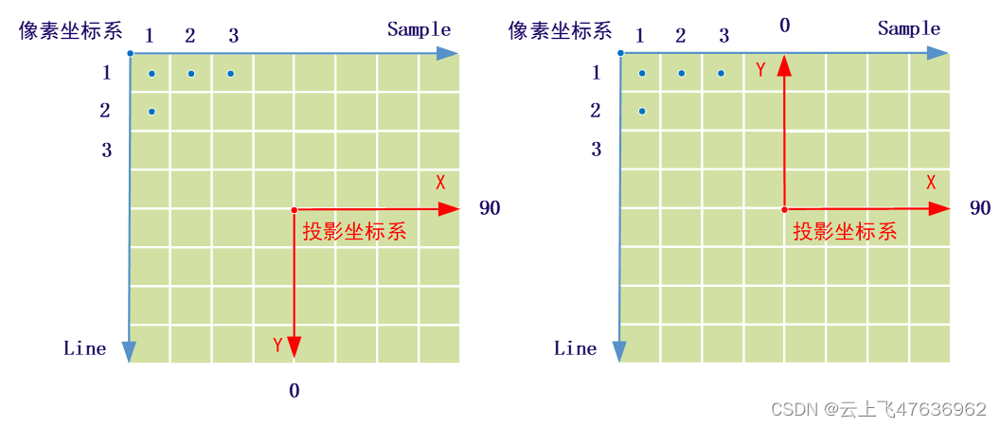
根据以上关系，我们可以给出像素坐标系和极方位立体投影坐标系之间的相互转换关系，也就是以下两个问题：
1)	已知像素坐标（SAMPLE，LINE），其对应的经纬度（LON，LAT）是多少？
2)	已知经纬度（LON，LAT），如何求解对应的像素坐标（SAMPLE，LINE）?

与等经纬度投影系有所不同的是，像素坐标系与经纬度之间的转换需要多一步转换，即首先像素坐标与投影坐标之间的转换，然后是投影坐标和经纬度之间的转换。

第1个问题中的像素坐标（SAMPLE，LINE）是指栅格区域中心点对应的经纬度。

下面给出像素坐标到经纬度的转化关系：

```bash
X = (I - N/2 - 0.5)*MAP_SCALE
Y = (J - N/2 - 0.5)*MAP_SCALE*NS
R = SQRT(X^2 + Y^2)
LON = ATAN2(Y,X) * 180/PI
LAT = 90 - 180/PI * 2*ATAN(0.5 * R/1737400) (北极)
LAT = -90 + 180/PI * 2*ATAN(0.5 * R/1737400) (南极)
```
经纬度到像素坐标的转换公式如下：

```bash
R = 2*1737400*TAN((90-ABS(LAT)) * PI/360) 
X = R*SIN(LON*PI/180)
Y = R*COS(LON*PI/180)
I = NINT(X/MAP_SCALE + N/2 + 0.5)
J = NINT(NS*Y/MAP_SCALE + N/2 + 0.5)
```
上式中，NINT表示四舍五入取整。MAP_SCALE的单位为：米/pix。

NS=1（北极点），NS=-1（南极点）。

N为横轴SAMPLE（或纵轴LINE）的总像素数。

经纬度（LON，LAT）的单位为度，X,Y的单位为米。

I=SAMPLE，J=LINE。

给定像素坐标（SAMPLE，LINE）后，即可从IMG（或JP2）文件中获取到对应的高程数据（以DN表示）。同样，获取到的高程值为16位整数值，还需要乘以缩放因子（SCALING_FACTOR），因此最终的实际高程（HEIGHT）为：

```bash
HEIGHT = DN * SCALING_FACTOR
```
对于GDR数据，SCALING_FACTOR为0.5，因此地形高度并不是连续的，最小间隔为0.5米。

以LDEM_875S_5M.IMG文件为例，对应的附属标签文件LDEM_875S_5M.LBL文件中的部分内容如下。
```bash
 LINE_SAMPLES          = 30336
    DERIVED_MINIMUM       = -8760
    DERIVED_MAXIMUM       = 4744
    SAMPLE_TYPE           = LSB_INTEGER
    SAMPLE_BITS           = 16
    UNIT                  = METER
    SCALING_FACTOR        = 0.5
    OFFSET                = 1737400.
  END_OBJECT              = IMAGE
END_OBJECT                = UNCOMPRESSED_FILE
OBJECT                    = IMAGE_MAP_PROJECTION
 ^DATA_SET_MAP_PROJECTION     = "DSMAP_POLAR.CAT"
 MAP_PROJECTION_TYPE          = "POLAR STEREOGRAPHIC"
 KEYWORD_LATITUDE_TYPE        = "PLANETOCENTRIC"
 MAP_RESOLUTION               = 6064.67 <pix/deg>
 A_AXIS_RADIUS                = 1737.4 <km>
 B_AXIS_RADIUS                = 1737.4 <km>
 C_AXIS_RADIUS                = 1737.4 <km>
CENTER_LATITUDE              = -90 <deg>
 CENTER_LONGITUDE             = 0 <deg>
LINE_FIRST_PIXEL             = 1
 LINE_LAST_PIXEL              = 30336
 SAMPLE_FIRST_PIXEL           = 1
 SAMPLE_LAST_PIXEL            = 30336
 MAP_PROJECTION_ROTATION      = 0.0
 MAP_SCALE                    = 5 <m/pix>
 MAXIMUM_LATITUDE             = -87.5 <deg>
 MINIMUM_LATITUDE             = -90 <deg>
 WESTERNMOST_LONGITUDE        = 'N/A'
 EASTERNMOST_LONGITUDE        = 'N/A'
 LINE_PROJECTION_OFFSET       = 15167.5 <pix>
 SAMPLE_PROJECTION_OFFSET     = 15167.5 <pix>
 COORDINATE_SYSTEM_TYPE       = "BODY-FIXED ROTATING"
 COORDINATE_SYSTEM_NAME       = "MEAN EARTH/POLAR AXIS OF DE421"
END_OBJECT                    = IMAGE_MAP_PROJECTION
```
从LBL文件中，我们可知LDEM_875S_5M.IMG数据尺寸大小为30336×30336，即宽度和高度均为30336个像素；每个像素表示的范围为一个正方形，边长为5m×5m。

SAMPLE_PROJECTION_OFFSET和LINE_PROJECTION_OFFSET均为15167.5，表示投影系原点相对左上角第1个栅格点（1,1）的偏移值。

MAP_SCALE数值为5 m/pix。

CENTER_LONGITUDE为0，CENTER_LATITUDE为-90°，表示为南极点投影。

##  LOLA数据产品
前面介绍过，LOLA的地形数据形式有多种EDR、RDR、GDR等，对于大多数使用者来说，应使用已经矫正过的栅格形式的地形数据：GDR。

GDR的数据格式有两种存储格式，一种是未压缩的IMG格式，还有一种是压缩的JP2格式，对于同一个地形数据，两种格式的文件存储的高程信息都是一样的，根据具体的使用工具和需求决定。GDR数据文件为二进制格式，每个高程数据由16位整数表示，高度缩放因子为0.5米，表示相对于月球半径的动态范围为±16 km。

在PDS存储系统中，GDR产品根据具体的地理范围而使用不同的投影坐标系，下面分别给出。
###	全球区域
投影系为Equirectangular map projection（等经纬度地图投影），也是常说的Simple Cylindrical（简单柱面投影）。

GDR全球区域的数据集（产品集）见下表，数据名称规则为：LDEM_<filespecs>。<filespecs>表示为每纬度的像素数。
|GDR产品|	数据大小|	分辨率（/像素）|	范围|
|--|--|--|--|
|LDEM_4|	2 MB|	7.5808 km|	全球，经度0-360°;纬度-90-90|
|LDEM_16|	32 MB|	1.895 km|	全球，经度0-360°;纬度-90-90|
|LDEM_64|	512 MB|	0.4738 km|	全球，经度0-360°;纬度-90-90|
|LDEM_128|	2 GB|	0.2369 km|	全球，经度0-360°;纬度-90-90|
|LDEM_256|	4×2GB|	118.45 m|	经度0:180:360；纬度-90:0:90|
|LDEM_512|	16×2GB|	59.225 m|	经度0:90:180:270:360；纬度-90:-45:0:45:90|
|LDEM_1024|	144×900 MB|	29.612 m|	经度0:30:60…:330:360；纬度-90:-75:…-15:0:15:…75:90|

上表中，LDEM_4表示，每度包含4个像素，因此类推。对于LDM_256及以上数据而言，单个数据文件大小不超过2GB，并分多幅数据进行存储，并按照经纬度均匀分割。例如“LDEM_512_00N_45N_180_360.IMG”表示每纬度方向为512个像素，纬度范围为0°-45°和经度范围180°-360°围成的矩形区域。

下图为全球区域数据所采用的投影系（Equirectangular map projection）及数据分割表示。在等经纬度地图投影中，经度和纬度是等间距的。
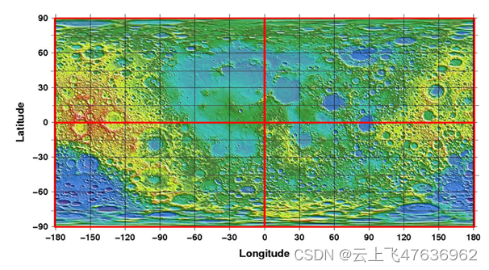
具体数据可访问网站查看：

https://pds-geosciences.wustl.edu/lro/lro-l-lola-3-rdr-v1/lrolol_1xxx/BROWSE/lola_gdr/CYLINDRICAL.html。

###	两级区域
投影系为Polar stereographic projections （极方位立体投影）。

GDR两级区域的数据集（产品集）见下表，数据名称规则为：LDEM_<filespecs>。<filespecs>表示为每像素表示的长度（米）。数据产品覆盖的范围分别从南北纬45°往两级区域，区域越小，则每像素表示的长度越小，表示的地形精度则越高。

|GDR产品|	数据尺寸（像素）|	分辨率（m/像素）|	范围|
|--|--|--|--|
|LDEM_45S_100M|	28800×28800|	100×100|	    +/-45° to pole|
|LDEM_60S_60M|	31040×31040|	60×60|	+/-60° to pole|
|LDEM_75S_30M|	30496×30496|	30×30|	+/-75° to pole|
|LDEM_80S_20M|	30400×30400|	20×20|	+/-80° to pole|
|LDEM_85S_10M|	30336×30336|	10×10|	+/-85° to pole|
|LDEM_875S_5M|	30336×30336|	5×5|	+/-87.5° to pole|

注意，上表中产品名称仅列出南极（以S代替）区域，北极类似，名称改为N即可。上表中，LDEM_45S_100M表示每像素4米长度，45S表示南极-45°以上区域，因此类推。

对于极方位立体投影，数据尺寸为正方形，极点（南极点或北极点）是由四个中心像素包围的一个点。

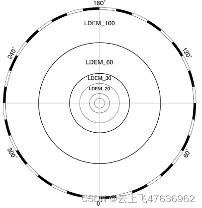
具体数据可访问网站查看：

https://pds-geosciences.wustl.edu/lro/lro-l-lola-3-rdr-v1/lrolol_1xxx/BROWSE/lola_gdr/South_pole.html。

## 数据下载与浏览
LOLA数据可通过PDS网站下载，其中GDR数据可通过以下两种方式获取：
1. 列表方式或ftp方式
https://pds-geosciences.wustl.edu/lro/lro-l-lola-3-rdr-v1/lrolol_1xxx/DATA/LOLA_GDR
列表或ftp方式直接以文件夹方式将所有的数据显示出来，用户根据需要点击进去响应的目录。数据类型包含JP2、IMG、Float等格式。
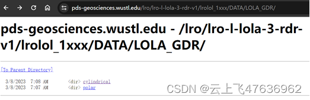
2.	网页浏览方式
https://pds-geosciences.wustl.edu/lro/lro-l-lola-3-rdr-v1/lrolol_1xxx/BROWSE/LOLA_GDR/
网页方式可以浏览地形的预览图，并根据不同的精度选择下载对应格式的数据。下图给出了南极（“极方位立体投影”）的地形数据，对于-87.5°以上的范围，分别给出了5mpp、10mpp和20m三种分辨率，对应的数据格式有JP2和IMG两种（包含对应的LBL文件）。
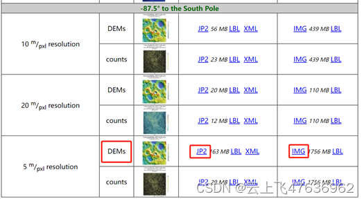
注意，以上两种下载方式的数据源都是同一个数据。每一个GDR数据都提供不同分辨率，分辨率越大，则数据量越大。


