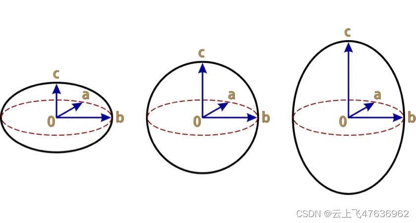
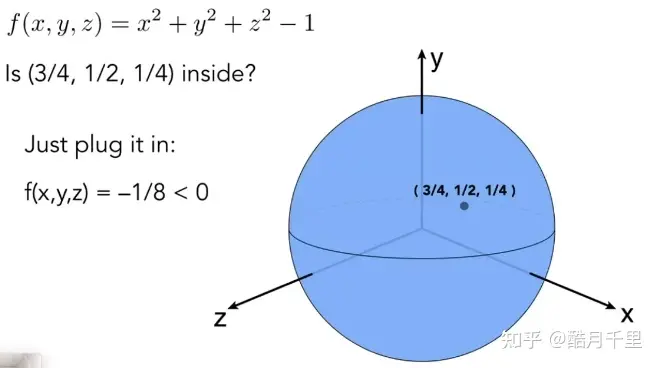
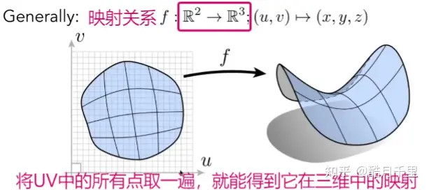
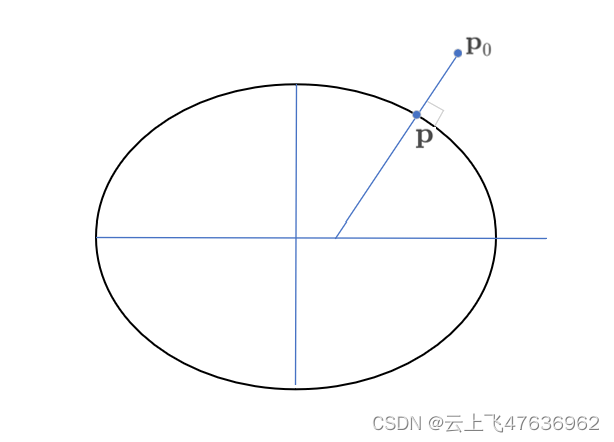

# 椭球面系列---基本性质

在STK软件和Cesium中，地球表面的形状是一个椭球面，而不是球面，因此许多相关计算(如表面的弧长、大地经纬度和笛卡尔坐标之间的转换等）都必须依赖椭球面的几何性质。

最近在看有关椭球面(在表示时有时也称椭球体)计算的相关代码，还是有必要整理一下，待后续参考，今天为系列一：基本性质。
## 定义

椭球面(Ellipsoid)是一个在三维空间中的曲面，它由所有满足以下方程的点 (x, y, z) 组成：
$$
\frac{x^2}{a^2} + \frac{y^2}{b^2} + \frac{z^2}{c^2} = 1
$$
其中，a、b 和 c 是实数，分别代表椭球体沿着三个坐标轴的半轴长度。如果 a = b = c，则椭球体就是一个球体。椭球体的基本性质包括:

1. 对称性：椭球体关于三个坐标平面（xy平面，yz平面和xz平面）以及通过中心的三个坐标轴都是对称的。
2. 中心点：椭球体有一个唯一的中心点 (0, 0, 0)，在这一点，椭球体的所有对称性都交汇。
3. 轴线：椭球体有三个互相垂直的轴线，分别是x轴、y轴和z轴，它们通过椭球体的中心。椭球体在这三个轴线上的长度分别是 2a、2b 和 2c。
4. 体积：椭球体的体积是由以下公式给出的：
$$
V = \frac{4}{3}\pi abc
$$
5. 表面积：椭球体的表面积没有简单的封闭形式，但它可以通过椭圆积分来近似或精确计算。对于特殊情况，比如当椭球体是一个球体时，表面积为 $4πr^2$，其中 r 是半径。

6. 焦点：对于任意的椭球体，其每一个主切面（x=0，y=0或z=0平面内的椭圆）都有一对焦点。对于旋转椭球体（两个半轴相等，如 a = b），在z轴上的焦点之间的距离为 $2√(a^2 - c^2)$。

7. 椭球面上的点：可以通过参数方程使用三个角度参数来表述椭球面上的点。
## 基本假设
在后续的讨论中，为了简化方便，无论是椭球体还是点、直线等表达，都有：
1. 椭球体的中心点为笛卡尔坐标系原点(0,0,0)。如果椭球体一开始不在坐标系中心，则需要经过平移和旋转，最后化为标准方程。
2. 椭球体为旋转椭球体，即a=b。笛卡尔坐标系的X轴和Y轴的半轴长度为a或b，Z轴方向的半轴长度为c。
3. XY平面称为赤道平面，Z轴一般称为极轴。因此$a$为赤道半长轴，$c$称为极半长轴。
4. 涉及到的点、矢量、直线等都表示在以椭球体中心为原点的笛卡尔坐标系中。

下图为三种基本**旋转**椭球体：

 - 左图: 扁球体(Oblate spheroid)，即$a=b>c$。
 - 中图: 圆球体(Sphere)，即$a=b=c$。
 - 右图: 长轴旋转椭球体(Prolate spheroid），即$a=b<c$。

后续过程文档中，使用以下基础的旋转椭球体参数：

- 扁率: $f=(a-c)/a$
- 第3扁率: $n=(a-c)/(a+c)=f/(2-f)$
- 偏心率: $e^2=(a^2-c^2)/a^2$
- 第2偏心率: $e'^2=(a^2-c^2)/c^2=e^2/(1-e^2)$

地球的形状为扁球体($a=b>c$)，其参数(WGS84模型)为：
- 赤道半长轴$a$: 6378137m
- 极半长轴$b$: 6356752.3142451793m
- 扁率: $f=1/298.257223563$

## 基本性质

## 曲面方程的隐式与显示表达方式
**- 隐式表达方式：**
告诉你空间中的点满足特定的关系，而不是告诉你点具体在哪。例如，三维球面上的任意一点都满足 ：$F(x,y,z)=x^2+y^2+z^2-1=0$
 。只要找到所有的x,y,z满足F(x,y,z)=0，就能将图像画出来。

缺点：很难去描述复杂的物体。仅根据表达式F(x,y,z)很难直接看出来是是什么样子，面上都有哪些点也不容易知道，面上采样起来比较困难（找到所有点），下面例子有。

优点：
1.通常表示出来很容易（例如用一个函数就能表示）。
2.做某些查询容易(判断在物体里面还是外面，计算到表面的距离等)。给你一个点，判断在里面还是外面是很简单的。将点代入F(x,y,z)，如果小于零在里面，大于零在外面，等于零在面上。
3.很容易对光线与表面求交。

**-显式Explicit**
典型一种方法的就是把每个点的位置都有明确的公式，自然就得到对象物体，这种方法直接给予。另一种方法是用参数映射的方法。

优点：采样很简单，将所有的UV代入就能得到所有的点了
缺点：给你一个点，判断在表面的里面还是外面是很困难了

## 点是否在椭球体面外、内、上
根据上节的知识，我们知道椭球面的方程是隐形表达的。给定三维空间中的点P，坐标为$(x,y,z)$，则带入椭球面方程：
$$
F(x,y,z)=\frac{x^2}{a^2} + \frac{y^2}{b^2} + \frac{z^2}{c^2} -1
$$
则有：
- $F(x,y,z)=0$，则点P在椭球面上。
- $F(x,y,z)<0$，则点P在椭球面内部。
- $F(x,y,z)>0$，则点P在椭球面外部。

实际计算时，判断一个点是否在椭球面上，考虑到计算误差，不能精确的判断是否为0，而是有个小的允许误差，即$|F(x,y,z)|<\varepsilon$，则点P在椭球面上。

## 椭球面的矩阵表示
根据椭球面定义，椭球面上任意一点P点$(x,y,z)$的坐标(采用$\mathbf{p}$表示)满足公式(1)。
定义对角矩阵$\mathbf{C}$：
$$
\mathbf{C}=
\left [ \begin{matrix}
1/a^2 & &\\
& 1/b^2 &\\
& & 1/c^2\\
\end{matrix} \right ]
$$
则逆矩阵$\mathbf{C}^{-1}$：
$$
\mathbf{C}^{-1}=
\left [ \begin{matrix}
a^2 & &\\
& b^2 &\\
& & c^2\\
\end{matrix} \right ]
$$
则公式(1)可以写为以下形式:
$$
\left [\begin{matrix}
x,y,z \end{matrix} \right].
\left [ \begin{matrix}
1/a^2 & &\\
& 1/b^2 &\\
& & 1/c^2\\
\end{matrix} \right ] .
\left [ \begin{matrix}
x\\y\\z\\\end{matrix} \right ]
=\mathbf{p}^T\mathbf{C}\mathbf{p}=1
$$

为了以后表达方便，**我们采用加粗字母表示矢量或者矩阵**。
## 椭球面法线
为了找到椭球面上某一点的法线，可以先找到该点的切平面。切平面是通过该点，并且与椭球面在该点处相切的平面。

椭球面在$P$点$(x,y,z)$的法线即为垂直于P点切平面的向量，在数学上，可以使用梯度向量来表示法线方向。梯度向量是椭球面方程的梯度，它指向函数在某一点的最大增长方向。可由以下公式给出：
$$
\mathbf{n}=∇F =\left [ \begin{matrix}
\frac{∂F}{∂x} \\
\frac{∂F}{∂y}\\
\frac{∂F}{∂z}\\
\end{matrix} \right ] =
\left [ \begin{matrix}
2x/a^2 \\
2y/b^2\\
2z/c^2\\
\end{matrix} \right ]
$$
我们知道，向量的方向是最重要的，大小可以不一致，单位化后都为同一个单位向量。若我们将法向量写成如下格式：
$$
\mathbf{n}=\left [ \begin{matrix}
n_x \\
n_y\\
n_z\\
\end{matrix} \right ]
=k\left [ \begin{matrix}
x/a^2 \\
y/b^2\\
z/c^2\\
\end{matrix} \right ]
$$
则有:
$$
a^2n_x^2+b^2n_y^2+c^2n_z^2=k^2(\frac{x^2}{a^2} + \frac{y^2}{b^2} + \frac{z^2}{c^2})=k^2
$$
也就是说，如果我们知道椭球面一点P的法向量$\mathbf{n}$，则可以通过上式得到$k$。
将上式写成矩阵表达方式，即k的求解由下式给出：
$$
\mathbf{n}^T\mathbf{C}^{-1}\mathbf{n}=k^2
$$
得到k的数值后，则$P$点的坐标$(x,y,z)$则可求出:
$$
\mathbf{p}=\left [ \begin{matrix}
x \\
y\\
z\\
\end{matrix} \right ]
=\frac1k\left [ \begin{matrix}
a^2n_x \\
b^2n_y\\
c^2n_z\\
\end{matrix} \right ]
=\frac1k\mathbf{C}^{-1}\mathbf{n}
$$

**至此，我们通过公式(8)和(9）,在已知椭球面的法向量$\mathbf{n}$的情况下，得到了具体的笛卡尔坐标$(x,y,z)$。**

## 球坐标与切平面
椭球面上的点除了采用笛卡尔坐标系外，常常采用球坐标系，即大地经度($\lambda$)和大地纬度$\varphi$。

则在椭球面上一点P的切平面（见图中绿色）中沿着纬度方向和经度方向的切向量为分别为：
$$
(\frac{∂\mathbf{p}}{∂\varphi},\frac{∂\mathbf{p}}{∂\lambda})
$$

## 椭球面离已知点最近距离的位置的法向量
给定空间中一点$\mathbf{p}_0$，设此点离椭球面最近的点为$\mathbf{p}$（未定），那么$\mathbf{p}$点处的椭球面法线方向一定指向$\mathbf{p}_0$。下面证明。

令$\mathbf{p}\mathbf{p}_0$的距离为$h$,则有:
$$
h^2=|\mathbf{p}_0-\mathbf{p}|^2
$$
当$\mathbf{p}$点在椭球面上变化时，则距离h是一个非负、周期性、可微的函数,因此它一定会有一个全局最小值,此时的一阶导数值为0,即:
$$
\begin{cases}
\frac{∂h^2}{∂\lambda} =2(\mathbf{p}_0-\mathbf{p}).\frac{∂\mathbf{p}}{∂\lambda}=0  & \\
\frac{∂h^2}{∂\varphi} =2(\mathbf{p}_0-\mathbf{p}).\frac{∂\mathbf{p}}{∂\varphi}=0
\end{cases}
$$
一阶导数为0，则表示位置向量$\mathbf{p}_0-\mathbf{p}$一定与$\frac{∂\mathbf{p}}{∂\lambda}$和$\frac{∂\mathbf{p}}{∂\varphi}$切平面内的这两个向量垂直，这说明$\mathbf{p}_0-\mathbf{p}$就是椭球面的法向量。

参考:
 [1]: [计算机图形学入门（九）-几何（基本表示方法：隐式和显式）](https://zhuanlan.zhihu.com/p/441384374)
 [2]: [学习内容：求一个点到椭球面的距离（下）](https://blog.csdn.net/Mart1n_shaw/article/details/120217146)
