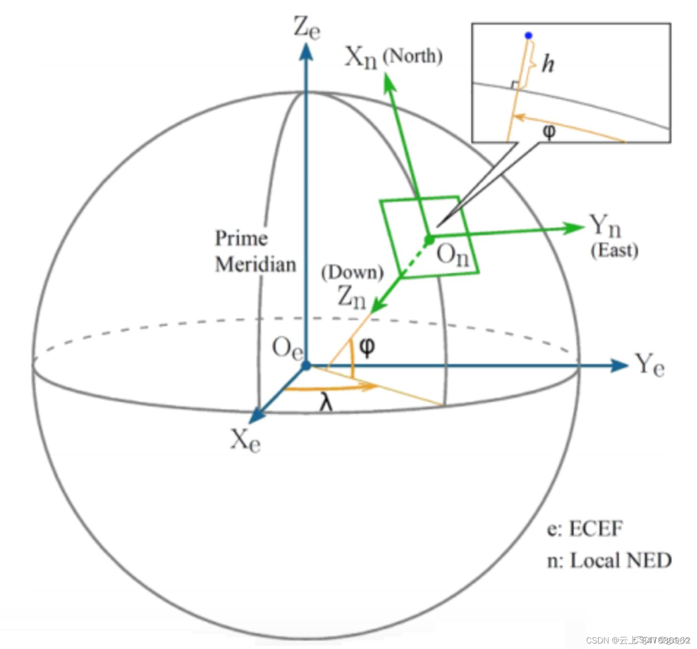
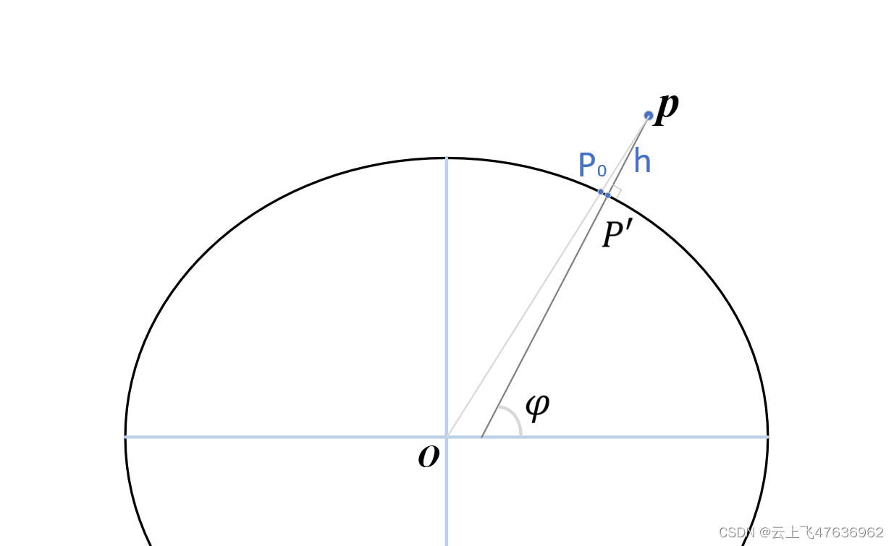

# 椭球面系列---大地坐标和笛卡尔坐标的相互转换

@[TOC](目录)

椭球体下，尤其是地球的旋转椭球体下，大地坐标和笛卡尔坐标的相互转换是最基础的算法了。本章给出两种坐标系下相互转换的原理及相应的转换公式，供参考。
## 大地坐标
大地坐标（Geodetic coordinate）是大地测量中以参考椭球面为基准面的坐标，点P的位置用大地经度λ、大地纬度φ和大地高H表示。

大地坐标多应用于大地测量学，测绘学等。具体为：
- 大地经度
大地经度是通过该点的大地子午面与起始大地子午面（通过格林尼治天文台的子午面）之间的夹角。规定以起始子午面起算，向东由0°至180°称为东经；向西由0°至180°称为西经。
- 大地纬度
大地纬度是P点在椭球面的投影点的法线与赤道面的夹角，规定由赤道面起算，由赤道面向北从0°至90°称为北纬；向南从0°到90°称为南纬。P点位于椭球面的投影点的法线方向上。
- 大地高度
大地高是地面点沿法线到参考椭球面的距离。

**注意大地纬度与地心纬度的区别**！大地坐标的示意图如下。

## 笛卡尔坐标
点P的笛卡尔坐标即为参考椭球体中心直角坐标系下的坐标，使用$(x,y,z)$表示。

## 大地坐标$(\lambda,\varphi,h)$转换为笛卡尔坐标$(x,y,z)$
大地坐标向笛卡尔坐标的转换为直接转换，不需要迭代。

见上图，已知$P$点的大地坐标$(\lambda,\varphi,h)$，$P'$为$P$点在椭球面上的投影点，即$P'P$为$P'$点的法线方向(定义为$\textbf{n}$)。

法线向量$\textbf{n}$很容易由大地经度和大地纬度计算得到：
$$\begin{equation}
\textbf{n}=\left [ \begin{matrix}
cos(\varphi)cos(\lambda)\\cos(\varphi)sin(\lambda)\\sin(\varphi)\\\end{matrix} \right ] 
\end{equation}$$
在[椭球面系列—基本性质](http://t.csdnimg.cn/cxrZj)一文中我们知道，若已知椭球面上点$P'$的法线向量$\textbf{n}$，则可求解$k$:
$$\begin{equation}
k^2=\textbf{n}^T\textbf{C}^{-1}\textbf{n}
\end{equation}$$
从而可以直接计算得到椭球面上点$P'$的笛卡尔坐标$(x',y',z')^T$：
$$\begin{equation}
P'=(x',y',z')^T=\frac1k\textbf{C}^{-1}\textbf{n}
\end{equation}$$
得到点$P'$后，则由法向量$\textbf{n}$和高度$h$可直接得到点$P$的笛卡尔坐标$(x,y,z)^T$。
$$\begin{equation}
P=
\left [ \begin{matrix}x\\y\\z\\\end{matrix} \right ] 
=\left [ \begin{matrix}x'\\y'\\z'\\\end{matrix} \right ] 
+\frac {\textbf{n}}{|\textbf{n}|}h
\end{equation}$$

## 笛卡尔坐标$(x,y,z)$转换为大地坐标$(\lambda,\varphi,h)$
笛卡尔坐标向大地坐标的转换为隐式转换，需要迭代求解。

仍然见上图，$P'$点的法线方向(定义为$\textbf{n}$)由其笛卡尔坐标$(x',y',z')^T$表示（这里我们不知道大地坐标，所以不能像式(1)方式来表示）则有：
$$\begin{equation}
\textbf{n}=\left [ \begin{matrix}x'/a^2\\y'/b^2\\z'/c^2\\\end{matrix} \right ] 
\end{equation}$$
很明显，此法线$\textbf{n}$为梯度向量的$1/2$。

$P'$点和$P$点的关系可表示为（与式(4)形式相同）：
$$\begin{equation}
\left [ \begin{matrix}x\\y\\z\\\end{matrix} \right ] =
\left [ \begin{matrix}x'\\y'\\z'\\\end{matrix} \right ] +
t\left [ \begin{matrix}x'/a^2\\y'/b^2\\z'/c^2\\\end{matrix} \right ] 
\end{equation}$$
上式中，$t$为法向量的系数，选取合适的$t$，则可使得上式成立。

将上式改变为：
$$\begin{equation}
\left [ \begin{matrix}x'\\y'\\z'\\\end{matrix} \right ] 
=\left [ \begin{matrix}x/(1+t/a^2)\\y/(1+t/b^2)\\z/(1+t/c^2)\\\end{matrix} \right ] 
\end{equation}$$
由于$P'$为椭球面上的点，因此满足椭球面方程：
$$\begin{equation}
\frac{x'^2}{a^2} + \frac{y'^2}{b^2} + \frac{z'^2}{c^2} = 1
\end{equation}$$
将式(8)带入上式，并定义函数$f(t)$:
$$\begin{equation}
f(t)=\frac{x^2}{a^2(1+t/a^2)^2} + \frac{y^2}{b^2(1+t/b^2)^2} + \frac{z^2}{c^2(1+t/c^2)^2} - 1
\end{equation}$$
由于$P$点坐标$(x,y,z)$已知，则变为求解方程$f(t)=0$的根。

函数$f(t)$为一元函数，且为隐式函数，因此求根一般采用牛顿迭代法(使用一阶导数$f'(t)$)，即：
$$\begin{equation}
f(t)=f(t_0)+f'(t_0).\Delta t=0
\end{equation}$$
迭代求解时，每一步$t$可由前一次数值给出：
$$\begin{equation}
t_{n+1}=t_n-f(t_n)/f'(t_n)
\end{equation}$$
由式(10)可得一阶导数$f'(t)$:
$$\begin{equation}
f'(t)=\frac{-2x^2}{a^4(1+t/a^2)^3} - \frac{2y^2}{b^4(1+t/b^2)^3} - \frac{2z^2}{c^4(1+t/c^2)^3}
\end{equation}$$

下面给出迭代参数$t$的初值$t_0$的求解。

由上图可知，$OP$与椭球面的交点$P_0$与$P'$点很近，因此首先求解$P_0$点的坐标$(x_0,y_0,z_0)$：
$$\begin{equation}
\left [ \begin{matrix}x_0\\y_0\\z_0\\\end{matrix} \right ] =
\frac 1d .\left [ \begin{matrix}x\\y\\z\\\end{matrix} \right ]
\end{equation}$$
上式中$d$可由$P$点的坐标$(x,y,z)$求得：
$$\begin{equation}
\frac{x^2}{a^2} + \frac{y^2}{b^2} + \frac{z^2}{c^2} = d^2
\end{equation}$$

迭代开始时，将$P_0$当作$P'$即可。则根据上图几何关系和式(6)，有：
$$
h=(1-1/d) |\textbf P|=t|\textbf{n}|
$$
因此$t_0$为：
$$\begin{equation}
t=(1-1/d) |\textbf P|/|\textbf{n}|
\end{equation}$$
上式中：
$$
|\textbf P|=\sqrt{x^2+y^2+z^2} 
$$
$$
|\textbf{n}|=\sqrt{x_0^2/a^4+y_0^2/b^4+z_0^2/c^4}
$$
使用牛顿迭代法求得$t$后，则带入式(8)可求得椭球面投影点于$P'$的坐标$(x',y',z')^T$。

有了$P'$点坐标，则椭球面法向量$\textbf{n}$可由式(5)给出。

最终，大地坐标为：
$$\begin{equation}
\begin{cases}
\lambda=tan^{-1}(n_y,n_x) \\
\varphi=sin^{-1}(n_z/|\textbf{n}|) \\
h=t/|\textbf{n}|
\end{cases}
\end{equation}$$
注意，上式中的$|\textbf{n}|$为$\sqrt{x'^2/a^4+y'^2/b^4+z'^2/c^4}$。

参考:
[1]: [椭球面系列---基本性质](http://t.csdnimg.cn/4zOrZ)
[2]: [\[学习内容：求一个点到椭球面的距离（下）](http://t.csdnimg.cn/YOwCK)
