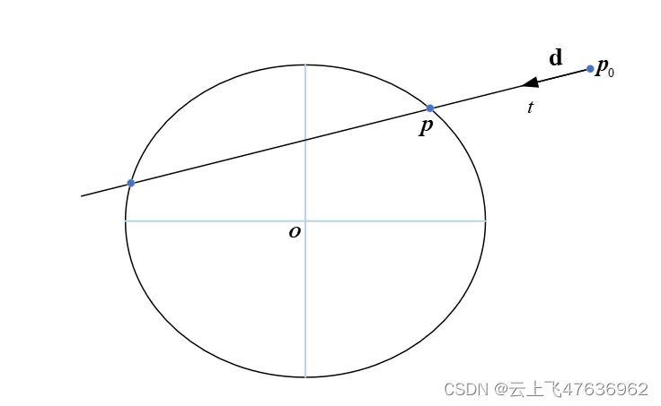

# 椭球面系列---射线与椭球面的交点

射线与椭球体的交点问题的求解是一个非常常见和经典的问题，本文给出具体的计算原理和矩阵表达的过程，便于编程计算。

见下图，已知射线(点为$\mathbf{p}_0$，单位方向为$\mathbf{d}$)，那么与椭球面的交点$\mathbf{p}$ 的笛卡尔坐标。

在继续计算前，记住之前我们的假设：椭球面和直线等坐标都是在椭球为中心的笛卡尔坐标系下。

有关椭圆的基础性质，请参考：[椭球面系列---基本性质](http://astrox.cn:8760/Posts/%E6%A4%AD%E7%90%83%E9%9D%A2%E7%B3%BB%E5%88%97-%E5%9F%BA%E6%9C%AC%E6%80%A7%E8%B4%A8)！！

首先，射线上任意一点$\mathbf{p}$与$\mathbf{p}_0$的距离为$t$，则$\mathbf{p}$可表示为：
$$
\mathbf{p}=\mathbf{p}_0+t\mathbf{d}
$$

$\mathbf{p}$在椭球面上，则需满足椭球面方程：
$$
\mathbf{p}^T\mathbf{C}\mathbf{p}=1
$$

则有：
$$
(\mathbf{p}_0+t\mathbf{d})^T\mathbf{C}(\mathbf{p}_0+t\mathbf{d})=1
$$
化简可得:
$$
(\mathbf{d}^T\mathbf{C}\mathbf{d})t^2+2(\mathbf{p}_0^T\mathbf{C}\mathbf{d})t+\mathbf{p}_0^T\mathbf{C}\mathbf{p}_0-1=0
$$
上式为典型的关于$t$的一元二次方程：
$$
at^2+bt+c=0
$$
其中:
$$
\begin{cases}
a=\mathbf{d}^T\mathbf{C}\mathbf{d} \\
b=2\mathbf{p}_0^T\mathbf{C}\mathbf{d} \\
c=\mathbf{p}_0^T\mathbf{C}\mathbf{p}_0-1
\end{cases}
$$
最终得到距离$t$的解（最多2个解）：
$$
t = \frac{-b \pm \sqrt{b^2 - 4ac}}{2a}
$$

显然：
1. $b^2 - 4ac>0$时，表示射线与椭球面有两个交点。

2. $b^2 - 4ac=0$时，表示射线与椭球面相切。

3. $b^2 - 4ac<0$时，表示射线与椭球面不相交。

当$t$求得后，带入式(1)即可得到$\mathbf{p}$点的坐标。
