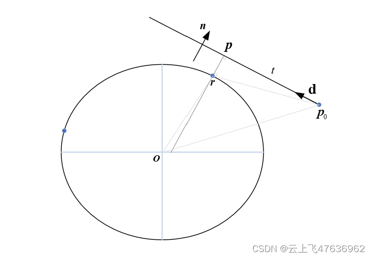
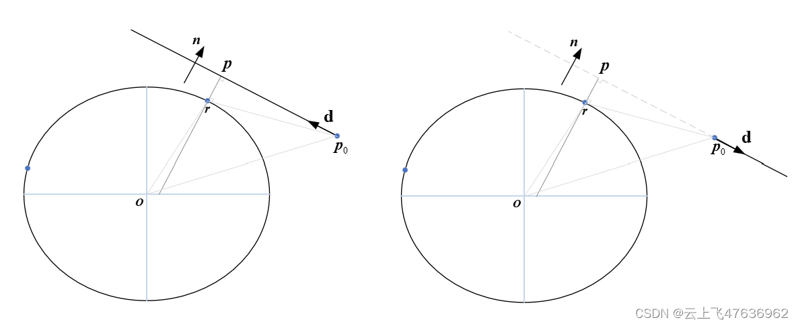

# 椭球面系列---直线上离椭球面最近的点

前面给出了射线与椭球体的交点问题的求解，本节讨论当射线与椭球面无交点时，那么在椭球面上离射线最近的点在那里？

本文给出具体的计算原理和矩阵表达的过程，便于编程计算。

有关椭圆的基础性质，请参考[椭球面系列—基本性质](http://t.csdnimg.cn/cxrZj)

见下图，已知射线(点为$\textbf{p}_0$，单位方向为$\textbf{d}$)，令射线与椭球面最近的点为$\textbf{p}$，对应的椭球面上的点为$\textbf{r}$，如何确定$\textbf{p}$和$\textbf{r}$的笛卡尔坐标？
​

首先不加证明的给出几个基本性质：

1. 由点$\textbf{p}_0$出发的射线和椭球体中心组成的平面与椭球体的截面为椭圆(上图即为截面内的射线和对应的椭圆，注意此椭圆的半长轴和半短轴未知，但是我们用不到）。
2. 由于椭球面为凸面体，所以椭球面上离直线最近的点必定位于此截面内。
3. 点到直线的距离最短为点到直线的垂线，因此$\textbf{r}-\textbf{p}$必定垂直于直线。
4. 过椭球面上最近点$\textbf{r}$的切平面必定垂直于上述的截面，也就是说切平面的法向量(椭球面法向量)垂直于直线。

综合以上性质，我们可以知道，利用射线可以求得截面内垂直于射线的向量$\textbf{n}$，也就是椭球面在$\textbf{r}$点处的法线向量（切平面法向量）。

首先，求解向量$\textbf{n}$，可由下式给出：
$$\begin{equation}
\textbf{n}=-\textbf{d}\times(\textbf{d}\times\textbf{p}_0)
\end{equation}$$
在[椭球面系列—基本性质](http://t.csdnimg.cn/cxrZj)一文中，我们给出了椭球面的法线基本性质，可得:
$$\begin{equation}
k^2=\textbf{n}^T\textbf{C}^{-1}\textbf{n}
\end{equation}$$
那么椭球面上离直线最近的点$\textbf{r}$可由下式给出:
$$\begin{equation}
\textbf{r}=\frac1k\textbf{C}^{-1}\textbf{n}
\end{equation}$$

下面我们再给出直线上距离椭球面最近的点$\textbf{p}$的求解。由前面给出的几条性质可知，$\textbf{r}-\textbf{p}$是垂直于直线的。因此将$\textbf{r}-\textbf{p}_0$投影到直线方向上可得到距离$t$：
$$\begin{equation}
t=(\textbf{r}-\textbf{p}_0)\cdot\textbf{d}
\end{equation}$$
那么射线上距离椭球面最近点$\textbf{p}$可表示为：
$$\begin{equation}
\textbf{p}=\textbf{p}_0+t\textbf{d}
\end{equation}$$

上图推导过程中虽然依赖射线，但是整个过程都是与直线相关的，也就是说，射线的方向不影响结论。见下图，射线的方向$\textbf{d}$相反，但是最终的结论都是求得直线上离椭球面最近点。

实际编程计算时需要考虑射线情况时，对于上图右图情形，显然射线方向离椭球体距离越来越远，最近点即为$\textbf{p}_0$，用公式表达为：
$$
\textbf{p}_0\cdot\textbf{d}>0
$$

另外一种情形，在向量$\textbf{n}$的求解中用到向量的叉乘，如果$\textbf{p}_0$和$\textbf{d}$在一条直线上时则叉乘结果为0，此时对应射线指向椭球圆心，即射线与椭球面相交，那么可使用"射线与椭球面的交点"计算，而不是使用本算法计算。

### 修正 
本文中的$\textbf{r}$仅在某些情况下才是椭球面上离直线最近的点，不是普遍情况，但是上述过程不影响最后的结果，即：射线上距离椭球面最近点$\textbf{p}$的求解。

点$\textbf{p}$得到后，则可以将笛卡尔坐标转换为大地坐标，从而可求得椭球面上离直线最近的点，详细可见参考2。

参考:
[1]: [Point on an ellipsoid closest to line](https://math.stackexchange.com/questions/895385/point-on-an-ellipsoid-closest-to-line)
[2]: [\[椭球面系列---大地坐标和笛卡尔坐标的相互转换\]](http://t.csdnimg.cn/EY7NP)

