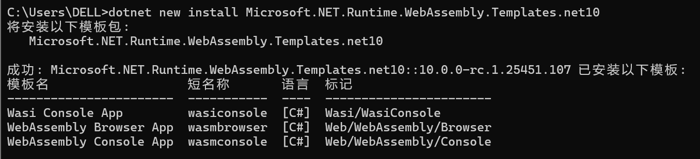
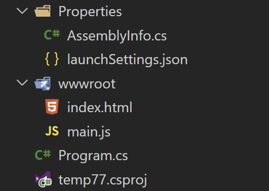
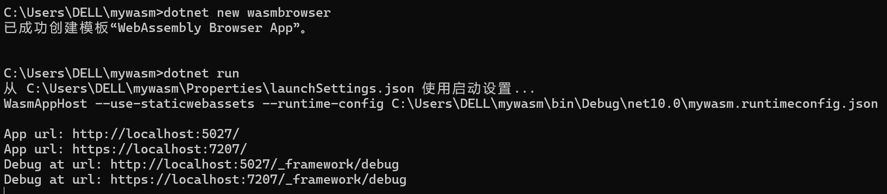
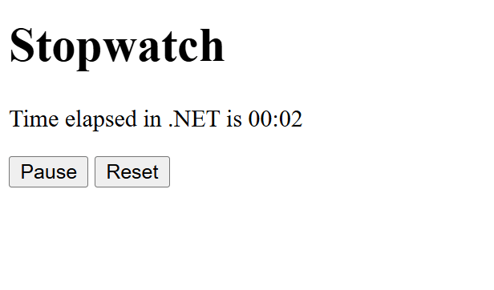
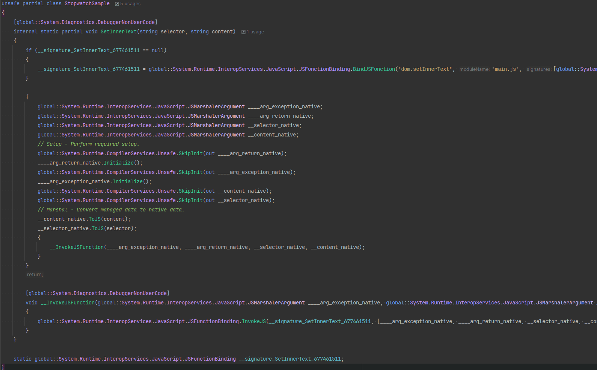

# 浏览器运行C#代码(不使用Blazor方式)初探

一直以来，对于.Net开发人员来说，难以将C#代码直接转化为WASM方式在浏览器里运行，本文介绍了一种使用.Net 10模板工程的方式，可将C#代码转换为WASM，而不使用Blazor方式。

本文为翻译，原文参见：[Running .NET in the browser without Blazor](https://andrewlock.net/running-dotnet-in-the-browser-without-blazor/)

在本文中，我将展示如何在不使用 Blazor 的情况下在浏览器中运行 .NET，而仅依赖 Blazor 所构建的 WASM 基础架构。我还将介绍 .NET 10 中的一些改进，主要围绕客户端文件指纹识别。
## 背景
2017 年，Steve Sanderson 展示了Blazor的技术演示，WebAssembly (WASM) 从此进入 .NET 领域。Blazor 是一个完全基于组件的 Web 框架，用于使用 HTML 和 C# 构建 Web 应用程序。它可以在多种渲染模式下运行，其中交互式WebAssembly 模式完全在浏览器中运行，并充分利用了 WASM 的强大功能。

当谈论 .NET 和 WASM 时，大多数人会立即想到 Blazor，但还有其他几种方法可以将 .NET 与 WASM 结合起来：

- 无需使用 Blazor即可在浏览器中的 WASM 上 运行 .NET 。
- 在服务器上的Node.js 进程内，在 WASM 上运行 .NET 。
- 编写与 WebAssembly 系统接口 (WASI) 兼容的 .NET 组件（并调用用其他语言编写的其他 WASI 组件）。

此外，您还可以将 Blazor 组件集成到其他 JavaScript 框架（如 Vue 或 React）中，.NET 10 中对此过程进行了改进。

在这篇文章中，我将介绍第一种方法，即在浏览器中使用 WASM 运行 .NET，但不使用 Blazor 组件。

据我所知，此功能从 .NET 7 开始就已提供。在本文中，我使用的是 .NET 10 预览版 6 的工作负载和模板，但它们并没有发生太大变化。

## 安装实验性的 WASM 模板
用于构建可从 JavaScript 运行的 .NET 应用程序的模板不包含在默认 SDK 中。这些模板是实验性的，因此需要显式安装。要安装哪个 NuGet 包取决于所需的模板版本：
- .NET 8：Microsoft.NET.Runtime.WebAssembly.Templates
- .NET 9：Microsoft.NET.Runtime.WebAssembly.Templates.net9
- .NET 10：Microsoft.NET.Runtime.WebAssembly.Templates.net10

我们需要最新的模板，因此我们将安装 .NET 10 模板（撰写本文时为预览版 6，本文翻译时为rc.1）

```
dotnet new install Microsoft.NET.Runtime.WebAssembly.Templates.net10
```

这将安装三个模板：



或者，您可以安装**wasm-experimental**工作负载，其中包括模板以及......一堆东西😅我不太确定这些额外的东西实际上是用来做什么的，因为据我所知，这些都不是必需的🤷‍♂️
```
dotnet workload install wasm-experimental
```
请注意，如果您要对生成的[应用程序进行 AOT 编译](https://github.com/dotnet/runtime/blob/main/src/mono/wasm/features.md#aot)，则还需要安装**wasm-tools**工作负载。这将提供更好的性能，但会大大增加文件大小（从而增加启动时间），因此您需要权衡利弊。

## 创建 .NET WASM 应用程序
安装模板后，我们可以创建一个新的应用程序：
```
dotnet new wasmbrowser
```
该模板创建以下文件：



我们很快就会看到这些文件，但首先我们要运行这个应用程序。你可以用一个简单的命令来运行它dotnet run：



如果你在浏览器中打开该应用，你会看到模板是一个简单的秒表应用程序。它会在你打开页面后立即启动，然后你可以暂停、重置和启动计时器：



那么它是如何工作的呢？在本文的剩余部分，我们将探讨该模板及其工作原理。

## 探索模板
我们先来看看Program.cs，它是一个顶级程序，包含一个名为 的辅助类型**StopwatchSample**。这个“程序”本身非常简单，如下所示。首先，它会写入控制台（将显示在浏览器的控制台窗口中），然后如果向程序传递了正确的参数，则可以选择性地调用静态方法。然后它会进入一个无限循环，每秒StopwatchSample.Start()调用一次。Render()
```
Console.WriteLine("Hello, Browser!");

if (args.Length == 1 && args[0] == "start")
    StopwatchSample.Start();

while (true)
{
    StopwatchSample.Render();
    await Task.Delay(1000);
}
```
大部分实现都定义在**StopwatchSample**类型中，如下所示。通常，此类型是静态System.Diagnostics.Stopwatch实例的简单包装。有趣的部分是Render()调用的方法SetInnerText（用属性修饰[JSImport]），以及其他用[JSExport]属性修饰的方法。
```
partial class StopwatchSample
{
    private static Stopwatch stopwatch = new();

    public static void Start() => stopwatch.Start();
    public static void Render() => SetInnerText("#time", stopwatch.Elapsed.ToString(@"mm\:ss"));
    
    // 注意，这里的"main.js"仅仅是一个参数名称，可以是任何值，只要和main.js文件里定义的函数一致即可
    // 译者注
    [JSImport("dom.setInnerText", "main.js")]
    internal static partial void SetInnerText(string selector, string content);

    [JSExport]
    internal static bool Toggle()
    {
        if (stopwatch.IsRunning)
        {
            stopwatch.Stop();
            return false;
        }
        else
        {
            stopwatch.Start();
            return true;
        }
    }

    [JSExport]
    internal static void Reset()
    {
        if (stopwatch.IsRunning)
            stopwatch.Restart();
        else
            stopwatch.Reset();

        Render();
    }

    [JSExport]
    internal static bool IsRunning() => stopwatch.IsRunning;
}
```
您可能已经猜到了，[JSImport]和[JSExport]提供了从 .NET 代码与浏览器中的 JavaScript 交互的方法。这两个属性分别用于驱动Microsoft.Interop.JavaScript中的两个源生成器JSImportGenerator和。这样，您就可以在 IDE 中查看生成的源代码，并确切地了解它正在做什么。JSExportGeneratorF12

最终，它是一段读起来有些粗糙的代码，所以我不会在这里详细介绍，但它本质上只是在 .NET（WASM）世界和 JavaScript 世界之间进行编组，绑定现有的 JavaScript 函数（在的情况下[JSImport]），或描述要公开给 JavaScript 调用的方法的形状。

JSImportGenerator 生成的代码的屏幕截图，显示了编组代码



为了理解生成的代码与什么交互，我们接下来看一下 HTML 和 JavaScript 代码。HTML 代码非常简单：
```
<!DOCTYPE html>
<html>

<head>
  <title>temp78</title>
  <meta charset="UTF-8">
  <meta name="viewport" content="width=device-width, initial-scale=1.0">
  <!-- 👇 These are updated during dotnet run and dotnet publish -->
  <link rel="preload" id="webassembly" />
  <script type="importmap"></script>
  <script type='module' src="main#[.{fingerprint}].js"></script>
</head>

<body>
  <h1>Stopwatch</h1>
  <p>
    Time elapsed in .NET is <span id="time"><i>loading...</i></span>
  </p>
  <p>
    <button id="pause">Pause</button>
    <button id="reset">Reset</button>
  </p>
</body>

</html>
```
这里的 HTML 展示了我们之前看到的应用程序的大致轮廓。它包含一些link和script元素，这些元素是连接 .NET WASM 组件所必需的，它还包含应用程序的基本元素结构，其中包括一堆带有显式**id**s 的元素。

接下来我们查看 main.js 文件，它是应用程序的入口点，因为它直接链接到上面的index.html文件中。我添加了注释来解释每个步骤的作用：
```
// 导入.NET 运行时支持，这个文件夹是项目编译发布后生成的
import { dotnet } from './_framework/dotnet.js'

const { setModuleImports, getAssemblyExports, getConfig, runMain } = await dotnet
    .withApplicationArguments("start") // C#主程序运行的输入参数
    .create(); // 设置 .NET WASM 运行时

// setModuleImports 将一组导入 (dom.setInnerText) 与一个相关模块 (main.js) 关联起来。
// 这个配对必须与 [JSImport] 属性中提供的值匹配，以正确连接所有内容
// 注意：这里的main.js仅仅是一个名称，可以为其它任何参数名称，只要和C#代码里一致即可
setModuleImports('main.js', {
    dom: {
        setInnerText: (selector, time) => document.querySelector(selector).innerText = time
    }
});

// 返回有关环境和应用的信息。例如，环境变量（非常少）
// runtimeConfig，程序集名称，引用的程序集等
const config = getConfig();

// 获取主程序集里通过 [JSExport] 导出的所有函数，以便它们
// 可以从 JavaScript 调用
const exports = await getAssemblyExports(config.mainAssemblyName);

// 给重置按钮附加点击处理程序并调用导出的
//  StopwatchSample.Reset() 函数
document.getElementById('reset').addEventListener('click', e => {
    exports.StopwatchSample.Reset();
    e.preventDefault();
});

// 给暂停按钮附加一个点击处理程序，并调用导出的 StopwatchSample.Toggle() 函数
const pauseButton = document.getElementById('pause');
pauseButton.addEventListener('click', e => {
    const isRunning = exports.StopwatchSample.Toggle();
    pauseButton.innerText = isRunning ? 'Pause' : 'Start';
    e.preventDefault();
});

// 运行 C# 的 Main() 方法，并保持运行时进程继续运行，以执行后续的 API 调用
await runMain();
```
这几乎涵盖了所有内容。总结一下：

- [JSExport]并[JSImport]生成处理 JavaScript 类型编组的 C# 代码。
- Index.html引用捆绑的 WASM .NET 运行时和编译的应用程序。
- main.js负责启动 .NET 运行时，为您的应用程序需要调用 JavaScript 提供所需的导入，并运行 .NET 应用程序。
- 
围绕这些功能的工具的一个好处是，您可以直接dotnet run或间接地F5在浏览器中运行您的应用程序，但最终您会希望在生产中运行它时发布您的项目。

## 发布您的 WASM 应用程序
您可以使用简单的**dotnet publish -c Release**默认方式发布您的应用程序，工具将编译您的应用程序，发布和修剪框架引用，并且 gzip 和 brotli 都会压缩输出。

另一个有趣的点是这些资产的客户端指纹识别。.NET 9 引入了静态资产的服务器端指纹识别（带有MapStaticAssets()），在 .NET 10 中，您可以选择对 Blazor WebAssembly 应用程序和无 Blazor 的 WASM 应用程序进行类似的资产指纹识别（正如我们正在讨论的）。

要启用此行为，您需要做几件事：

- 添加<script type="importmap"></script>到您的index.html。
- 在index.html中添加#[.{fingerprint}]脚本引用。
- 放OverrideHtmlAssetPlaceholders=true。
- 使用 选择加入您的资产<StaticWebAssetFingerprintPattern>。
这些都是模板默认完成的。继续阅读了解更多详情。

.NET 10 中模板的新增功能涵盖了前两点，它将importmap和指纹添加到main：
```
<link rel="preload" id="webassembly" />
<script type="importmap"></script>
<script type='module' src="main#[.{fingerprint}].js"></script>
```
该模板还添加了```<link rel="preload" id="webassembly" />```预加载 WebAssembly 文件的功能，旨在缩短冷启动时间。运行应用程序时，这些元素将被重写为如下所示，并包含所有文件的指纹识别：
```
<link href="_framework/dotnet.y5zm2li12l.js" rel="preload" as="script" fetchpriority="high" crossorigin="anonymous" integrity="sha256-eo4p7mQEfnCQ6TQ0N72uJX+t0QX8QmikrPGJjyy3QLQ=" />
  <script type="importmap">{
  "imports": {
    "./_framework/dotnet.native.js": "./_framework/dotnet.native.hwglpvp32y.js",
    "./_framework/dotnet.runtime.js": "./_framework/dotnet.runtime.0t78nptbqi.js",
    "./_framework/dotnet.js": "./_framework/dotnet.y5zm2li12l.js",
    "./main.js": "./main.ofkecrt505.js"
  },
  "scopes": {},
  "integrity": {
    "./_framework/dotnet.js": "sha256-eo4p7mQEfnCQ6TQ0N72uJX+t0QX8QmikrPGJjyy3QLQ=",
    "./_framework/dotnet.native.hwglpvp32y.js": "sha256-0S3nkr+7+aZ+9tFRQOEYkmozryFXfrzgl+nv+qz71QM=",
    "./_framework/dotnet.native.js": "sha256-0S3nkr+7+aZ+9tFRQOEYkmozryFXfrzgl+nv+qz71QM=",
    "./_framework/dotnet.runtime.0t78nptbqi.js": "sha256-fBs/I1SdlqDOQOqxGF+LdElB3o5/FirA8fyIHRUy9cE=",
    "./_framework/dotnet.runtime.js": "sha256-fBs/I1SdlqDOQOqxGF+LdElB3o5/FirA8fyIHRUy9cE=",
    "./_framework/dotnet.y5zm2li12l.js": "sha256-eo4p7mQEfnCQ6TQ0N72uJX+t0QX8QmikrPGJjyy3QLQ=",
    "./main.js": "sha256-9EZteoeGyecFbFTmMweXxx9ItCAClDZ8n+6lXEEulSU=",
    "./main.ofkecrt505.js": "sha256-9EZteoeGyecFbFTmMweXxx9ItCAClDZ8n+6lXEEulSU="
  }
}</script>
  <script type='module' src="main.ofkecrt505.js"></script>
</head>
```
在.csproj文件中，模板还添加了所需的OverrideHtmlAssetPlaceholders和StaticWebAssetFingerprintPattern条目，从而实现了上述行为：
```
<Project Sdk="Microsoft.NET.Sdk.WebAssembly">
  <PropertyGroup>
    <TargetFramework>net10.0</TargetFramework>
    <AllowUnsafeBlocks>true</AllowUnsafeBlocks>
    <!-- 👇 Required for fingerprinting -->
    <OverrideHtmlAssetPlaceholders>true</OverrideHtmlAssetPlaceholders>
  </PropertyGroup>

  <ItemGroup>
    <!-- 👇 Required for fingerprinting -->
    <StaticWebAssetFingerprintPattern Include="JS" Pattern="*.js" Expression="#[.{fingerprint}]!" />
  </ItemGroup>
</Project>
```

## 减小已发布应用程序的大小
出于兴趣，我检查了这个示例应用程序的发布大小（在发布模式下），它大致如下所示：

- 未压缩时为 6.8MB
- 压缩后（gzip）2.5MB
- 压缩后 2.0MB（brotli）
这包括所有文件，包括 .NET 运行时，所以还不错。运行时显然经过了大量精简才达到这些大小，但我们可以再小一点吗？一个明显的突出问题是icu程序集，所以我想启用全球化不变模式是否可以进一步减少文件大小。我在项目文件中添加了以下内容：
```
<InvariantGlobalization>true</InvariantGlobalization>
```
然后再次运行dotnet publish -c Release。果然，我们得到了一些不错的收获：
- 未压缩时为 4.3MB，减少 2.5MB
- 压缩后 (gzip) 1.7MB — 减少 0.8MB
- 压缩后为 1.4MB（brotli），减少 0.6MB
这使得应用程序整体大小减少了 30-37%，这是一个相当不错的缩减！显然，全球化不变模式是否可行取决于你的应用程序，但如果可行，它是一个非常方便的工具。

这就是全部内容了。这种在 JavaScript 中运行 .NET 代码的方法比使用 Blazor 或与其他 Web 框架交互的方法要底层得多，因此你不太可能从这一层看到巨大的价值。但是，如果你不需要Blazor，那么这可能正是你所需要的！

## 概括
在本文中，我描述了使用 WebAssembly (WASM) 运行 .NET 代码的各种方式，重点介绍了如何在不使用 Blazor Web 组件框架的情况下在浏览器中运行 .NET 代码。我介绍了使用 WASM 在浏览器中运行 .NET 的基本模板，并分析了 .NET 和 JavaScript 代码，以了解它们如何协同工作。最后，我介绍了 .NET 10 中客户端指纹
