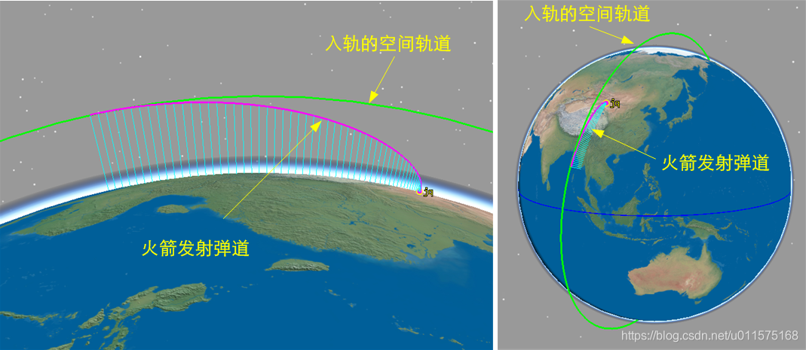
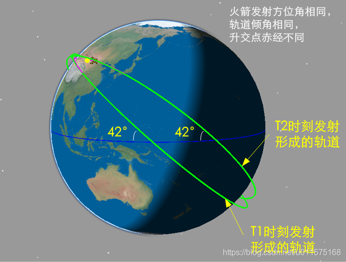
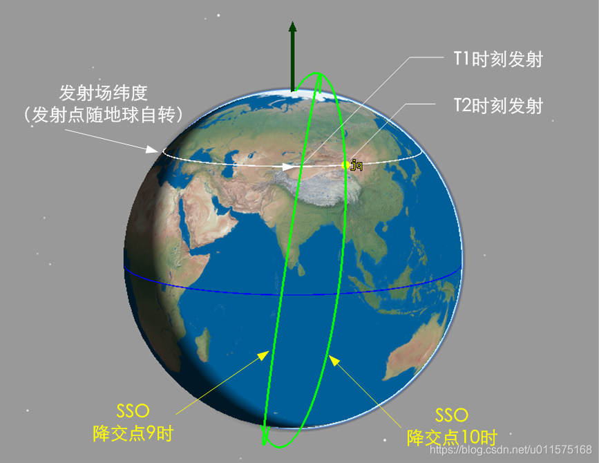
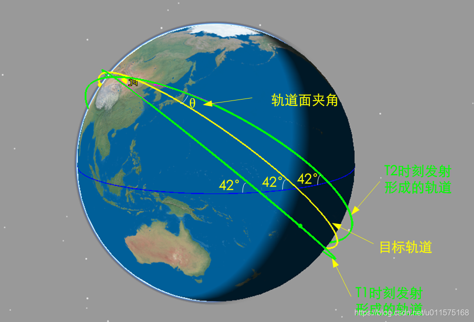
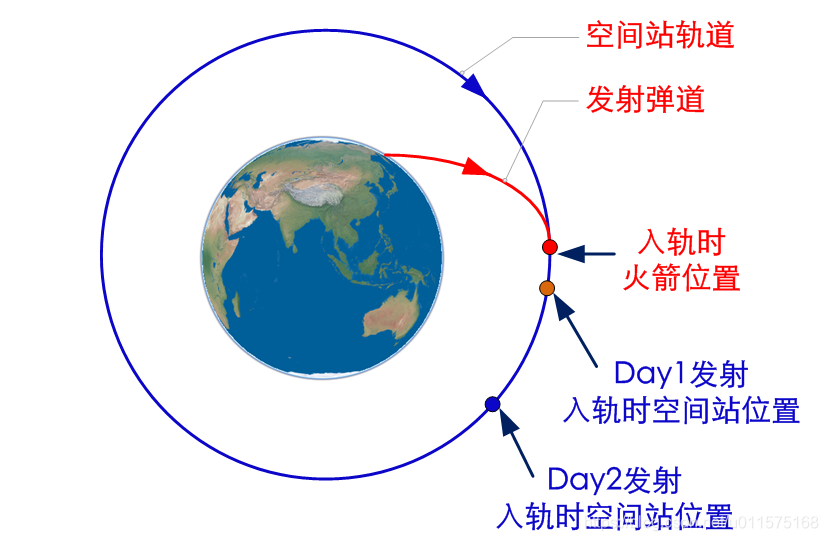
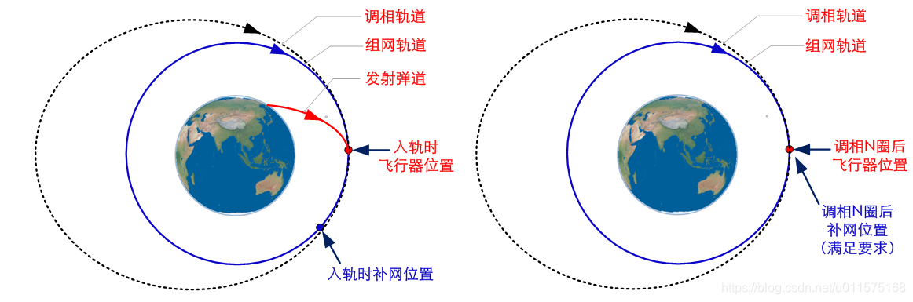

# 火箭的发射窗口

在火箭发射活动中，我们经常可以看到某某火箭发射XX卫星的窗口是10:30（此处随便写个时间），窗口宽度是5min诸如此类的。那么火箭的发射窗口究竟是怎么计算出来的？窗口宽度又是怎么定义的？

本文初步探讨火箭的发射窗口，给出发射太阳同步轨道（SSO）和近地轨道时的发射窗口原理。深空探测的发射窗口较为复杂，本文不予讨论。

## 发射窗口的定义
发射窗口一般包含两方面定义：月发射窗口和日发射窗口
- 月发射窗口
  指一个月中有哪几天可以发射火箭，如1月1日-5日，14-19日。
- 日发射窗口
  指一天中有哪些时刻可以发射火箭，如上午10:00-10:20,或19:00（零窗口）
- 发射窗口宽度
   指发射窗口持续的时间，如10:00-10:20，则发射窗口宽度是20min
## 火箭发射弹道的特性
受火箭运载能力的限制，火箭发射弹道通常在同一轨道面内（或者偏航很小），因此火箭的发射弹道与入轨的空间轨道共面，见下图。图中给出火箭发射弹道和入轨后形成的轨道，两者必然共面（无偏航）。

对于火箭的同一个发射方位角，则其入轨后的轨道倾角相同，无论任何时候发射，其发射弹道相对于地面是固定的。但由于发射场是随地球自转的，这也就意味着不同时间发射的弹道其在惯性空间是不一样的（升交点赤经不一样），见下图。

## 太阳同步轨道（SSO）的发射窗口
下图给出了降交点分别为9时和10时的SSO轨道（假设就是我们要发射入轨的目标轨道），由于其轨道进动缓慢（约1°/天），因此可近似认为两个轨道在惯性空间是固定的。

以酒泉发射场为例，其随地球旋转每天自转一圈，那么只有当发射场转到轨道面下方时发射才能保证入轨轨道是所要求的轨道。从图中可以看出，目标SSO轨道的降交点地方时为9时和10时时，其空间的位置是不一样的，简单的说，就是其降交点赤经相差约15°（对应地球自转1小时），因此，两个目标轨道对应的发射时间就相差约1小时。

通常，卫星方在给出目标轨道时，其降交点地方时会允许一定的偏差（并不影响其对地观测指标）。以降交点地方时9时为例，假设其允许的偏差是±5min，那么对应火箭发射的窗口也基本是±5min，即共10min的窗口。

## LEO轨道（无约束）
对于低倾角轨道的发射，如果对目标轨道无升交点赤经的约束，仅仅要求轨道倾角（以42°为例），那么火箭发射时刻则可以任意选择，不同发射时刻均能形成42°的轨道倾角，轨道高度也相同。此种情况下，其发射窗口的宽度是无限的。

然而，在实际工程中，不同发射时间的便利性、或者入轨后的光照特性（图2中两个轨道的光照特性是不一样的）等各种工程约束都会对火箭的发射窗口提出要求，但此时的发射窗口宽度相对来说较为充裕。

## LEO轨道（发射飞船与空间站对接或星座补网发射）
当发射低倾角轨道的飞行器时，若对轨道的升交点赤经有要求，如发射一首飞船与空间站对接或者发射一颗卫星对已有的轨道面内补网（类似GPS星座的发射），那么同发射SSO轨道类似，发射时刻就不能任意选择，必须等到发射场随地球旋转到入轨轨道面（空间站轨道面或需补网的轨道面）的下方时才能发射。

以42°的低倾角发射为例，见下图，T1时刻发射和T2时刻发射形成的轨道倾角皆为42°，但是都没有与所要求的目标轨道重合（如空间站轨道）。显然，火箭在T1-T2之间某个特定的时刻发射才能保证发射后的轨道与目标轨道重合。

对于特定的发射场，一天有2次机会穿过目标轨道下方，但我国的发射场发射方位都是往东、东南或西南方向的，所以我国发射飞行器与空间站对接或者补网一天只有一次机会，且为零窗口，即发射窗口宽度为0。

从上图中可以看出，当发射窗口错过时（发射滞后或超前），入轨轨道与目标轨道不重合，两轨道面存在夹角θ。这个轨道面夹角θ需要靠飞行器入轨后进行轨道面修正，需要耗费飞行器大量的燃料。

对于42°倾角的轨道，若火箭发射时刻偏差5min，则需要飞行器额外多消耗约110m/s的速度增量来修正轨道面偏差。

因此，对于发射诸如空间站对接轨道或组网轨道来说，为了减少飞行器的轨道面修正量，通常要求发射窗口的宽度为零（零窗口发射）。

实际上，以空间站交会对接为例，发射窗口未必每天都有，见下图示意。假设发射弹道面与空间站轨道面重合，当火箭发射飞行器入轨时，空间站在轨道上的相位是不定的。由于交会对接需要，通常要求火箭发射入轨时即与空间站的相位相差一定的角度（补网部署发射类似），假设下图中Day1发射时满足相位要求，那么Day2发射时就不满足相位要求，因此需要根据工程任务约束详细计算每天的发射窗口是否满足相位差要求，最终筛选出特定的发射日期（如每个月特定的日期），如此一来，便不能保证每天都有发射窗口了（但发射窗口宽度要求未变，还是为零窗口）。

为了使得每天都有发射窗口，可通过调相轨道来解决，即飞行器入轨后，变轨进入调相轨道，在调相轨道上运行数圈后，再次变轨进入目标轨道，此时两者相位已满足要求。此种情况下，飞行器在调相轨道上运行的时间较长，不适用于载人任务（与空间站对接），常适用于星座补网，见下图。

## 小结
- 无论是发射SSO还是发射LEO（空间站对接或补网），由于其轨道在惯性空间中是固定的，因此只有当发射场随地球旋转到目标轨道面下方时才能发射，因此每天仅有一次发射窗口（我国是降轨发射）。
- 对于SSO轨道，一般其降交点地方时要求并不严格，因此每天的发射窗口宽度要数分钟至数十分钟。
- 对于与空间站交会对接或组网部署情况时，由于修正轨道面的能量较大，因此发射窗口通常为零窗口。
- 考虑到火箭发射入轨时与空间站的相位要满足一定的相位差要求，因此需要进行窗口分析，并不是每天发射都满足相位差要求，最终每个月仅有部分天数满足要求。
- 对于组网部署，常常通过发射入轨后调相轨道来满足特定相位差的要求，只是需要较长的时间和一定的速度增量，但仍能保证每天都有发射窗口。

以上仅从轨道几何特性上对发射窗口进行分析，实际工程任务中，还需考虑其他约束（如光照等）对发射窗口进行限制。

