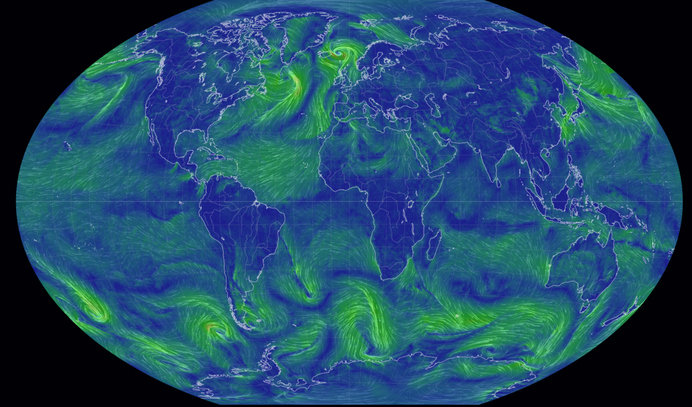
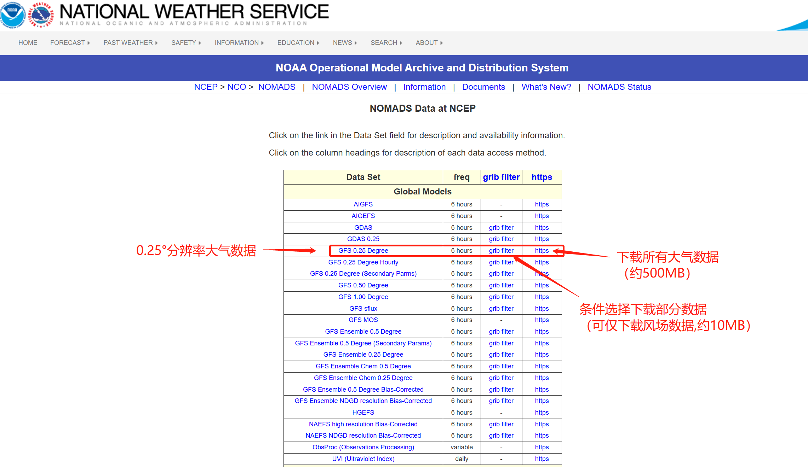
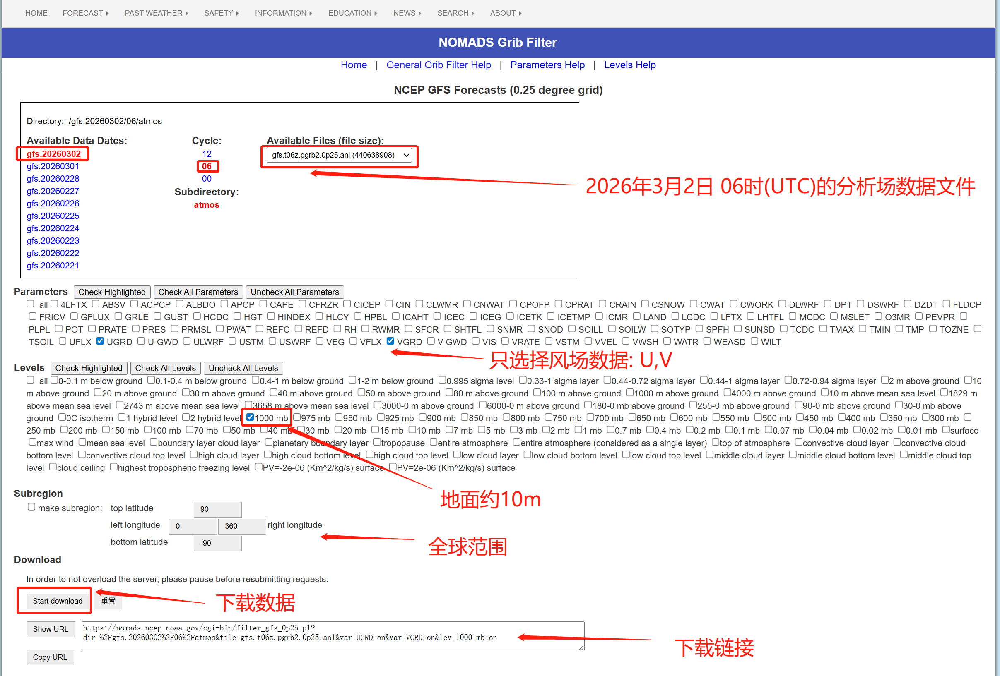
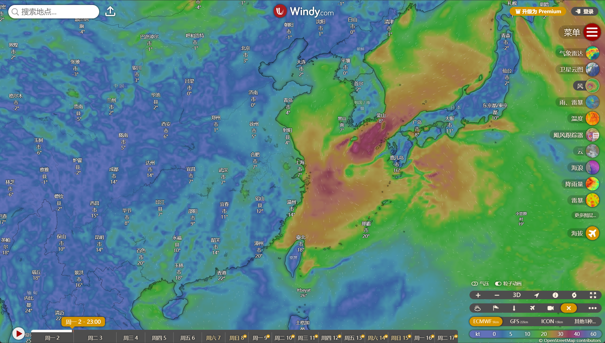
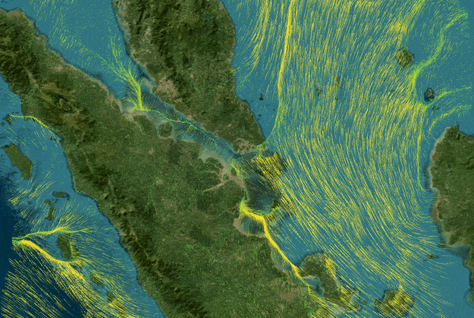

# 看不见的“全球风”：一篇读懂 NASA/NOAA 风场数据

如果你打开一张动态风场图，会看到地球表面像被无数细线“吹动”——这背后不是动画特效，而是来自气象数值模式的真实数据。


很多人会把这类数据统称为“NASA 全球风场数据”。这个说法并不完全错，但在工程实践里，更准确的理解是：

- NASA 常见于长期再分析与科研数据；
- NOAA/NCEP 常见于实时或准实时预报数据（例如 GFS）；
- 两者是互补关系，不是二选一。

本文不讲接口实现，只讲一件事：**全球风场数据到底是什么，以及它是如何变成可用的数据文件的。**

---

## 1. 全球风场数据，本质上是什么？

可以把它想象成：

- 给地球套上一层规则网格；
- 在每个网格点上记录“风向东吹多快、向北吹多快”；
- 再在不同高度重复这件事。

所以风场并不是一个“风速值”，而是两部分组成的矢量：

- `U`：东西向分量（向东为正）
- `V`：南北向分量（向北为正）

拿到 `U` 和 `V` 后，才可以计算我们常见的“风有多大”：

$$
|\vec{V}| = \sqrt{u^2 + v^2}
$$

这也是为什么专业数据里经常优先提供 `U/V`，而不是直接给“风速风向”。

---

## 2. 为什么会有“好多高度层”？

我们日常感受到的是地面风，但大气是三维的。

同一地点(hPa:百帕)：

- 1000 hPa（近地面）可能是偏南风；
- 500 hPa（中高空）可能是强西风；
- 200 hPa（高空）又可能是急流带。

因此，风场数据通常按“层”组织。常见层次如：

`1000, 925, 850, 700, 500, 300, 250, 200 hPa`

在很多业务场景里：

- 1000/850 hPa 看低层输送；
- 500 hPa 看天气系统演变；
- 250/200 hPa 看高空急流。

这也是“全球风场”真正有价值的地方：它不是平面的风，而是立体的大气运动。

---

## 3. 一张“全球风场图”背后有多大？

在当前工程规格中，常见是 **0.25° × 0.25°** 分辨率。直观理解：

- 经向约 1440 格；
- 纬向约 721 格；
- 单层就是超过百万网格点；
- 多层+多时次后，数据量会快速增长。

所以做风场产品时，永远在做取舍：

- 更细分辨率 → 更清晰，但更耗存储与带宽；
- 更多高度层 → 更完整，但更耗内存与计算；
- 更长时效 → 更全面，但不确定性更大。
---

## 4. 为什么原始数据常见 GRIB2，落地却常用 NetCDF？

一个常见误解是：“既然 GRIB2 是官方发布格式，为什么不直接全流程都用它？”

答案很工程化：

- **GRIB2** 很适合分发，体积小、压缩强；
- 但在通用应用层和前端生态中，直接消费成本较高；
- **NetCDF** 结构清晰、自描述，跨语言协作更顺畅。

所以常见做法是：

1. 从源头获取 GRIB2；
2. 提取目标变量（如 UGRD/VGRD）；
3. 转成结构规范的 NetCDF；
4. 再进入分析、渲染或产品链路。

这不是“谁更高级”，而是不同阶段各用最合适的格式。

| 特性 | NetCDF V3 | GRIB2 |
|------|-----------|-------|
| 浏览器 JS 库 | ✅ netcdfjs | ❌ 无 |
| 自描述性 | ✅ 高 | ⚠️ 复杂 |
| 文件大小 | 较大 | 较小（压缩） |
| 解析难度 | 低 | 高 |

## 5. 如何准备自己的数据

### 步骤 1：获取原始数据

从 NOAA GFS 下载 GRIB2 格式数据：
- 数据源：https://www.ncdc.noaa.gov/data-access/model-data/model-datasets/global-forcast-system-gfs
- 或者: https://nomads.ncep.noaa.gov/

### 步骤 2：转换格式

使用 **ToolsUI**（Unidata 官方工具）将 GRIB2 转换为 NetCDF V3：
- 下载地址：https://www.unidata.ucar.edu/software/netcdf-java/

### 步骤 3：处理数据

使用 **NCO**（NetCDF Operators）提取和处理数据：
- 官网：http://nco.sourceforge.net/

项目提供的 PowerShell 脚本位于 `Util/processNetCDF.ps1`

### 步骤 4：添加属性

确保 U 和 V 变量包含 `min` 和 `max` 属性：

```bash
# 使用 NCO 添加属性示例
ncatted -a min,U,o,f,-50.0 -a max,U,o,f,50.0 input.nc output.nc
```

### 常用工具

| 工具 | 用途 | 下载地址 |
|------|------|----------|
| **Panoply** | 查看 NetCDF 文件 | https://www.giss.nasa.gov/tools/panoply/ |
| **ToolsUI** | 格式转换 | https://www.unidata.ucar.edu/software/netcdf-java/ |
| **NCO** | 命令行处理 | http://nco.sourceforge.net/ |
| **ncdump** | 查看结构 | NetCDF 库自带 |
| **CDO** | 气候数据处理 | https://code.mpimet.mpg.de/projects/cdo |
## 6. 全球风场数据可以做什么？

除了“好看”的流线图，风场数据还有很多实际价值：

- 台风外围环流、急流、切变的可视分析
- 航线与高空风优化（顺风/逆风影响）
- 污染输送与跨区域扩散研判
- 新能源（风电）资源评估与时段对比
- 气候统计中的环流背景研究

如果把它比作地图，风场数据就像“看不见的交通流”：
地形是道路，风是车流，天气系统是大型枢纽。

---

## 7. 给初学者的三条建议

### 建议 1：先从单层开始

先用 1000 hPa 或 850 hPa 做完整闭环，再扩展多层，不要一上来就全层全时效。

### 建议 2：先保证结构正确，再追求精细

比起“更高分辨率”，先确保：维度、坐标、变量命名、单位都一致。

### 建议 3：把“近期数据”和“历史数据”分开思考

近期强调时效，历史强调完整性；两类数据的获取路径和更新策略通常不同。

---
## 8. 一句话总结
“NASA 全球风场数据”在工程上更像一个生态概念：

- 数据来源可以是 NOAA 的预报，也可以是 NASA 的再分析；
- 原始格式常是 GRIB2，生产与应用常落在 NetCDF；
- 真正决定可用性的，不只是有没有数据，而是数据是否结构化、标准化、可持续维护。

当你把这些做好，风场就不再只是“天气图”，而会变成可计算、可解释、可复用的基础能力。

## 附录A：数据下载示例
通过美国国家大气与海洋局网站(https://nomads.ncep.noaa.gov/)，可下载全部数据或者部分数据:

-  filter:数据筛选，条件选择下载部分数据，这里只需选择风场即可，一个高度约10MB大小；
-  https:下载所有的大气数据，包含温度、气压、风场以及多个高度层，大约500MB；
下图为filter数据的筛选，仅选择风场参数

## 附录B：风场可视化
### [Windy.com](https://www.windy.com/)：全球最流行的专业气象可视化工具。
- 亮点：支持流线动画、粒子密度调节。你可以自由切换高度（从地面到 13,500 米高空），查看 ECMWF 或 GFS 模型的实时动态。

### [\[Earth :: Nullschool\]](https://earth.nullschool.net/)：全球风场可视化的鼻祖。
- 亮点：极简主义风格，提供非常丝滑的球体旋转和缩放。除了风场，还能看洋流、化工业污染物扩散。
本文首图即是。

### [Cesium-wind](https://qjvic.github.io/cesium-wind/)：一个非常经典的 Cesium 风场扩展
- 亮点 :支持自定义颜色映射和粒子参数调节。

### [Cesium Wind Layer](https://github.com/hongfaqiu/cesium-wind-layer)：
- 亮点：基于cesium的矢量场可视化gpu加速粒子系统


