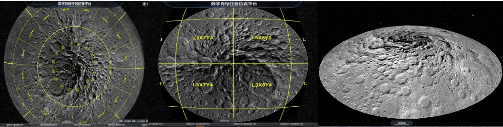
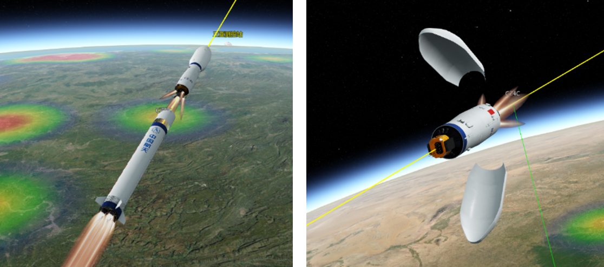
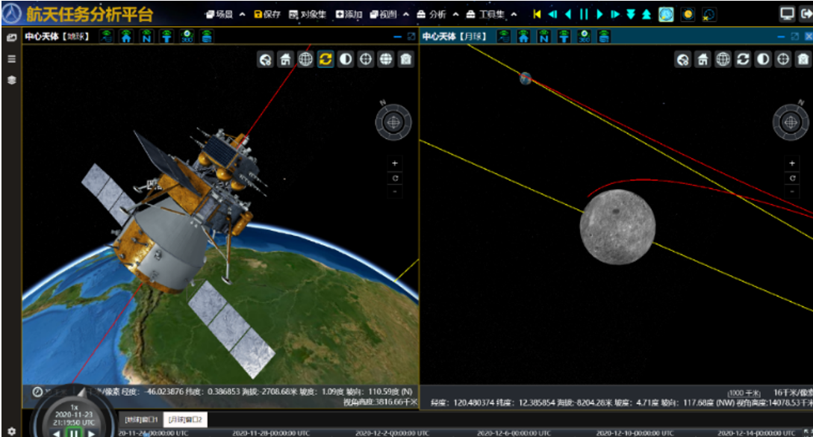
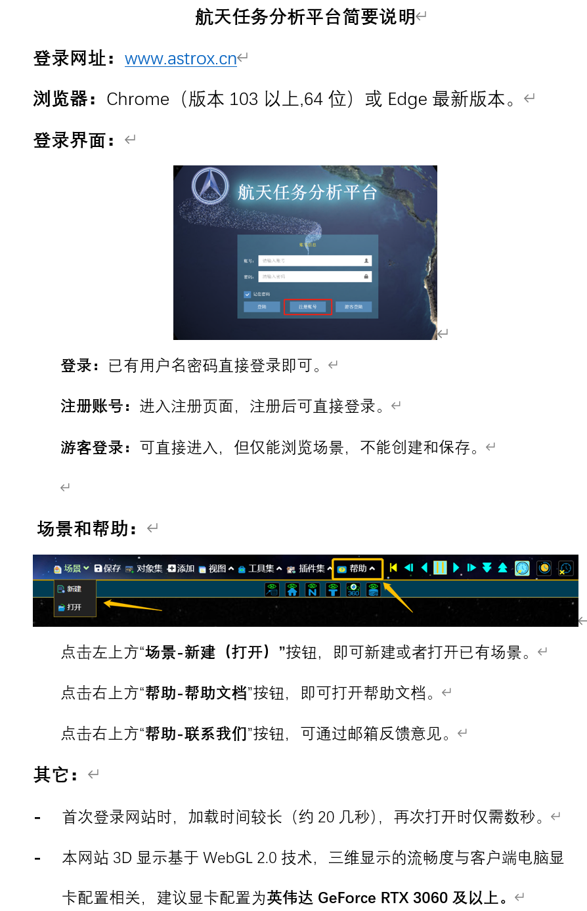

# 航天任务分析平台(网页版国产化STK)上线啦

航天任务分析平台是一款基于B/S架构的时空协同复杂信息系统软件。该平台构建了完整的数字太阳系模型，涵盖行星及其卫星、小行星（小天体）以及太阳系边际环境，同时整合了全周期航天任务仿真与计算工具，提供需求分析、任务设计、发射与轨道转移仿真、任务运营支持以及探测数据处理等核心功能。平台支持用户高效开展复杂航天任务分析，除传统的文本与图表输出外，还提供直观的三维可视化效果，助力用户快速制定系统级解决方案。

平台突破多项关键技术，包括BS架构下的多天体物理空间数字化、南北极地形高清三维展示、数字太阳系时空系统设计、GIS数据发布、高精度卫星轨道计算以及多数据源协同展示等。通过分阶段实施数字月球、数字地球到数字太阳系的递进开发，致力于打造航天工业领域领先的商业化分析软件。平台创新实现了月球南北极三维地图的无损展示，开发了与任务仿真深度集成的行星数字地形系统，并成为首个在B/S模式下实现多天体自由切换的航天业务软件。

本平台是STK软件的国产化替代，可实现云部署，云服务及协同设计。

欢迎大家使用！网址: [www.astrox.cn](http://www.astrox.cn)

