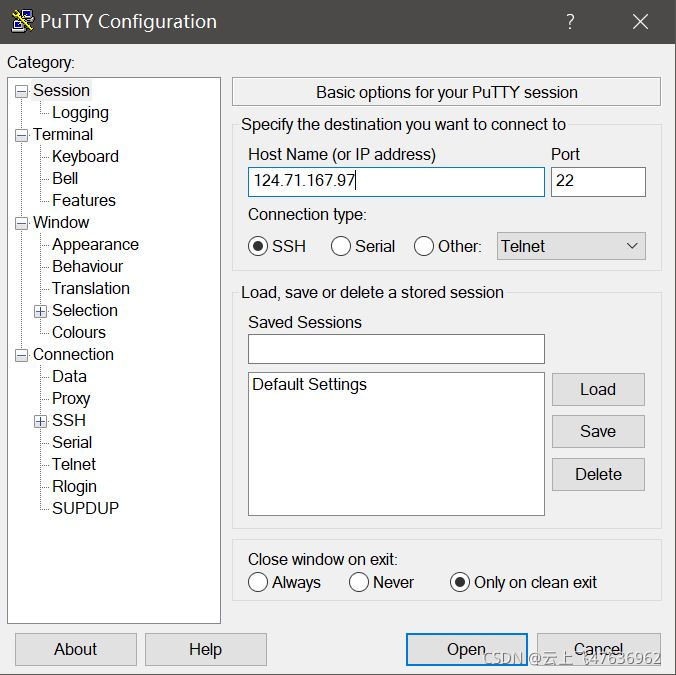
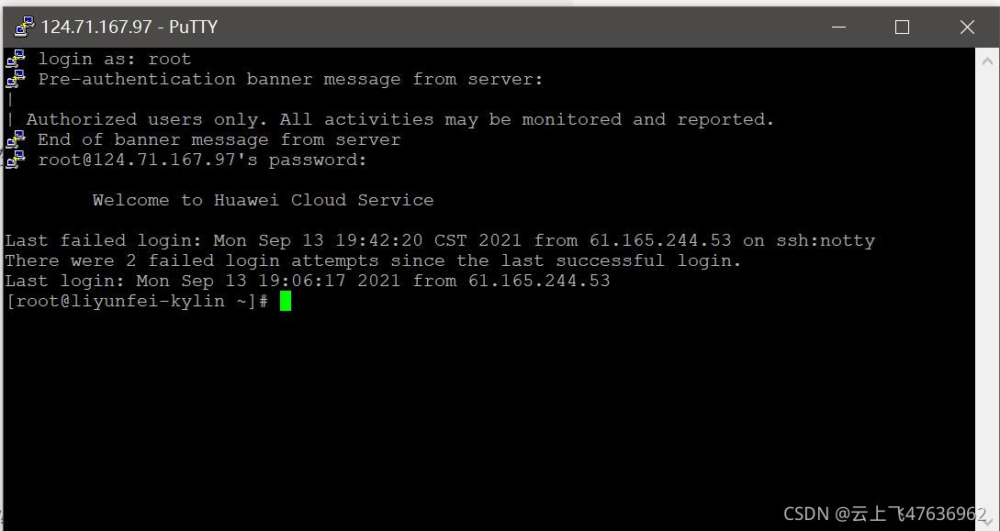
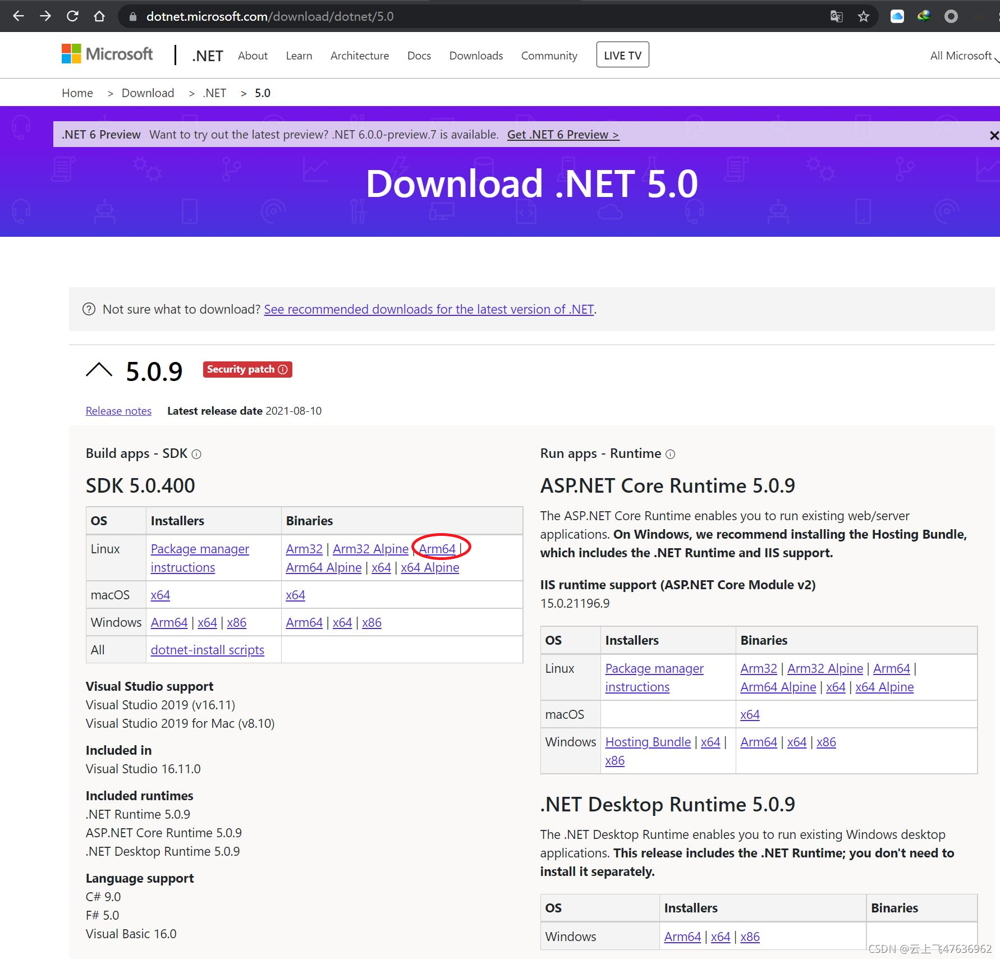
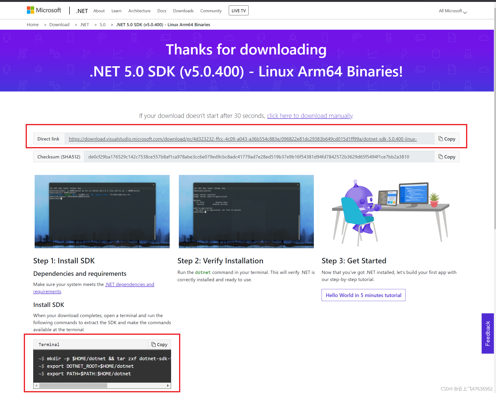
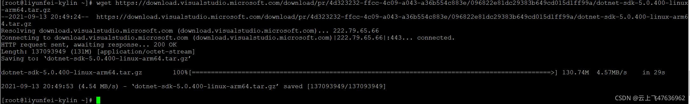
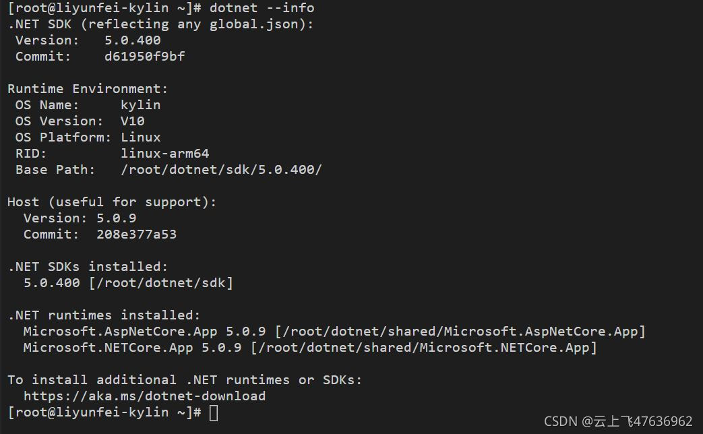
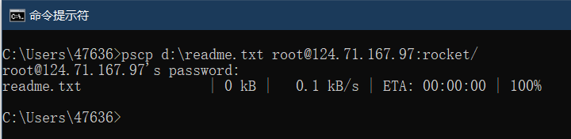
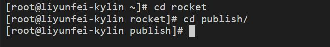
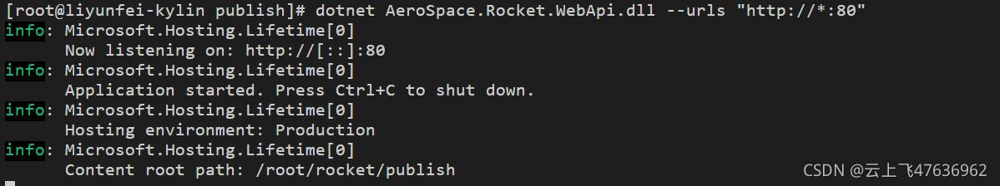
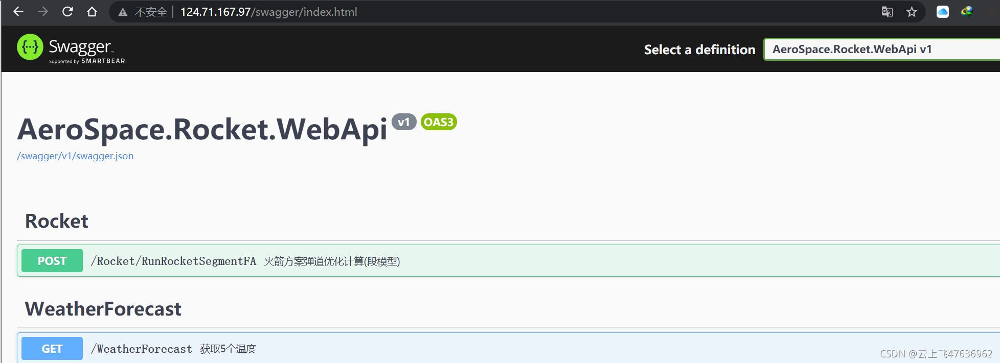

# 麒麟服务器上安装.Net Core环境并发布web网站

本文主要记录在麒麟服务器上安装.Net Core的运行环境，并运行.Net Core webApi程序。

## 准备工作
我使用的是华为云主机，操作系统为：银河麒麟高级服务器操作系统V10，CPU为鲲鹏，架构为Arm64。

如何购买一台云主机？各位自己在网上搜索吧！

由于麒麟系统是基于linux系统的，所以以下操作同样适用于linux系统。

.Net Core版本: 5.0

在window系统上，使用visual studio 2019创建一个.net core 5.0的webApi应用程序，编译后发布到D:\publish目录下。目录名称不一定是publish，可以任意命名。我们的最终的目的是要将我们编写好的webApi应用程序文件夹上传到linux服务器上，并启动web服务。

## 登录Linux服务器
首先安装putty工具，[点此下载](https://www.chiark.greenend.org.uk/~sgtatham/putty/latest.html)。

这个工具可以用来远程登录Linux服务器。当然，登录后仍然是命令行的方式。

安装完成后，打开PuTTY软件，输入IP地址，然后点击"Open"接口即可打开终端窗口。

输入管理员账户:root,然后再输入你的Linux服务器的登录密码，即可远程登录Linux服务器，见下图。
随后即可在此终端窗口内输入各种命令来配置.Net Core运行环境和运行网站了。


## 下载.net 5.0 SDK
此处采用原始的方式来安装，即下载.net 5.0 压缩包安装。

打开.net 5.0的[下载页面](https://dotnet.microsoft.com/download/dotnet/5.0)，即可看到各种操作系统版本的SDK，见下图。

由于我选用的麒麟服务器为Arm64架构的，因此选择Arm64。读者根据服务器的需要，点击相应的版本。

点击"Arm64"后进入具体的下载地址页面，如下图。

此页面直接给出了下载地址。点击“Copy”，即可。

在Linux终端输入下面命令即可下载（同样的原理可以下载其它版本的.net sdk，只要更换对应的下载地址接口）：
```bash
wget https://download.visualstudio.microsoft.com/download/pr/4d323232-ffcc-4c09-a043-a36b554c883e/096822e81dc29383b649cd015d1ff99a/dotnet-sdk-5.0.400-linux-arm64.tar.gz
```

下载完成后如图所示，最终的文件名为"dotnet-sdk-5.0-400-linux-arm64.tar.gz"。


## 安装.Net 5.0 SDK, 并创建dotnet环境变量
linux 终端里采用以下命令，在HOME目录下创建dotnet文件夹，并将刚下载好的压缩包解压在其中；然后创建环境变量。
```bash
mkdir -p $HOME/dotnet && tar zxf dotnet-sdk-5.0.400-linux-arm64.tar.gz -C $HOME/dotnet
export DOTNET_ROOT=$HOME/dotnet
export PATH=$PATH:$HOME/dotnet
```

上述后面两个命令"export"用于设置环境变量，但是这种方式每次登录都需要输入，很不方便。可以直接通过修改文件的方式一劳永逸的解决，具体如下：
```bash
vim /etc/profile

# 在最后一行加上
export DOTNET_ROOT=$HOME/dotnet
export PATH=$PATH:$HOME/dotnet
```

然后保存退出即可。使用vim命令打开文件修改、编辑、保存退出的命令自行查询，此处不再详述。

可通过"dotnet --info"命令查看安装后的.Net版本信息，见下图。.net sdk安装完成后，包含了.net runtime和asp.net core runtime。

至此，linux系统下的.net core运行环境即安装完毕。

下面阐述一下如何部署.net core web程序。

前面说过，我们已经在windows系统下编译好web应用程序，并发布到文件夹publish中（在D盘根目录下），我们需要将此文件夹上传至linux服务器的“Rocket”文件夹中，Rocket文件夹也是任意指定的。

## 上传文件至linux服务器
首先要在Windows系统里将需要发布的文件上传到linux服务器上。

那么，如何上传文件到远程的linux服务器？

安装putty工具后，它提供了pscp命令用来上传或下载文件。

打开windows系统的控制台(cmd)，通过以下命令可将D盘的readme.txt文件（需要有此文件）上传到linux服务器的rocket目录（之前创建好的）下，其中124.71.167.97是我的linux服务器地址，替换为你的即可:
```bash
pscp d:\readme.txt root@124.71.167.97:rocket/
```

之后提示输入linux服务器的密码，输入正确后，即可成功上传文件，见下图。

如果上传整个文件夹，则需加"-r"。例如，**下面命令将D盘的publish文件夹整体上传到linux系统的rocket目录下**.
```bash
pscp -r  D:\publish root@124.71.167.97:rocket/
```

**注意，上述命令是在windows系统的控制台里输入的，不是在Linux服务器终端窗口里输入的！！**

## 启动网站
现在，linux服务器上有了.net core运行环境，也有了需要发布的网站内容(/rocket/publish文件夹)。

**1. 进入需要部署网站的文件夹：publish文件夹;**
```bash
cd rocket
cd publish
```


**2. 启动网站**
```bash
dotnet AeroSpace.Rocket.WebApi.dll --urls "http://*:80"
```

上述命令启动网站后，访问的端口为80，这样我们在浏览器里访问的时候就可以不需输入端口号了；当然你也可以设置其它的端口号。

注意！！AeroSpace.Rocket.WebApi.dll就是publish文件夹中的主文件l。

**3. 访问网站**
在联网的任一台终端中，打开浏览器，输入地址：http://124.71.167.97/swagger，即可看到网站的webApi接口页面。
大功告成。

可使用Postman等工具来测试webApi端口。

## Linux路径问题
在部署.net core webApi应用程序时，发现如果内部有读取文件的语句，则必须格外注意。
例如，以下代码在Windows系统下运行没有任何问题：
```bash
// CurrentDir为当前dll所在目录
string CurrentDir = Path.GetDirectoryName(Assembly.GetExecutingAssembly().Location)
// Facilities.dat文件的完整路径:
string path1 =Path.Combine(CurrentDir, @"Data\Rocket\Facilities.dat")
```

但是在Linux运行下，path1的值为:" /root/rocket/publish/Data\Rocket\Facilities.dat"。

Linux系统下，路径使用“/”，而我们使用了"\"，所以会出错。而"/"路径分隔符在Windows系统里也可以，因此，最保险的办法是在编写.Net Core程序时，全部使用"/"符号用作路径分隔符。

因此，将上述代码的写法改为下面形式即可：
```bash
// CurrentDir为当前dll所在目录
string CurrentDir = Path.GetDirectoryName(Assembly.GetExecutingAssembly().Location)
// Facilities.dat文件的完整路径:
string path1 =Path.Combine(CurrentDir, @"Data/Rocket/Facilities.dat")
```

**此外，文件名为中文也不行！待后续解决！**
