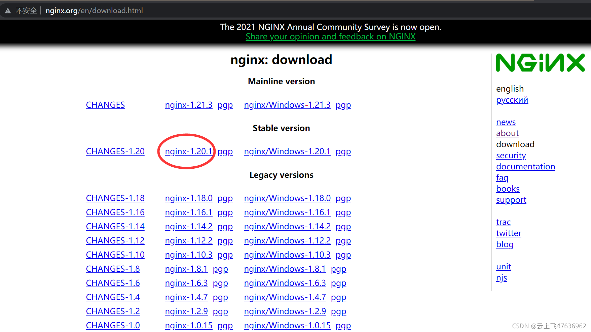
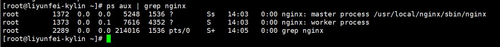
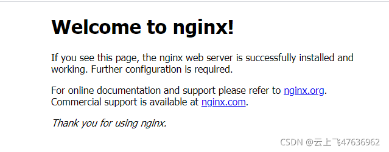
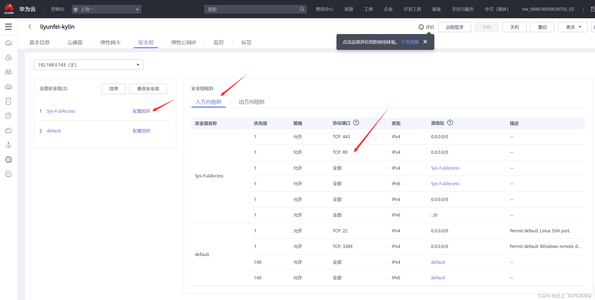
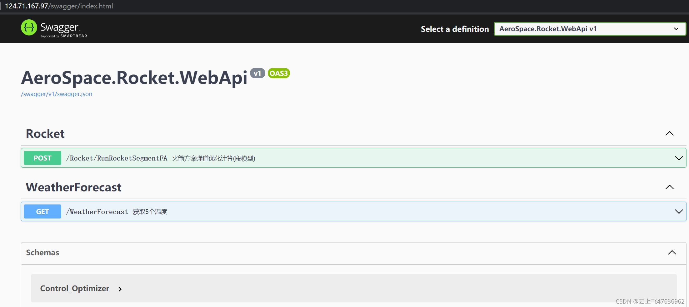

# 麒麟系统(Linux)上配置Nginx服务反向代理asp.net core 应用程序


## 一、前言
前面详细描述了如何在麒麟系统上部署.Net Core运行环境，并成功运行了Asp.Net Core webApi应用程序。

不过这种方式并不能持久，一旦关闭远程shell会话，或者服务器重启，应用进程就结束了。因此我们需要一个守护进程(配置)来管理我们的dotnet 后台进程，当服务器启动的时候可以自动运行我们的Asp.Net core web应用程序。

本章讲述如何使用Nginx反向代理服务来反向代理终止HTTP 请求，并将其转发到 ASP.NET Core 应用程序上。

## 二、Nginx反向代理服务器
Nginx是一款轻量级Web服务器，也是一款反向代理服务器。

Kestrel 是一个跨平台的适用于 ASP.NET Core 的 Web 服务器。 Kestrel 是包含在 ASP.NET Core 项目模板中的 Web 服务器，默认处于启用状态。

Kestrel 非常适合从 ASP.NET Core 提供动态内容。 但是，Web 服务功能不像服务器（如 IIS、Apache 或 Nginx）那样功能丰富。 反向代理服务器可以卸载 HTTP 服务器的工作负载，如提供静态内容、缓存请求、压缩请求和 HTTPS 终端。 反向代理服务器可能驻留在专用计算机上，也可能与 HTTP 服务器一起部署。

### 1.下载
官网下载：http://nginx.org/en/download.html
尽量选择稳定版本，我们是Linux系统，因此选择下图中红圈的版本：nginx-1.20.1。点击之后，会自动下载（同时可看到下载地址:http://nginx.org/download/nginx-1.20.1.tar.gz），然后将压缩包上传到Linux服务器上即可。

或者，直接在Linux系统上下载，命令如下：
```bash
wget http://nginx.org/download/nginx-1.20.1.tar.gz
```

### 2.安装
Linux服务器终端上，依次输入以下命令：
```bash
# 安装依赖
yum -y install zlib zlib-devel pcre-devel openssl openssl-devel
# 解压缩
tar -zxvf nginx-1.20.1.tar.gz
# 进入解压后的目录
cd nginx-1.20.1/
# 执行配置
./configure
# 编译安装(默认安装在/usr/local/nginx)
make
make install
```
安装完成后，使用whereis nginx即可查看安装路径，缺省安装在/usr/local/nginx目录下。
```bash
[root@liyunfei-kylin ~]# whereis nginx
nginx: /etc/nginx /usr/local/nginx
[root@liyunfei-kylin ~]# 
```
### 3.启动
通过上面的命令获取到路径，然后并进入sbin目录，可以看见一个可执行文件nginx，通过./nginx执行。
```bash
[root@liyunfei-kylin ~]# cd /usr/local/nginx/sbin
[root@liyunfei-kylin sbin]# ./nginx
```
nginx启动后是无状态显示的，可以通过以下命令查看nginx的启动状态:
```bash
# ps aux | grep nginx
```

可以看到master和worker进程，即表示nginx启动成功，正在运行。

我们就可以通过浏览器访问对应的IP就可以了，nginx默认端口为80，对于我的Linux服务器，输入网址: http://124.71.167.97，即可出现以下欢迎界面。

如果访问不到，可以排查以下几点：
1. 防火墙配置
nginx默认监听80端口，Linux服务器需关闭防火墙，或者iptables规则开放80端口(以centos6为例):
编辑配置文件：vim /etc/sysconfig/iptables
在文件中间添加iptables规则
-A INPUT -m state --state NEW -m tcp -p tcp --dport 80 -j ACCEPT
重启防火墙：service iptables restart
或者关闭iptables规则：iptables -F && iptables -t nat -F
2. 登录云服务器控制台，查看安全组策略，查看对应的服务器是否开放了80端口。也就是说通过网络要能够访问到你的Linux服务器上的80端口。


若访问时出现403页面错误，有可能是由于启动用户和nginx工作用户不一致所致。需要将nginx.config的中的user改为和启动用户一致即可。

下面Linux命令中，在nginx目录下(/usr/local/nginx)，首先使用ll列出了nginx目录下的所有子目录。
然后使用"vi conf/nginx.conf"打开配置文件，见下面。将其中的user 后面的用户名改为"root"即可。
```bash
[root@liyunfei-kylin nginx]# ll
total 40
drwx------ 2 root root 4096 Sep 13 23:09 client_body_temp
drwx------ 2 root root 4096 Sep 14 14:00 conf
drwx------ 2 root root 4096 Sep 13 23:09 fastcgi_temp
drwx------ 2 root root 4096 Sep 14 11:46 hosts
drwxr-xr-x 2 root root 4096 Sep 13 23:07 html
drwx------ 2 root root 4096 Sep 14 14:03 logs
drwx------ 3 root root 4096 Sep 14 11:47 proxy_temp
drwx------ 2 root root 4096 Sep 13 23:08 sbin
drwx------ 2 root root 4096 Sep 13 23:09 scgi_temp
drwx------ 2 root root 4096 Sep 13 23:09 uwsgi_temp
[root@liyunfei-kylin nginx]# vi conf/nginx.conf

# 将user后面的用户名修改为root，保持用于名一致
user  root;
worker_processes  1;
#error_log  logs/error.log;
#error_log  logs/error.log  notice;
#error_log  logs/error.log  info;

#pid        logs/nginx.pid;

events {
    worker_connections  1024;
}

http {
    include       mime.types;
    default_type  application/octet-stream;

....
```
### 4. 常用命令
下面给出了nginx常用的命令。
```bash
cd /usr/local/nginx/sbin/
./nginx 启动
./nginx -s stop 停止
./nginx -S quit 安全退出
./nginx -s reload 重新加载配置文件
ps auxIgrep nginx 查看nginx进程
```
当我们修改了 配置文件后(/usr/local/nginx/conf/nginx.conf)，需要重新加载配置文件，即: -s reload命令。

### 5. Nginx开机自启动
需要将nginx设置为随Linux系统开机自启动方式，这样配置完成后即使重启系统网站也会自动运行的。

修改/etc/rc.d/rc.local文件，添加最后一行内容：
```bash
[root@liyunfei-kylin ~]# vi /etc/rc.d/rc.local 

#!/bin/bash
# THIS FILE IS ADDED FOR COMPATIBILITY PURPOSES
#
# It is highly advisable to create own systemd services or udev rules
# to run scripts during boot instead of using this file.
#
# In contrast to previous versions due to parallel execution during boot
# this script will NOT be run after all other services.
#
# Please note that you must run 'chmod +x /etc/rc.d/rc.local' to ensure
# that this script will be executed during boot.

touch /var/lock/subsys/local
# 添加下面一行，实现开机启动nginx
/usr/local/nginx/sbin/nginx
```
注意，使用vi命令打开文件，修改、保存的命令自行查询。

文件修改保存后，执行以下命令，修改/etc/rc.d/rc.local的访问权限。
```bash
[root@liyunfei-kylin rc.d]# chmod +x /etc/rc.d/rc.local
```

最后，使用reboot命令重启Linux系统，然后使用"ps aux | grep nginx"命令查看nginx是否真的成功的自启动了。

## 三、Asp.Net Core
### 1. Startup.Configure中增加中间件调用
在使用Nginx反向代理Asp.Net Core程序时，由于请求通过反向代理转发，因此在Asp.Net Core中，需要使用Microsoft.AspNetCore.HttpOverrides 包中的中间件。 此中间件使用 X-Forwarded-Proto 标头来更新 Request.Scheme，使重定向 URI 和其他安全策略能够正常工作。

此中间件应在其他中间件之前运行。 

在Asp.Net Core应用程序中，修改Startup.cs中的Startup.Configure方法，增加ForwardedHeaders的中间件的调用，代码如下。
```csharp
using Microsoft.AspNetCore.HttpOverrides;

...

// 增加此中间件的调用，并放在Configure函数的最前面
// 此中间件是为了配合Nginx反向代理使用
app.UseForwardedHeaders(new ForwardedHeadersOptions
{
    ForwardedHeaders = ForwardedHeaders.XForwardedFor | ForwardedHeaders.XForwardedProto
});
...
```
重新编译并发布Asp.Net Core应用程序，并上传到Linux服务器上。
### 2. .Net Core程序开机自启动
前一章中我们介绍过，使用dotnet命令可以启动.Net Core应用程序。这种方式下，一旦Linux系统重启就必须重新重新输入dotnet命令才能重启.Net Core应用程序。

使用Systemd，它可用于创建服务文件以启动和监视基础 Web 应用， 可以提供启动、停止和管理进程的许多强大的功能。

首先创建一个服务定义文件:rocket.service，名称可自定义。

```bash
sudo vi /etc/systemd/system/rocket.service
```
打开rocket.service文件后，填写以下内容。
```bash
[Unit]
Description=Example .NET Web API App running on kylin

[Service]
WorkingDirectory=/root/rocket/publish
ExecStart=/root/dotnet/dotnet /root/rocket/publish/AeroSpace.Rocket.WebApi.dll --urls=http://*:8000
Restart=always
# Restart service after 10 seconds if the dotnet service crashes:
RestartSec=10
KillSignal=SIGINT
SyslogIdentifier=dotnet-example
User=root
Environment=ASPNETCORE_ENVIRONMENT=Production
Environment=DOTNET_PRINT_TELEMETRY_MESSAGE=false

[Install]
WantedBy=multi-user.target
```
有关上述配置中的参数说明如下：
 - WorkingDirectory：是Asp.Net Core应用程序的路径，需根据自己部署程序的路径修改；
 - ExecStart:是启动时的donnet命令，其中/root/dotnet/dotnet是我安装在Linux服务器上的.Net SDK的安装路径，后面是我的应用程序dll的完整路径，启动方式为http，端口号为8000。此端口号随意，只要不和其它端口冲突即可。
 - User：用户名，与当前用户名(root)一致即可。
 
 保存该文件，并启用该服务。
 

```bash
 sudo systemctl enable kestrel-helloapp.service
```
启用该服务，并确认它正在运行。
```bash
[root@liyunfei-kylin dotnet]# sudo systemctl start rocket.service
[root@liyunfei-kylin dotnet]# sudo systemctl status rocket.service
● rocket.service - Example .NET Web API App running on kylin
   Loaded: loaded (/etc/systemd/system/rocket.service; enabled; vendor preset: disabled)
   Active: active (running) since Tue 2021-09-14 15:07:18 CST; 4s ago
 Main PID: 3075 (dotnet)
    Tasks: 15
   Memory: 33.0M
   CGroup: /system.slice/rocket.service
           └─3075 /root/dotnet/dotnet /root/rocket/publish/AeroSpace.Rocket.WebApi.dll --urls=http://*:8000

Sep 14 15:07:18 liyunfei-kylin systemd[1]: Started Example .NET Web API App running on kylin.
Sep 14 15:07:18 liyunfei-kylin dotnet-example[3075]: info: Microsoft.Hosting.Lifetime[0]
Sep 14 15:07:18 liyunfei-kylin dotnet-example[3075]:       Now listening on: http://[::]:8000
Sep 14 15:07:18 liyunfei-kylin dotnet-example[3075]: info: Microsoft.Hosting.Lifetime[0]
Sep 14 15:07:18 liyunfei-kylin dotnet-example[3075]:       Application started. Press Ctrl+C to shut down.
Sep 14 15:07:18 liyunfei-kylin dotnet-example[3075]: info: Microsoft.Hosting.Lifetime[0]
Sep 14 15:07:18 liyunfei-kylin dotnet-example[3075]:       Hosting environment: Production
Sep 14 15:07:18 liyunfei-kylin dotnet-example[3075]: info: Microsoft.Hosting.Lifetime[0]
Sep 14 15:07:18 liyunfei-kylin dotnet-example[3075]:       Content root path: /root/rocket/publish
[root@liyunfei-kylin dotnet]# 

```
此时，系统已具备启动时自动按照rocket.service文件里的配置，启动应用程序:AeroSpace.Rocket.WebApi.dll。

打开浏览器，输入 http://124.71.167.97:8000/swagger，即可打开网站的WebApi接口页面(Swagger)。

## 四、Nginx反向代理Asp.Net Core应用程序
下面开始将Nginx 配置为反向代理以将 HTTP 请求转发到 ASP.NET Core 应用程序。

使用下面语句打开文件nginx.conf
```bash
[root@liyunfei-kylin ~]# vi /usr/local/nginx/conf/nginx.conf
```
替换其中的server部分如下：
```bash
# 此处的user改为使用的用户名称root
user  root;
worker_processes  1;

#error_log  logs/error.log;
#error_log  logs/error.log  notice;
#error_log  logs/error.log  info;

#pid        logs/nginx.pid;

events {
    worker_connections  1024;
}

http {
    include       mime.types;
    default_type  application/octet-stream;

    #log_format  main  '$remote_addr - $remote_user [$time_local] "$request" '
    #                  '$status $body_bytes_sent "$http_referer" '
    #                  '"$http_user_agent" "$http_x_forwarded_for"';

    #access_log  logs/access.log  main;

    sendfile        on;
    #tcp_nopush     on;

    #keepalive_timeout  0;
    keepalive_timeout  65;

    #gzip  on;
    
# 此处为替换的内容！！
server {
    listen        80;
    server_name   124.71.167.97;
    location / {
        proxy_pass         http://127.0.0.1:8000;
        proxy_http_version 1.1;
        proxy_set_header   Upgrade $http_upgrade;
        proxy_set_header   Connection keep-alive;
        proxy_set_header   Host $host;
        proxy_cache_bypass $http_upgrade;
        proxy_set_header   X-Forwarded-For $proxy_add_x_forwarded_for;
        proxy_set_header   X-Forwarded-Proto $scheme;
    }
}
	
    # another virtual host using mix of IP-, name-, and port-based configuration
    #
    #server {
    #    listen       8000;
    #    listen       somename:8080;
    #    server_name  somename  alias  another.alias;

    #    location / {
    #        root   html;
    #        index  index.html index.htm;
    #    }
    #}


    # HTTPS server
    #
    #server {
    #    listen       443 ssl;
    #    server_name  localhost;

    #    ssl_certificate      cert.pem;
    #    ssl_certificate_key  cert.key;

    #    ssl_session_cache    shared:SSL:1m;
    #    ssl_session_timeout  5m;

    #    ssl_ciphers  HIGH:!aNULL:!MD5;
    #    ssl_prefer_server_ciphers  on;

    #    location / {
    #        root   html;
    #        index  index.html index.htm;
    #    }
    #}

}
```
在server参数中：

- listen： 是Nginx监听的端口，默认为80。当然也可以改成别的端口；
- server_name：是Nginx所在服务器的IP(此处是我的服务器地址124.71.167.97)，如果你的服务器已经有域名了，那么可以直接写域名，比如: www.baidu.com;
- proxy_pass: 就是Nginx转发将HTTP 请求转发的地址，此处为http://127.0.0.1:8000，即本机的8000端口。注意，此处的8000端口就是前面我们为ASP.NET Core 应用程序设置的端口号，两者必须一致！！！

在浏览器里输入：http://124.71.167.97/swagger，即可看到Asp.Net Core的WebApi页面。大功告成！！

## 五、总结
这篇文章给出了Nginx服务器的下载、安装，以及Asp.Net Core应用程序的配置。并且在Linux系统里，都给出了两者随系统启动的方法。最后给出了利用Nginx反向代理Asp.Net Core应用程序的配置方法。

我们在访问网站时，由Nignx服务器接收Http请求，并通过端口8000转发给Asp.Net Core应用程序；然后再接收Asp.Net Core应用程序返回的数据，再发回给客户端。

对于本文的配置来说，Nginx起的作用不大，我们完全可以不用Nginx，直接访问地址: http://124.71.167.97:8000/swagger，直接与Ketrel服务器连接。

## 参考
1.  [Linux下安装Nginx](https://www.jianshu.com/p/9f2c162ac77c)
2. 狂神, [Linux下安装nginx](https://www.kuangstudy.com/bbs/1424752534395879426)
3. [Linux安装nginx并设置开机自启（命令行方式）](https://blog.csdn.net/fei1234456/article/details/107234075)
4. [Nginx 403 Forbidden 最终解决](https://blog.csdn.net/qq_42225507/article/details/84578820)
5. [使用 Nginx 在 Linux 上托管 ASP.NET Core](https://docs.microsoft.com/en-us/aspnet/core/host-and-deploy/linux-nginx?view=aspnetcore-5.0#monitoring-our-web-application)


